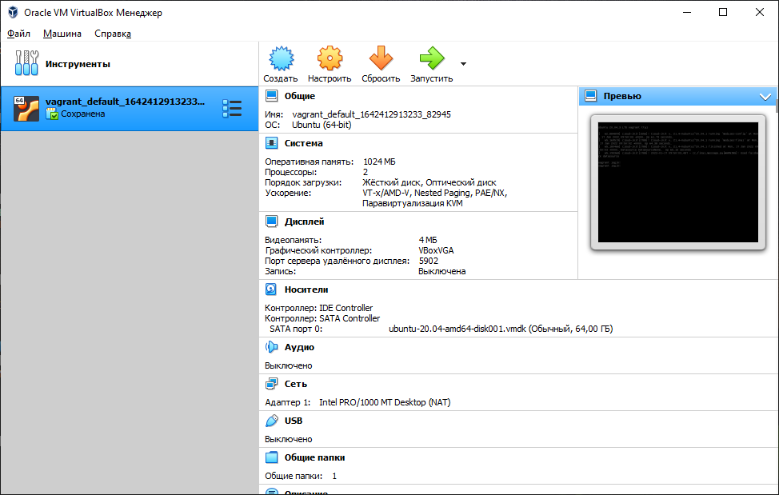
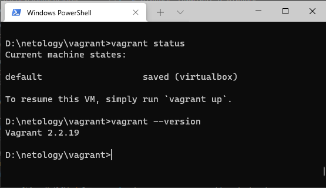
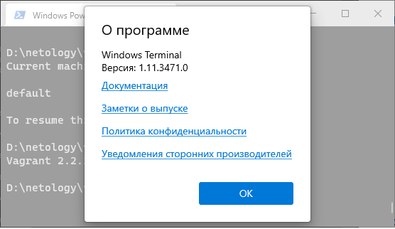
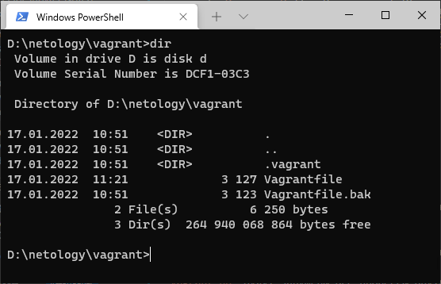
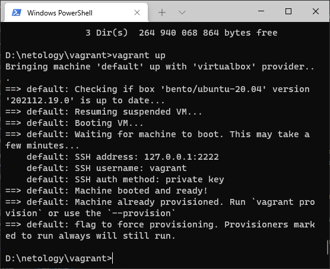

# Домашнее задание к занятию "3.1. Работа в терминале, лекция 1"

1. Установите средство виртуализации [Oracle VirtualBox](https://www.virtualbox.org/).

	>### Установили VirtualBox

	>
1. Установите средство автоматизации [Hashicorp Vagrant](https://www.vagrantup.com/).

	>### Установили Vagrant

	>

1. В вашем основном окружении подготовьте удобный для дальнейшей работы терминал.

	>### Установили Windows Terminal

	>

1. С помощью базового файла конфигурации запустите Ubuntu 20.04 в VirtualBox посредством Vagrant:
	* Создайте директорию, в которой будут храниться конфигурационные файлы Vagrant. В ней выполните `vagrant init`. Замените содержимое Vagrantfile по умолчанию следующим:

	```bash
	Vagrant.configure("2") do |config|
	config.vm.box = "bento/ubuntu-20.04"
	end
	```

	>### Создали, выполнили и изменили содержимое Vagrantfile
	
	>

	* Выполнение в этой директории `vagrant up` установит провайдер VirtualBox для Vagrant, скачает необходимый образ и запустит виртуальную машину.

	>### Выполнили `vagrant up`

	> 

	* `vagrant suspend` выключит виртуальную машину с сохранением ее состояния (т.е., при следующем `vagrant up` будут запущены все процессы внутри, которые работали на момент вызова suspend), `vagrant halt` выключит виртуальную машину штатным образом.
	
	>### Выполнили `vagrant up`, `vagrant suspend`, `vagrant up` и `vagrant halt`

	```
	D:\netology\vagrant>vagrant suspend
		==> default: Saving VM state and suspending execution...
	D:\netology\vagrant>vagrant up
		Bringing machine 'default' up with 'virtualbox' provider...
		==> default: Checking if box 'bento/ubuntu-20.04' version '202112.19.0' is up to date...
		==> default: Resuming suspended VM...
		==> default: Booting VM...
		==> default: Waiting for machine to boot. This may take a few minutes...
			default: SSH address: 127.0.0.1:2222
			default: SSH username: vagrant
			default: SSH auth method: private key
		==> default: Machine booted and ready!
		==> default: Machine already provisioned. Run `vagrant provision` or use the `--provision`
		==> default: flag to force provisioning. Provisioners marked to run always will still run.
	D:\netology\vagrant>vagrant halt
		==> default: Attempting graceful shutdown of VM...
	```

1. Ознакомьтесь с графическим интерфейсом VirtualBox, посмотрите как выглядит виртуальная машина, которую создал для вас Vagrant, какие аппаратные ресурсы ей выделены. Какие ресурсы выделены по-умолчанию?

	>### Все ресурсы можно увидеть на скриншоте

	- CPU - 2 
	- RAM - 1024MB
	- VMEM - 64MB
	- DISK - 64GB

	>

1. Ознакомьтесь с возможностями конфигурации VirtualBox через Vagrantfile: [документация](https://www.vagrantup.com/docs/providers/virtualbox/configuration.html). Как добавить оперативной памяти или ресурсов процессора виртуальной машине?

	>### Ознакомились с документацией и внесли правки в Vagrantfile

	```
	config.vm.provider "virtualbox" do |v|
		# чтоб показывал окно виртуал бокса
		v.gui = true 

		#Дадим имя виртальной машине
		v.name = "voevodin_vm"

		# Память и количество процессоров
		v.memory = 1024
		v.cpus = 2
	end
	```

1. Команда `vagrant ssh` из директории, в которой содержится Vagrantfile, позволит вам оказаться внутри виртуальной машины без каких-либо дополнительных настроек. Попрактикуйтесь в выполнении обсуждаемых команд в терминале Ubuntu.

	>### Подключились к ВМ через `vagrant ssh`

	```
	D:\netology\vagrant>vagrant ssh
	Welcome to Ubuntu 20.04.3 LTS (GNU/Linux 5.4.0-91-generic x86_64)

	* Documentation:  https://help.ubuntu.com
	* Management:     https://landscape.canonical.com
	* Support:        https://ubuntu.com/advantage

	System information as of Sat 22 Jan 2022 01:24:21 PM UTC

	System load:  0.67               Processes:             120
	Usage of /:   11.6% of 30.88GB   Users logged in:       0
	Memory usage: 18%                IPv4 address for eth0: 10.0.2.15
	Swap usage:   0%


	This system is built by the Bento project by Chef Software
	More information can be found at https://github.com/chef/bento
	Last login: Sat Jan 22 13:22:09 2022 from 10.0.2.2
	vagrant@vagrant:~$
	```

1. Ознакомиться с разделами `man bash`, почитать о настройках самого bash:
    * какой переменной можно задать длину журнала `history`, и на какой строчке manual это описывается?

	>### Ознакомились с `man bash`, узнали что длинну журнала можно задать переменной `HISTFILESIZE` она находится на 736 строке

	```
	vagrant@vagrant:~$ man bash | grep history | grep maximum
				The maximum number of lines contained in the history file.  When this variable is assigned a value, the history file is truncated,
				Set the maximum number of history entries saved in the history list.  If set to zero, any existing history entries are deleted and
				value, the maximum number of history entries will be set to 500.
	vagrant@vagrant:~$ man bash | grep 'The maximum number of lines contained in the history file.'
				The maximum number of lines contained in the history file.  When this variable is assigned a value, the history file is truncated,
	vagrant@vagrant:~$ man bash | grep 'The maximum number of lines contained in the history file.' -n
	737:              The maximum number of lines contained in the history file.  When this variable is assigned a value, the history file is truncated,
	vagrant@vagrant:~$ man bash | head -n737 | tail -n10
				previous  history entry to not be saved.  A value of ignoreboth is shorthand for ignorespace and ignoredups.  A value of erasedups
				causes all previous lines matching the current line to be removed from the history list before that line is saved.  Any value  not
				in  the above list is ignored.  If HISTCONTROL is unset, or does not include a valid value, all lines read by the shell parser are
				saved on the history list, subject to the value of HISTIGNORE.  The second and subsequent lines of a multi-line  compound  command
				are not tested, and are added to the history regardless of the value of HISTCONTROL.
		HISTFILE
				The  name of the file in which command history is saved (see HISTORY below).  The default value is ~/.bash_history.  If unset, the
				command history is not saved when a shell exits.
		HISTFILESIZE
				The maximum number of lines contained in the history file.  When this variable is assigned a value, the history file is truncated,
	vagrant@vagrant:~$ man bash | grep 'HISTFILESIZE' -n
	736:       HISTFILESIZE
	2680:       value of HISTFILE is truncated, if necessary, to contain no more than the number of lines specified by the  value  of  HISTFILESIZE.   If
	2681:       HISTFILESIZE  is  unset, or set to null, a non-numeric value, or a numeric value less than zero, the history file is not truncated.  When
	2689:       ing  the  history, the history file is truncated to contain no more than HISTFILESIZE lines.  If HISTFILESIZE is unset, or set to null, a
	vagrant@vagrant:~$
	```

    * что делает директива `ignoreboth` в bash?
	
	>### Директива ignoreboth является сокращением для ignorespace и ignoredups. ignorespace — игнорирование строк, начинающихся с пробела. ignoredups — игнорирование строк-дубликатов предыдущих.
	
	```
	HISTCONTROL
        A  colon-separated  list of values controlling how commands are saved on the history list.  If the list of values includes ignorespace, lines which begin with a space character are not
        saved in the history list.  A value of ignoredups causes lines matching the previous history entry to not be saved.  A value of ignoreboth is shorthand for ignorespace and  ignoredups.
        A value of erasedups causes all previous lines matching the current line to be removed from the history list before that line is saved.  Any value not in the above list is ignored.  If
        HISTCONTROL is unset, or does not include a valid value, all lines read by the shell parser are saved on the history list, subject to the value of HISTIGNORE.  The  second  and  subse‐
        quent lines of a multi-line compound command are not tested, and are added to the history regardless of the value of HISTCONTROL.         
	```


1. В каких сценариях использования применимы скобки `{}` и на какой строчке `man bash` это описано?

	>### `{}` это список для группировки команд, описнаие находится на 206 строке `man bash`

	```
	vagrant@vagrant:~$ man bash | grep -F "{ list; }" -n
		206:       { list; }
	```


1. Основываясь на предыдущем вопросе, как создать однократным вызовом `touch` 100000 файлов? А получилось ли создать 300000? Если нет, то почему?

	>### это можно сделать используя выражение последовательности `{START..END[..INCREMENT]}`

	```
	vagrant@vagrant:~$ touch {1..100000}
	vagrant@vagrant:~$ ls | wc -w
		100000
	```

	>### 100000 файлов создалось. 300000 нет, получил ошибку: `Argument list too long`. Существует ограничение на максимальное количество аргументов в команде. 

	```
	vagrant@vagrant:~$ touch {1..300000}
		-bash: /usr/bin/touch: Argument list too long
	vagrant@vagrant:~$ getconf ARG_MAX
		2097152
	```

1. В man bash поищите по `/\[\[`. Что делает конструкция `[[ -d /tmp ]]`

>### Возвращает статус 0 или 1 в зависимости от значения указанного условного выражения, в данном случае проверяется существоание директории `/tmp`.  

	```
	vagrant@vagrant:~$ [[ -d /tmp ]]
	vagrant@vagrant:~$ echo $?
	0
	vagrant@vagrant:~$ [[ -d /tmp1 ]]
	vagrant@vagrant:~$ echo $?
	1
	vagrant@vagrant:~$
	```


1. Основываясь на знаниях о просмотре текущих (например, PATH) и установке новых переменных; командах, которые мы рассматривали, добейтесь в выводе type -a bash в виртуальной машине наличия первым пунктом в списке:

	```bash
	bash is /tmp/new_path_directory/bash
	bash is /usr/local/bin/bash
	bash is /bin/bash
	```

	(прочие строки могут отличаться содержимым и порядком)
		В качестве ответа приведите команды, которые позволили вам добиться указанного вывода или соответствующие скриншоты.

	
	>### Как то так

	```
	vagrant@vagrant:~$ mkdir /tmp/new_patch_directory
	vagrant@vagrant:~$ cp /bin/bash /tmp/new_patch_directory/
	vagrant@vagrant:~$ PATH=/tmp/new_patch_directory/:$PATH
	vagrant@vagrant:~$ type -a bash
	bash is /tmp/new_patch_directory/bash
	bash is /usr/bin/bash
	bash is /bin/bash
	```

1. Чем отличается планирование команд с помощью `batch` и `at`?

	>### `at` запускает команду в назначенное время. `batch` запускает команду при достижении определённого уровня нагрузки системы.

1. Завершите работу виртуальной машины чтобы не расходовать ресурсы компьютера и/или батарею ноутбука.
	```
	D:\netology\vagrant>vagrant halt
		==> default: Attempting graceful shutdown of VM...
	```

 