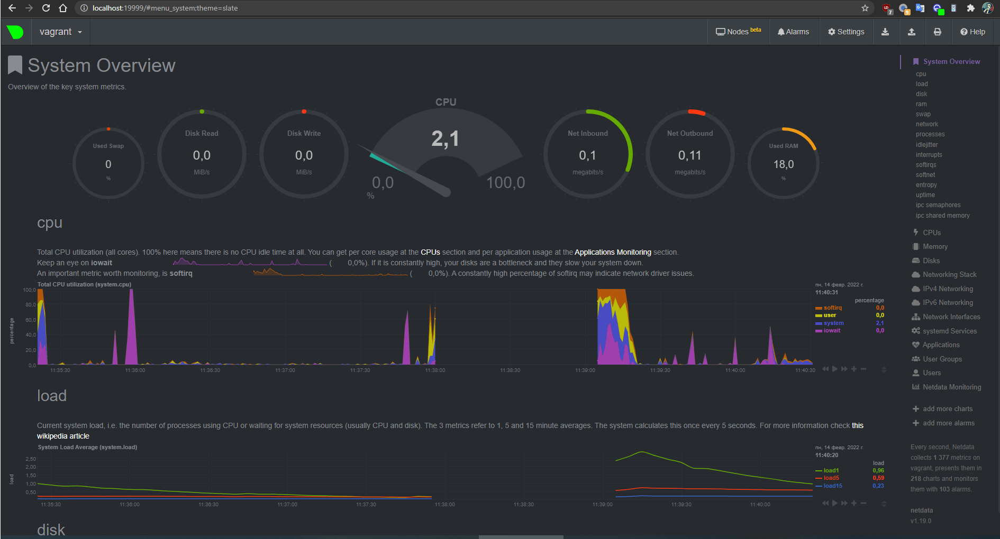

# Домашнее задание к занятию "3.4. Операционные системы, лекция 2"

1. На лекции мы познакомились с [node_exporter](https://github.com/prometheus/node_exporter/releases). В демонстрации его исполняемый файл запускался в background. Этого достаточно для демо, но не для настоящей production-системы, где процессы должны находиться под внешним управлением. Используя знания из лекции по systemd, создайте самостоятельно простой [unit-файл](https://www.freedesktop.org/software/systemd/man/systemd.service.html) для node_exporter:

    * поместите его в автозагрузку,
    * предусмотрите возможность добавления опций к запускаемому процессу через внешний файл (посмотрите, например, на `systemctl cat cron`),
    * удостоверьтесь, что с помощью systemctl процесс корректно стартует, завершается, а после перезагрузки автоматически поднимается.

    >### Скачали и распаковали 

    ```
    vagrant@vagrant:~$ wget "https://github.com/prometheus/node_exporter/releases/download/v1.3.1/node_exporter-1.3.1.linux-amd64.tar.gz"
    vagrant@vagrant:~$ tar -xzf ./node_exporter-1.3.1.linux-amd64.tar.gz
    ```

    >### Поместили в `/opt/node_exporter` и создали файл `node_exporter.unit` в `/etc/systemd/system` со следующим содержимым:

    ```
    [Unit]
    Description=node_exporter

    [Service]
    EnvironmentFile=-/etc/default/node_exporter
    ExecStart=/opt/node_exporter/node_exporter $DEFAULT_OPTION
    KillMode=process
    Restart=on-failure
    RestartSec=30s

    [Install]
    WantedBy=multi-user.target
    ```

    >### Создали файл `node_exporter` в `/etc/default` и добавили опцию `DEFAULT_OPTION`:
    
    ```
    DEFAULT_OPTION=--log.level="debug" --log.format=json --web.listen-address=":9100"
    ```


    >### Включим и запустим сервис 

    ```
    root@vagrant:/etc/systemd/system# systemctl enable node_exporter.service
    root@vagrant:/etc/systemd/system# systemctl start node_exporter.service
    root@vagrant:/etc/systemd/system# systemctl status node_exporter.service
        ● node_exporter.service - node_exporter
            Loaded: loaded (/etc/systemd/system/node_exporter.service; enabled; vendor preset: enabled)
            Active: active (running) since Mon 2022-02-14 06:47:26 UTC; 12min ago
        Main PID: 2097 (node_exporter)
            Tasks: 4 (limit: 1071)
            Memory: 4.3M
            CGroup: /system.slice/node_exporter.service
                    └─2097 /opt/node_exporter/node_exporter

    ... 
    ```

    >### Проверим как останавливается и запускается

    ```
    root@vagrant:/etc/systemd/system# systemctl stop node_exporter.service
    root@vagrant:/etc/systemd/system# systemctl status node_exporter.service
    ● node_exporter.service - node_exporter
        Loaded: loaded (/etc/systemd/system/node_exporter.service; enabled; vendor preset: enabled)
        Active: inactive (dead) since Mon 2022-02-14 07:02:29 UTC; 2s ago
        Process: 2097 ExecStart=/opt/node_exporter/node_exporter $EXTRA_OPTS (code=killed, signal=TERM)
    Main PID: 2097 (code=killed, signal=TERM)

    ...
    root@vagrant:/etc/systemd/system# systemctl restart node_exporter.service
    root@vagrant:/etc/systemd/system# systemctl status node_exporter.service
    ● node_exporter.service - node_exporter
        Loaded: loaded (/etc/systemd/system/node_exporter.service; enabled; vendor preset: enabled)
        Active: active (running) since Mon 2022-02-14 07:02:38 UTC; 1s ago
    Main PID: 2243 (node_exporter)
        Tasks: 3 (limit: 1071)
        Memory: 2.2M
        CGroup: /system.slice/node_exporter.service
                └─2243 /opt/node_exporter/node_exporter

    ...
    ```

    >### Проверим работу после перезагрузки
    
    ```
    PS D:\netology\vagrant> vagrant reload
    ...
    PS D:\netology\vagrant> vagrant ssh
    ...
    vagrant@vagrant:~$ systemctl status node_exporter
    ● node_exporter.service - node_exporter
        Loaded: loaded (/etc/systemd/system/node_exporter.service; enabled; vendor preset: enabled)
        Active: active (running) since Mon 2022-02-14 07:04:10 UTC; 2min 7s ago
    Main PID: 615 (node_exporter)
        Tasks: 4 (limit: 1071)
        Memory: 14.4M
        CGroup: /system.slice/node_exporter.service
                └─615 /opt/node_exporter/node_exporter

    ...
    ```
    >### `node_exporter` работает как сервис и загружается вместе с системой

1. Ознакомьтесь с опциями node_exporter и выводом `/metrics` по-умолчанию. Приведите несколько опций, которые вы бы выбрали для базового мониторинга хоста по CPU, памяти, диску и сети.

    >### Посмотрим какие метрики отдает `node_exporter`

    ```
     vagrant@vagrant:~$ curl "localhost:9100/metrics"
    ```

    >### Для мониторинга хоста по CPU, памяти, диску и сети можно выделить следующие опции:
    >### CPU (`curl http://localhost:9100/metrics | grep node_cpu`):
    ```
    node_cpu_seconds_total{cpu="0",mode="idle"} 2238.49
    node_cpu_seconds_total{cpu="0",mode="system"} 16.72
    node_cpu_seconds_total{cpu="0",mode="user"} 6.86
    process_cpu_seconds_total
    ```
    >### Disk (`curl http://localhost:9100/metrics | grep node_disk`):
    ```
    node_disk_io_time_seconds_total{device="sda"} 
    node_disk_read_bytes_total{device="sda"}
    node_disk_read_time_seconds_total{device="sda"} 
    node_disk_write_time_seconds_total{device="sda"}
    ```
    >### Memory (`curl http://localhost:9100/metrics | grep node_memory`):
    ```
    node_memory_MemAvailable_bytes 
    node_memory_MemFree_bytes
    ```
    >### Network (`curl http://localhost:9100/metrics | grep node_network`):
    ```
    node_network_receive_errs_total{device="eth0"} 
    node_network_receive_bytes_total{device="eth0"} 
    node_network_transmit_bytes_total{device="eth0"}
    node_network_transmit_errs_total{device="eth0"}
    ```
1. Установите в свою виртуальную машину [Netdata](https://github.com/netdata/netdata). Воспользуйтесь [готовыми пакетами](https://packagecloud.io/netdata/netdata/install) для установки (`sudo apt install -y netdata`). После успешной установки:
    * в конфигурационном файле `/etc/netdata/netdata.conf` в секции [web] замените значение с localhost на `bind to = 0.0.0.0`,
    * добавьте в Vagrantfile проброс порта Netdata на свой локальный компьютер и сделайте `vagrant reload`:

    ```bash
    config.vm.network "forwarded_port", guest: 19999, host: 19999
    ```

    После успешной перезагрузки в браузере *на своем ПК* (не в виртуальной машине) вы должны суметь зайти на `localhost:19999`. Ознакомьтесь с метриками, которые по умолчанию собираются Netdata и с комментариями, которые даны к этим метрикам.

    >### Установили, поправили конфигурации, перезапустили, открыли браузер и увидели практически все метрики в красивом графическом интерфейсе

    

1. Можно ли по выводу `dmesg` понять, осознает ли ОС, что загружена не на настоящем оборудовании, а на системе виртуализации?

    >### Да, ОС понимает что загружена на системе виртуализации

    ```bash
    vagrant@vagrant:~$ dmesg | grep virtual
    [    0.003010] CPU MTRRs all blank - virtualized system.
    [    0.079209] Booting paravirtualized kernel on KVM
    [    3.101371] systemd[1]: Detected virtualization oracle.

    vagrant@vagrant:~$ dmesg | grep vbox
    [    0.990760] fbcon: vboxvideodrmfb (fb0) is primary device
    [    0.997543] vboxvideo 0000:00:02.0: fb0: vboxvideodrmfb frame buffer device
    [    1.026131] [drm] Initialized vboxvideo 1.0.0 20130823 for 0000:00:02.0 on minor 0
    [    4.028761] vboxguest: loading out-of-tree module taints kernel.
    [    4.040888] vboxguest: Successfully loaded version 6.1.26_Ubuntu r145957
    [    4.040912] vboxguest: misc device minor 58, IRQ 20, I/O port d020, MMIO at 00000000f0400000 (size 0x400000)
    [    4.040913] vboxguest: Successfully loaded version 6.1.26_Ubuntu r145957 (interface 0x00010004)
    [    7.210152] vboxsf: g_fHostFeatures=0x8000000f g_fSfFeatures=0x1 g_uSfLastFunction=29
    [    7.210418] *** VALIDATE vboxsf ***
    [    7.210424] vboxsf: Successfully loaded version 6.1.26_Ubuntu r145957
    [    7.210477] vboxsf: Successfully loaded version 6.1.26_Ubuntu r145957 on 5.4.0-96-generic SMP mod_unload modversions  (LINUX_VERSION_CODE=0x5049d)
    [    7.211618] vboxsf: SHFL_FN_MAP_FOLDER failed for '/vagrant': share not found
    ```

1. Как настроен sysctl `fs.nr_open` на системе по-умолчанию? Узнайте, что означает этот параметр. Какой другой существующий лимит не позволит достичь такого числа (`ulimit --help`)?

    >### `fs.nr_open` – максимальное количество файловых дескрипторов, которое может выделить процесс. Значение по умолчанию - 1024 * 1024 (1048576), должно быть кратно 1024. `file-max` - но можно глянуть и максимальный предел ОС.
    
    ```
    bash
    vagrant@vagrant:~$ /sbin/sysctl -n fs.nr_open
    1048576
    ```
    >### Мягкий лимит на пользователя `ulimit -n = 1024` не позволит достичь максимального числа открытых дескрипторов для ядра.

    ```
    bash
    vagrant@vagrant:~$ ulimit -n
    1024
    ```

    >### `ulimit --help` показал, что для юзера есть `soft` и `hard` лимиты:
    ```bash
    vagrant@vagrant:~$ ulimit -Sn
    1024
    vagrant@vagrant:~$ ulimit -Hn
    1048576
    ```

    >### жесткий лимит на пользователя (не может быть увеличен, только уменьшен) Оба `ulimit -n` НЕ могут превысить системный fs.nr_open

1. Запустите любой долгоживущий процесс (не `ls`, который отработает мгновенно, а, например, `sleep 1h`) в отдельном неймспейсе процессов; покажите, что ваш процесс работает под PID 1 через `nsenter`. Для простоты работайте в данном задании под root (`sudo -i`). Под обычным пользователем требуются дополнительные опции (`--map-root-user`) и т.д.

    >### Как видим процесс `sleep 1h` имеет PID 1
    ```
    root@vagrant:~# unshare -f -p --mount-proc sleep 1h &
    [1] 2335
    root@vagrant:~# jobs
    [1]+  Running                 unshare -f -p --mount-proc sleep 1h &
    root@vagrant:~# ps aux | grep sleep
    root        2335  0.0  0.0   5480   592 pts/0    S    08:39   0:00 unshare -f -p --mount-proc sleep 1h
    root        2336  0.0  0.0   5476   528 pts/0    S    08:39   0:00 sleep 1h
    root        2338  0.0  0.0   6432   736 pts/0    S+   08:39   0:00 grep --color=auto sleep
    root@vagrant:~# nsenter --target 2336 --pid --mount
    root@vagrant:/# ps aux
    USER         PID %CPU %MEM    VSZ   RSS TTY      STAT START   TIME COMMAND
    root           1  0.0  0.0   5476   528 pts/0    S    08:39   0:00 sleep 1h
    root           2  0.0  0.4   7236  4096 pts/0    S    08:39   0:00 -bash
    root          13  0.0  0.3   8892  3484 pts/0    R+   08:39   0:00 ps aux
    ```
1. Найдите информацию о том, что такое `:(){ :|:& };:`. Запустите эту команду в своей виртуальной машине Vagrant с Ubuntu 20.04 (**это важно, поведение в других ОС не проверялось**). Некоторое время все будет "плохо", после чего (минуты) – ОС должна стабилизироваться. Вызов `dmesg` расскажет, какой механизм помог автоматической стабилизации. Как настроен этот механизм по-умолчанию, и как изменить число процессов, которое можно создать в сессии?

    >### Это ни что иное как один из вариантов fork-бомбы. Запустили и долго ждали когда прекратится. `dmesg` сказал следующее.

    ```
    vagrant@vagrant:~$ dmesg
    ...
    [ 3961.537439] cgroup: fork rejected by pids controller in /user.slice/user-1000.slice/session-3.scope
    vagrant@vagrant:~$
    ```

    >### Сработало ограниечение на максимальное количество процессов котороем можно посмотреть  в `ulimits -a`. Так же можно задать самостоятельно: `ulimit -u <n>`.
    ```
        vagrant@vagrant:~$ ulimit -a
    core file size          (blocks, -c) 0
    data seg size           (kbytes, -d) unlimited
    scheduling priority             (-e) 0
    file size               (blocks, -f) unlimited
    pending signals                 (-i) 3571
    max locked memory       (kbytes, -l) 65536
    max memory size         (kbytes, -m) unlimited
    open files                      (-n) 1024
    pipe size            (512 bytes, -p) 8
    POSIX message queues     (bytes, -q) 819200
    real-time priority              (-r) 0
    stack size              (kbytes, -s) 8192
    cpu time               (seconds, -t) unlimited
    max user processes              (-u) 3571
    virtual memory          (kbytes, -v) unlimited
    file locks                      (-x) unlimited
    ```