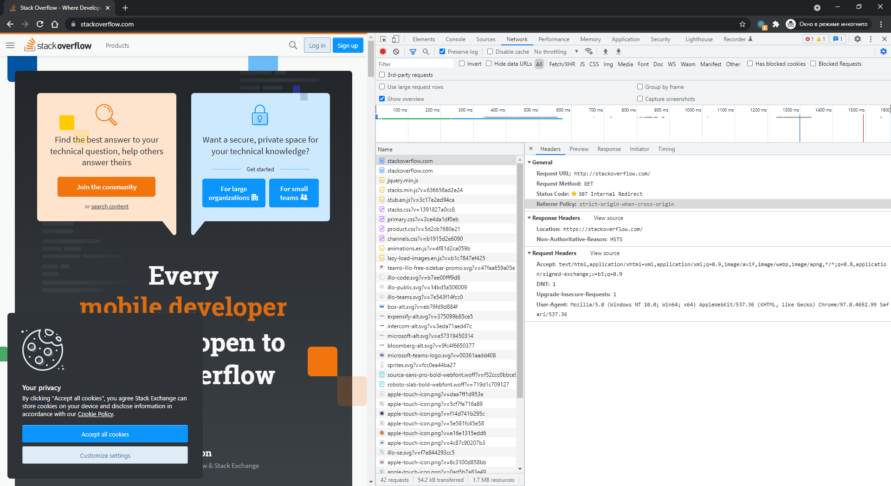

# Домашнее задание к занятию "3.6. Компьютерные сети, лекция 1"

1. Работа c HTTP через телнет.
- Подключитесь утилитой телнет к сайту stackoverflow.com
`telnet stackoverflow.com 80`
- отправьте HTTP запрос
    ```bash
    GET /questions HTTP/1.0
    HOST: stackoverflow.com
    [press enter]
    [press enter]
    ```
- В ответе укажите полученный HTTP код, что он означает?

    >### Код перенаправления "301 Moved Permanently" протокола передачи гипертекста (HTTP) показывает, что запрошенный ресурс был окончательно перемещён в URL, указанный в заголовке.
    ```
    user@pc0debian:~$ telnet stackoverflow.com 80
    Trying 151.101.193.69...
    Connected to stackoverflow.com.
    Escape character is '^]'.
    GET /questions HTTP/1.0
    HOST: stackoverflow.com

    HTTP/1.1 301 Moved Permanently
    cache-control: no-cache, no-store, must-revalidate
    location: https://stackoverflow.com/questions
    x-request-guid: 73194cd0-0c3e-40c0-bb29-49ee8d50eebc
    feature-policy: microphone 'none'; speaker 'none'
    content-security-policy: upgrade-insecure-requests; frame-ancestors 'self' https://stackexchange.com
    Accept-Ranges: bytes
    Date: Mon, 14 Feb 2022 10:47:07 GMT
    Via: 1.1 varnish
    Connection: close
    X-Served-By: cache-hhn4070-HHN
    X-Cache: MISS
    X-Cache-Hits: 0
    X-Timer: S1644835627.108458,VS0,VE156
    Vary: Fastly-SSL
    X-DNS-Prefetch-Control: off
    Set-Cookie: prov=82ed2cda-ff9d-03e5-c26a-e8b4b2d5834e; domain=.stackoverflow.com; expires=Fri, 01-Jan-2055 00:00:00 GMT; path=/; HttpOnly

    Connection closed by foreign host.
    ```
2. Повторите задание 1 в браузере, используя консоль разработчика F12.
- откройте вкладку `Network`
- отправьте запрос http://stackoverflow.com
- найдите первый ответ HTTP сервера, откройте вкладку `Headers`
- укажите в ответе полученный HTTP код.
- проверьте время загрузки страницы, какой запрос обрабатывался дольше всего?
- приложите скриншот консоли браузера в ответ.

    >### Полученный HTTP код 307. HTTP код перенаправления  307 Temporary Redirect означает, что запрошенный ресурс был временно перемещён в URL-адрес, указанный в заголовке
    >- дольше всего загружались картинки
    

3. Какой IP адрес у вас в интернете?

    >### Посмотри какой у нас белый IP адрес.
    ```bash
    user@pc0debian:~$ curl ifconfig.me
    178.176.100.100
    ```

4. Какому провайдеру принадлежит ваш IP адрес? Какой автономной системе AS? Воспользуйтесь утилитой `whois`

    >### Это мегафон
    ```bash
    user@pc0debian:~$ whois 178.176.100.100
    % This is the RIPE Database query service.
    % The objects are in RPSL format.
    %
    % The RIPE Database is subject to Terms and Conditions.
    % See http://www.ripe.net/db/support/db-terms-conditions.pdf

    % Note: this output has been filtered.
    %       To receive output for a database update, use the "-B" flag.

    % Information related to '178.176.96.0 - 178.176.127.255'

    % Abuse contact for '178.176.96.0 - 178.176.127.255' is 'abuse-mailbox@megafon.ru'

    inetnum:        178.176.96.0 - 178.176.127.255
    netname:        MF-GNOC-UF-20170721
    descr:          Urals Branch of PJSC MegaFon 178.176.96.0/19
    country:        RU
    admin-c:        MURA-RIPE
    tech-c:         MURA-RIPE
    status:         LIR-PARTITIONED PA
    mnt-by:         MEGAFON-RIPE-MNT
    mnt-lower:      MEGAFON-AUTO-MNT
    mnt-lower:      MF-UGSM-MNT
    mnt-routes:     MF-UGSM-MNT
    mnt-domains:    MF-UGSM-MNT
    mnt-domains:    MEGAFON-DNS-MNT
    created:        2017-07-21T07:03:30Z
    last-modified:  2019-12-20T07:40:07Z
    source:         RIPE # Filtered

    role:           Ural Branch Of OJSC MegaFon
    address:        RUSSIA,620078, Ekaterinburg, Malisheva str. 122
    nic-hdl:        MURA-RIPE
    mnt-by:         MF-UGSM-MNT
    mnt-by:         MEGAFON-RIPE-MNT
    mnt-by:         MEGAFON-WEST-MNT
    mnt-by:         MEGAFON-GNOC-MNT
    mnt-by:         COMLINE-MNT
    admin-c:        ZAV2011-RIPE
    admin-c:        AB31820-RIPE
    created:        2015-02-25T05:48:06Z
    last-modified:  2018-02-01T07:00:16Z
    source:         RIPE # Filtered

    % Information related to '178.176.100.0/24AS29648'

    route:          178.176.100.0/24
    origin:         AS29648
    mnt-by:         COMLINE-MNT
    mnt-by:         MF-UGSM-MNT
    created:        2018-12-06T12:24:04Z
    last-modified:  2018-12-06T12:24:04Z
    source:         RIPE

    % This query was served by the RIPE Database Query Service version 1.102.2 (HEREFORD)
    ```
5. Через какие сети проходит пакет, отправленный с вашего компьютера на адрес 8.8.8.8? Через какие AS? Воспользуйтесь утилитой `traceroute`

    >### Запускает `traceroute`
    ```bash
    user@debian:~$ traceroute 8.8.8.8
    traceroute to 8.8.8.8 (8.8.8.8), 30 hops max, 60 byte packets
    1  192.168.136.11 (192.168.136.11)  0.420 ms  0.517 ms  0.654 ms
    2  192.168.30.1 (192.168.30.1)  2.196 ms  2.205 ms  2.229 ms
    3  178.176.100.65 (178.176.100.65)  10.417 ms  10.426 ms  10.443 ms
    4  188.170.165.132 (188.170.165.132)  4.292 ms  4.313 ms  4.327 ms
    5  dns.google (8.8.8.8)  35.945 ms  35.897 ms  38.030 ms
    ```

6. Повторите задание 5 в утилите `mtr`. На каком участке наибольшая задержка - delay?

    >### Запустили `mtr`
    ```bash
    1. 192.168.136.11                                                                                                                                                     0.0%    19    0.5   0.5   0.4   0.6   0.0
    2. 192.168.30.1                                                                                                                                                       0.0%    19    0.6   0.7   0.6   0.9   0.1
    3. 178.176.100.65                                                                                                                                                     0.0%    19   17.7  11.2   2.2  20.7   6.1
    4. 188.170.165.132                                                                                                                                                    0.0%    19    2.4   3.7   2.0  10.2   2.2
    5. dns.google                                                                                                                                                         0.0%    18   36.7  36.7  36.5  36.9   0.1
    ```
7. Какие DNS сервера отвечают за доменное имя dns.google? Какие A записи? воспользуйтесь утилитой `dig`

    >### Это сервера `8.8.8.8` и `8.8.4.4`
    ```bash
    user@debian:~$ dig dns.google

    ; <<>> DiG 9.16.22-Debian <<>> dns.google
    ;; global options: +cmd
    ;; Got answer:
    ;; ->>HEADER<<- opcode: QUERY, status: NOERROR, id: 38515
    ;; flags: qr rd ra ad; QUERY: 1, ANSWER: 2, AUTHORITY: 0, ADDITIONAL: 1

    ;; OPT PSEUDOSECTION:
    ; EDNS: version: 0, flags:; udp: 1232
    ; COOKIE: 52d0e8ec9892906301000000620a38d7d565f4935419a39c (good)
    ;; QUESTION SECTION:
    ;dns.google.                    IN      A

    ;; ANSWER SECTION:
    dns.google.             617     IN      A       8.8.4.4
    dns.google.             617     IN      A       8.8.8.8

    ;; Query time: 47 msec
    ;; SERVER: 192.168.1.1#53(192.168.1.1)
    ;; WHEN: Mon Feb 14 15:11:19 +04 2022
    ;; MSG SIZE  rcvd: 99
    ```
8. Проверьте PTR записи для IP адресов из задания 7. Какое доменное имя привязано к IP? воспользуйтесь утилитой `dig`

    >### Доменное имя `dns.google` привязано к обоим ip-адресам

    ```bash
    user@debian:~$ dig -x 8.8.4.4

    ; <<>> DiG 9.16.22-Debian <<>> -x 8.8.4.4
    ;; global options: +cmd
    ;; Got answer:
    ;; ->>HEADER<<- opcode: QUERY, status: NOERROR, id: 59899
    ;; flags: qr rd ra; QUERY: 1, ANSWER: 1, AUTHORITY: 0, ADDITIONAL: 1

    ;; OPT PSEUDOSECTION:
    ; EDNS: version: 0, flags:; udp: 1232
    ; COOKIE: 35d488a13f1508bc01000000620a393f1100e11b99cf713b (good)
    ;; QUESTION SECTION:
    ;4.4.8.8.in-addr.arpa.          IN      PTR

    ;; ANSWER SECTION:
    4.4.8.8.in-addr.arpa.   46384   IN      PTR     dns.google.

    ;; Query time: 11 msec
    ;; SERVER: 192.168.1.1#53(192.168.1.1)
    ;; WHEN: Mon Feb 14 15:13:03 +04 2022
    ;; MSG SIZE  rcvd: 101


    user@debian:~$ dig -x 8.8.8.8

    ; <<>> DiG 9.16.22-Debian <<>> -x 8.8.8.8
    ;; global options: +cmd
    ;; Got answer:
    ;; ->>HEADER<<- opcode: QUERY, status: NOERROR, id: 55038
    ;; flags: qr rd ra; QUERY: 1, ANSWER: 1, AUTHORITY: 0, ADDITIONAL: 1

    ;; OPT PSEUDOSECTION:
    ; EDNS: version: 0, flags:; udp: 1232
    ; COOKIE: f373f286ed6ce7de01000000620a39471ec79e499ddecf5f (good)
    ;; QUESTION SECTION:
    ;8.8.8.8.in-addr.arpa.          IN      PTR

    ;; ANSWER SECTION:
    8.8.8.8.in-addr.arpa.   66637   IN      PTR     dns.google.

    ;; Query time: 0 msec
    ;; SERVER: 192.168.1.1#53(192.168.1.1)
    ;; WHEN: Mon Feb 14 15:13:11 +04 2022
    ;; MSG SIZE  rcvd: 101

    user@debian:~$
    ```
