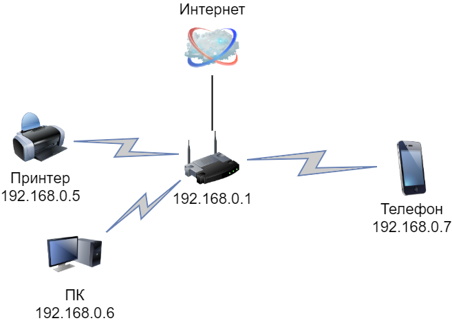

# Домашнее задание к занятию "3.8. Компьютерные сети, лекция 3"

1. Подключитесь к публичному маршрутизатору в интернет. Найдите маршрут к вашему публичному IP
```
telnet route-views.routeviews.org
Username: rviews
show ip route x.x.x.x/32
show bgp x.x.x.x/32
```

  >### Подключились и посмотрели
  ```
    route-views>sh ip route 178.176.100.100
    Routing entry for 178.176.100.0/24
    Known via "bgp 6447", distance 20, metric 0
    Tag 852, type external
    Last update from 154.11.12.212 18:26:32 ago
    Routing Descriptor Blocks:
    * 154.11.12.212, from 154.11.12.212, 18:26:32 ago
        Route metric is 0, traffic share count is 1
        AS Hops 3
        Route tag 852
        MPLS label: none
    route-views>sh bgp ipv4 unicast 178.176.100.100/24
    BGP routing table entry for 178.176.100.0/24, version 307707568
    Paths: (22 available, best #8, table default)
    Not advertised to any peer
    Refresh Epoch 1
    701 3356 31133 29648
        137.39.3.55 from 137.39.3.55 (137.39.3.55)
        Origin IGP, localpref 100, valid, external
        path 7FE09161EB10 RPKI State not found
        rx pathid: 0, tx pathid: 0
    Refresh Epoch 1
    3549 3356 31133 29648
        208.51.134.254 from 208.51.134.254 (67.16.168.191)
        Origin IGP, metric 0, localpref 100, valid, external
        Community: 3356:2 3356:22 3356:90 3356:123 3356:513 3356:903 3356:2084 3549:2581 3549:30840 31133:33 31133:166 31133:200 31133:1000 31133:1018
        path 7FE14C7929C8 RPKI State not found
        rx pathid: 0, tx pathid: 0
    Refresh Epoch 1
    53767 14315 6453 6453 3356 31133 29648
        162.251.163.2 from 162.251.163.2 (162.251.162.3)
        Origin IGP, localpref 100, valid, external
        Community: 14315:5000 53767:5000
        path 7FE0E9B96048 RPKI State not found
        rx pathid: 0, tx pathid: 0
    Refresh Epoch 1
    3356 31133 29648
        4.68.4.46 from 4.68.4.46 (4.69.184.201)
        Origin IGP, metric 0, localpref 100, valid, external
        Community: 3356:2 3356:22 3356:90 3356:123 3356:513 3356:903 3356:2084 31133:33 31133:166 31133:200 31133:1000 31133:1018
        path 7FE0006EA3F8 RPKI State not found
        rx pathid: 0, tx pathid: 0
  ``` 


2. Создайте dummy0 интерфейс в Ubuntu. Добавьте несколько статических маршрутов. Проверьте таблицу маршрутизации.
    >### Создадим dummy0-интерфейс:

    ```bash
    vagrant@vagrant:~$ sudo modprobe -v dummy
    vagrant@vagrant:~$ lsmod | grep dummy
    dummy                  16384  0
    vagrant@vagrant:~$ sudo ip link add dummy0 type dummy
    vagrant@vagrant:~$ sudo ip addr add 10.0.0.2/24 dev dummy0
    vagrant@vagrant:~$ sudo ip link set dummy0 up
    vagrant@vagrant:~$ ip address show
    ...
    4: dummy0: <BROADCAST,NOARP,UP,LOWER_UP> mtu 1500 qdisc noqueue state UNKNOWN group default qlen 1000
        link/ether 62:c3:79:fa:bd:57 brd ff:ff:ff:ff:ff:ff
        inet 10.0.0.2/24 scope global dummy0
        valid_lft forever preferred_lft forever
        inet6 fe80::60c3:79ff:fefa:bd57/64 scope link
        valid_lft forever preferred_lft forever
    ```
    >### Добавим маршруты и проверим таблицу маршрутизации:

    ```bash
    vagrant@vagrant:~$ ip route
    default via 10.0.2.2 dev eth0 proto dhcp src 10.0.2.15 metric 100
    10.0.0.0/24 dev dummy0 proto kernel scope link src 10.0.0.2
    10.0.2.0/24 dev eth0 proto kernel scope link src 10.0.2.15
    10.0.2.2 dev eth0 proto dhcp scope link src 10.0.2.15 metric 100

    vagrant@vagrant:~$ sudo ip route add 188.242.0.0/15 dev dummy0
    vagrant@vagrant:~$ ip route
    default via 10.0.2.2 dev eth0 proto dhcp src 10.0.2.15 metric 100
    10.0.0.0/24 dev dummy0 proto kernel scope link src 10.0.0.2
    10.0.2.0/24 dev eth0 proto kernel scope link src 10.0.2.15
    10.0.2.2 dev eth0 proto dhcp scope link src 10.0.2.15 metric 100
    188.242.0.0/15 dev dummy0 scope link
    ```


3. Проверьте открытые TCP порты в Ubuntu, какие протоколы и приложения используют эти порты? Приведите несколько примеров.

    >### Посмотрим прты TCP через `ss` и видим какие порты какие приложения используют, например  `ssh`  слушает 22 порт
    ```bash
    vagrant@vagrant:~$ sudo ss -tanp
    State              Recv-Q             Send-Q                         Local Address:Port                          Peer Address:Port            Process
    LISTEN             0                  4096                           127.0.0.53%lo:53                                 0.0.0.0:*                users:(("systemd-resolve",pid=587,fd=13))
    LISTEN             0                  128                                  0.0.0.0:22                                 0.0.0.0:*                users:(("sshd",pid=1081,fd=3))
    LISTEN             0                  4096                               127.0.0.1:8125                               0.0.0.0:*                users:(("netdata",pid=608,fd=36))
    LISTEN             0                  4096                                 0.0.0.0:19999                              0.0.0.0:*                users:(("netdata",pid=608,fd=4))
    ESTAB              0                  0                                  10.0.2.15:22                                10.0.2.2:3434             users:(("sshd",pid=2190,fd=4),("sshd",pid=2143,fd=4))
    LISTEN             0                  4096                                       *:9100                                     *:*                users:(("node_exporter",pid=612,fd=3))
    LISTEN             0                  128                                     [::]:22                                    [::]:*                users:(("sshd",pid=1081,fd=4))                           [::]:*
    ```

4. Проверьте используемые UDP сокеты в Ubuntu, какие протоколы и приложения используют эти порты?
    >### Посмотрим прты UDP через `ss` и видим какие порты какие приложения используют, например  `netdata`  слушает 8125 порт
    ```bash
    vagrant@vagrant:~$ sudo ss -uanp
    State               Recv-Q              Send-Q                             Local Address:Port                             Peer Address:Port              Process
    UNCONN              0                   0                                  127.0.0.53%lo:53                                    0.0.0.0:*                  users:(("systemd-resolve",pid=587,fd=12))
    UNCONN              0                   0                                 10.0.2.15%eth0:68                                    0.0.0.0:*                  users:(("systemd-network",pid=584,fd=19))
    UNCONN              0                   0                                      127.0.0.1:8125                                  0.0.0.0:*                  users:(("netdata",pid=608,fd=15))
    ```
5. Используя diagrams.net, создайте L3 диаграмму вашей домашней сети или любой другой сети, с которой вы работали. 
    >### Дома все просто вот [схема](img/scheme.drawio)
    