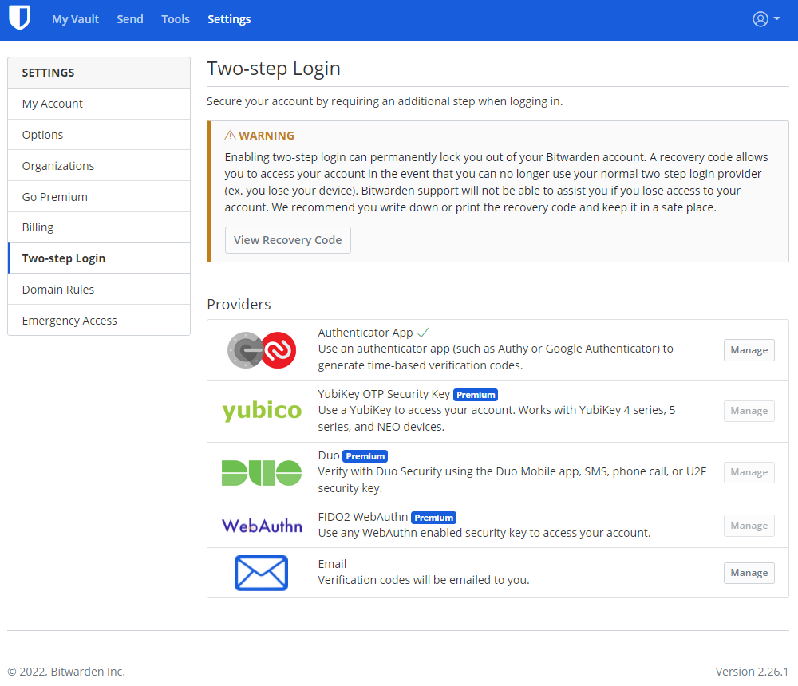

# Домашнее задание к занятию "3.9. Элементы безопасности информационных систем"

1. Установите Bitwarden плагин для браузера. Зарегестрируйтесь и сохраните несколько паролей.

    >### Установил и зарегистрировался, добавил пару записей
    
    >### Плагин в браузере выглядит так
    

2. Установите Google authenticator на мобильный телефон. Настройте вход в Bitwarden акаунт через Google authenticator OTP.

    >### Установил и включил, скрин на телефоне сделать не удалось `Google authenticator` защищаестя, поэтому скрин с ПК с галочкой что включена двухфакторная аутентификация.

    

3. Установите apache2, сгенерируйте самоподписанный сертификат, настройте тестовый сайт для работы по HTTPS.

    >### Установил `apache2` и `openssl`.

    ```bash
    vagrant@vagrant:~$ sudo apt install apache2 openssl
    ```

    >### Сгенерировали и установили самоподписанный корневой сертификат.

    ```bash
    vagrant@vagrant:~$ openssl genrsa -out rootCA.key 2048
    vagrant@vagrant:~$ openssl req -x509 -new -nodes -key rootCA.key -sha256 -days 1024 -out rootCA.pem
    ```

    


    >### Создали сертификат для сайта.

    ```bash
    vagrant@vagrant:~$ openssl req -new -newkey rsa:2048 -sha256 -nodes -key device.key -subj "/C=CA/ST=None/L=NB/O=None/CN=test.test" -out device.csr
    vagrant@vagrant:~$ openssl x509 -req -in device.csr -CA rootCA.pem -CAkey rootCA.key -CAcreateserial -out device.crt -days 999 -sha256 -extfile ./v3.ext
    ```

    

    >### Создали тестовый сайт.

    ```html
    vagrant@vagrant:~$ cat /var/www/test/index.htm
    <html>
        <head>
            <title>03-sysadmin-09-security</title>
        </head>
        <body>
            <h1>This is <b>03-sysadmin-09-security lesson's</b> test page</h1>
        </body>
    </html>
    ```
    ```bash
    vagrant@vagrant:~$ cat /etc/apache2/sites-available/test.conf 
    <VirtualHost *:443>
    ServerName test.test
    DocumentRoot /var/www/test

    SSLEngine on
    SSLCertificateFile /etc/ssl/certs/device.crt
    SSLCertificateKeyFile /etc/ssl/private/device.key
    </VirtualHost>
    ```
    >### Проверяем работу в браузере.

    

4. Проверьте на TLS уязвимости произвольный сайт в интернете (кроме сайтов МВД, ФСБ, МинОбр, НацБанк, РосКосмос, РосАтом, РосНАНО и любых госкомпаний, объектов КИИ, ВПК ... и тому подобное).

    >### Запустили проверку `https://www.apple.com` в отчете увидели сообщение о возможных потенциальных уязвимостях `BREACH (CVE-2013-3587)` и ` LUCKY13 (CVE-2013-0169)`.

    ```bash
    root@vagrant:/vagrant/testssl/testssl.sh# ./testssl.sh -U --sneaky https://www.apple.com/

    ###########################################################
        testssl.sh       3.1dev from https://testssl.sh/dev/
        (54e5469 2022-04-14 13:19:24 -- )

        This program is free software. Distribution and
                modification under GPLv2 permitted.
        USAGE w/o ANY WARRANTY. USE IT AT YOUR OWN RISK!

        Please file bugs @ https://testssl.sh/bugs/

    ###########################################################

    Using "OpenSSL 1.0.2-chacha (1.0.2k-dev)" [~183 ciphers]
    on vagrant:./bin/openssl.Linux.x86_64
    (built: "Jan 18 17:12:17 2019", platform: "linux-x86_64")


    Start 2022-04-15 13:29:54        -->> 92.122.109.22:443 (www.apple.com) <<--

    Further IP addresses:   2a02:2d8:3:98c::1aca 2a02:2d8:3:9a4::1aca
    rDNS (92.122.109.22):   a92-122-109-22.deploy.static.akamaitechnologies.com.
    Service detected:       HTTP


    Testing vulnerabilities

    Heartbleed (CVE-2014-0160)                not vulnerable (OK), no heartbeat extension
    CCS (CVE-2014-0224)                       not vulnerable (OK)
    Ticketbleed (CVE-2016-9244), experiment.  not vulnerable (OK)
    ROBOT                                     not vulnerable (OK)
    Secure Renegotiation (RFC 5746)           supported (OK)
    Secure Client-Initiated Renegotiation     not vulnerable (OK)
    CRIME, TLS (CVE-2012-4929)                not vulnerable (OK)
    BREACH (CVE-2013-3587)                    potentially NOT ok, "gzip" HTTP compression detected. - only supplied "/" tested
                                            Can be ignored for static pages or if no secrets in the page
    POODLE, SSL (CVE-2014-3566)               not vulnerable (OK)
    TLS_FALLBACK_SCSV (RFC 7507)              Downgrade attack prevention supported (OK)
    SWEET32 (CVE-2016-2183, CVE-2016-6329)    not vulnerable (OK)
    FREAK (CVE-2015-0204)                     not vulnerable (OK)
    DROWN (CVE-2016-0800, CVE-2016-0703)      not vulnerable on this host and port (OK)
                                            make sure you don't use this certificate elsewhere with SSLv2 enabled services
                                            https://censys.io/ipv4?q=A5F17AFA5F0B3D7AD316BE87550327BC17B8F176CC83E81BD3D3FDB0E1DE3DA4 could help you to find out
    LOGJAM (CVE-2015-4000), experimental      not vulnerable (OK): no DH EXPORT ciphers, no DH key detected with <= TLS 1.2
    BEAST (CVE-2011-3389)                     TLS1: ECDHE-RSA-AES256-SHA ECDHE-RSA-AES128-SHA AES256-SHA AES128-SHA
                                            VULNERABLE -- but also supports higher protocols  TLSv1.1 TLSv1.2 (likely mitigated)
    LUCKY13 (CVE-2013-0169), experimental     potentially VULNERABLE, uses cipher block chaining (CBC) ciphers with TLS. Check patches
    Winshock (CVE-2014-6321), experimental    not vulnerable (OK)
    RC4 (CVE-2013-2566, CVE-2015-2808)        no RC4 ciphers detected (OK)


    Done 2022-04-15 13:30:55 [  68s] -->> 92.122.109.22:443 (www.apple.com) <<--


    root@vagrant:/vagrant/testssl/testssl.sh#
    ```
5. Установите на Ubuntu ssh сервер, сгенерируйте новый приватный ключ. Скопируйте свой публичный ключ на другой сервер. Подключитесь к серверу по SSH-ключу.
 
    >### Установили `ssh`:

    ```bash
    user@vagrant:~$ sudo apt install openssh-server
    user@vagrant:~$ sudo systemctl enable ssh
    ```

    >### Сгенерировали новый ключ
    
    ```bash
    user@vagrant:~$ ssh-keygen
    Generating public/private rsa key pair.
    Enter file in which to save the key (/home/user/.ssh/id_rsa):
    Created directory '/home/user/.ssh'.
    Enter passphrase (empty for no passphrase):
    Enter same passphrase again:
    Your identification has been saved in /home/user/.ssh/id_rsa
    Your public key has been saved in /home/user/.ssh/id_rsa.pub
    The key fingerprint is:
    SHA256:W+PGlfmJAxhwse43UYcZaXbmXXzTIETH24BAj76g0x4 user@vagrant
    The key's randomart image is:
    +---[RSA 3072]----+
    |      . ooo+=+oo.|
    |       o . o=*=.=|
    |        o .o=+.=+|
    |       . + . +o o|
    |        S * +    |
    |       + * * o . |
    |      o E B o o  |
    |       o + . .   |
    |        .        |
    +----[SHA256]-----+
    ```

    >### Скопировали на машину наш ключ

    ```bash
    user@vagrant:~$ ssh-copy-id user@localhost
    /usr/bin/ssh-copy-id: INFO: Source of key(s) to be installed: "/home/user/.ssh/id_rsa.pub"
    The authenticity of host 'localhost (127.0.0.1)' can't be established.
    ECDSA key fingerprint is SHA256:RztZ38lZsUpiN3mQrXHa6qtsUgsttBXWJibL2nAiwdQ.
    Are you sure you want to continue connecting (yes/no/[fingerprint])? yes
    /usr/bin/ssh-copy-id: INFO: attempting to log in with the new key(s), to filter out any that are already installed
    /usr/bin/ssh-copy-id: INFO: 1 key(s) remain to be installed -- if you are prompted now it is to install the new keys
    user@localhost's password:

    Number of key(s) added: 1

    Now try logging into the machine, with:   "ssh 'user@localhost'"
    and check to make sure that only the key(s) you wanted were added.
    ```

    >### Подключились по ключу без пароля

    ```
    user@vagrant:~$ ssh user@localhost
    Welcome to Ubuntu 20.04.3 LTS (GNU/Linux 5.4.0-91-generic x86_64)

    * Documentation:  https://help.ubuntu.com
    * Management:     https://landscape.canonical.com
    * Support:        https://ubuntu.com/advantage

    System information as of Fri 15 Apr 2022 02:02:09 PM UTC

    System load:  0.21               Processes:             122
    Usage of /:   12.8% of 30.88GB   Users logged in:       1
    Memory usage: 22%                IPv4 address for eth0: 10.0.2.15
    Swap usage:   0%


    This system is built by the Bento project by Chef Software
    More information can be found at https://github.com/chef/bento
    $
    ```

6. Переименуйте файлы ключей из задания 5. Настройте файл конфигурации SSH клиента, так чтобы вход на удаленный сервер осуществлялся по имени сервера.

     >### Создали файл конфигурации SSH клиента 

    ```bash
    user@vagrant:~/.ssh$ cat ./config
    Host vagrant
            HostName localhost
            IdentityFile ~/.ssh/id_rsa
            User user
    ```

    >### Подключились по имени
    
    ```
    user@vagrant:~/.ssh$ ssh vagrant
    Welcome to Ubuntu 20.04.3 LTS (GNU/Linux 5.4.0-91-generic x86_64)

    * Documentation:  https://help.ubuntu.com
    * Management:     https://landscape.canonical.com
    * Support:        https://ubuntu.com/advantage

    System information as of Fri 15 Apr 2022 02:14:40 PM UTC

    System load:  0.0                Processes:             121
    Usage of /:   12.8% of 30.88GB   Users logged in:       1
    Memory usage: 22%                IPv4 address for eth0: 10.0.2.15
    Swap usage:   0%


    This system is built by the Bento project by Chef Software
    More information can be found at https://github.com/chef/bento
    Last login: Fri Apr 15 14:02:10 2022 from 127.0.0.1
    user@vagrant:~$
    ```

7. Соберите дамп трафика утилитой tcpdump в формате pcap, 100 пакетов. Откройте файл pcap в Wireshark.

    >### Соберём трафик в файл

    ```bash
    vagrant@vagrant:~$ sudo tcpdump -w /vagrant/traffic.pcap -c 100
    tcpdump: listening on eth0, link-type EN10MB (Ethernet), capture size 262144 bytes
    100 packets captured
    122 packets received by filter
    0 packets dropped by kernel
    vagrant@vagrant:~$
    ```

    >### Откроем файл в `wireshark` трафик:

    
