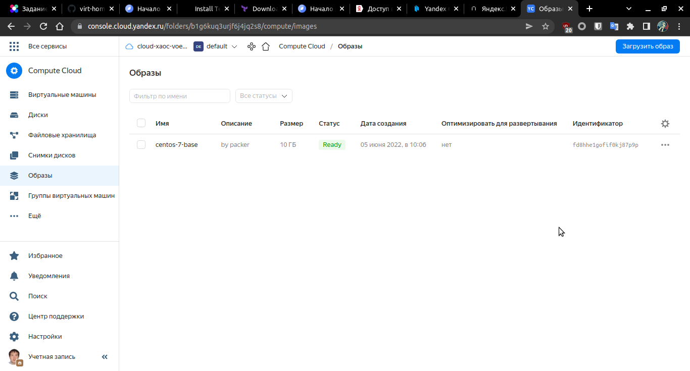
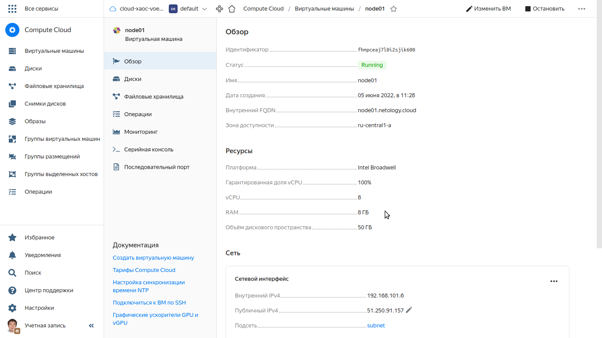
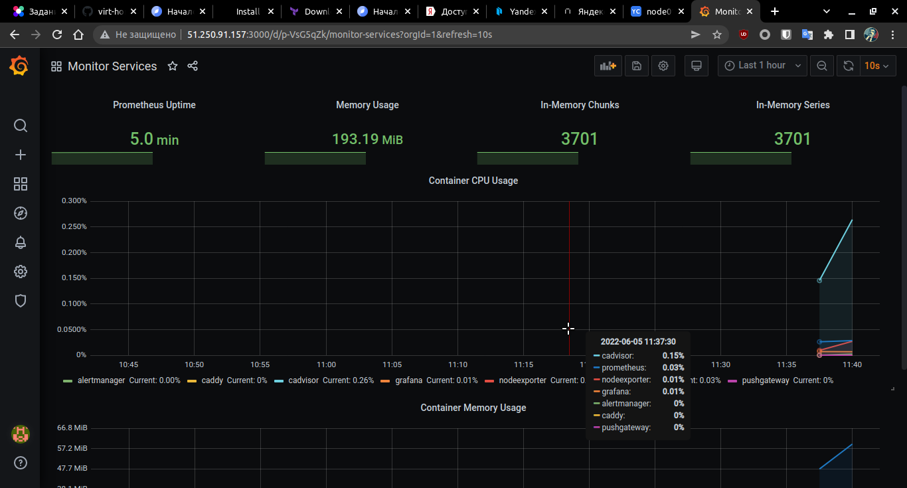

# Домашнее задание к занятию "5.4. Оркестрация группой Docker контейнеров на примере Docker Compose"

## Задача 1

Создать собственный образ операционной системы с помощью Packer.

Для получения зачета, вам необходимо предоставить:
- Скриншот страницы, как на слайде из презентации (слайд 37).

>## Ответ 
> Скачали и установили `packer`
```bash
user@user-Aspire-5750G:~/virt-homeworks$ curl -fsSL https://apt.releases.hashicorp.com/gpg | sudo apt-key add -
OK
user@user-Aspire-5750G:~/virt-homeworks$ sudo apt-add-repository "deb [arch=amd64] https://apt.releases.hashicorp.com $(lsb_release -cs) main"
user@user-Aspire-5750G:~/virt-homeworks$ sudo apt update && sudo apt install packer
...
user@user-Aspire-5750G:~/virt-homeworks$ packer --version
1.8.1
```
> Установили `yc`
```bash
user@user-Aspire-5750G:~/virt-homeworks$ curl -sSL https://storage.yandexcloud.net/yandexcloud-yc/install.sh | bash

user@user-Aspire-5750G:~/netology-dvpspdc3/05-virt-04-docker-compose$ yc --version
Yandex Cloud CLI 0.91.0 linux/amd64

```
>Инициализируем профиль, сеть и подсеть:
```bash
user@user-Aspire-5750G:~/netology-dvpspdc3/05-virt-04-docker-compose$ yc init
Welcome! This command will take you through the configuration process.
Please go to https://oauth.yandex.ru/authorize?response_type=token&client_id=1a6990aa636648e9b2ef855fa7bec2fb in order to obtain OAuth token.

Please enter OAuth token: ***-Kw
You have one cloud available: 'cloud-xaoc-voevodin' (id = b1gsb5e2dh80gh2m64v3). It is going to be used by default.
Please choose folder to use:
 [1] default (id = b1g6kuq3urjf6j4jq2s8)
 [2] Create a new folder
Please enter your numeric choice: 1
Your current folder has been set to 'default' (id = b1g6kuq3urjf6j4jq2s8).
Do you want to configure a default Compute zone? [Y/n] y
Which zone do you want to use as a profile default?
 [1] ru-central1-a
 [2] ru-central1-b
 [3] ru-central1-c
 [4] Dont set default zone
Please enter your numeric choice: 1
Your profile default Compute zone has been set to 'ru-central1-a'.

user@user-Aspire-5750G:~/netology-dvpspdc3/05-virt-04-docker-compose$ yc config list
token: ***-Kw
cloud-id: b1gsb5e2dh80gh2m64v3
folder-id: b1g6kuq3urjf6j4jq2s8
compute-default-zone: ru-central1-a

user@user-Aspire-5750G:~/netology-dvpspdc3/05-virt-04-docker-compose$ yc vpc network create --name net --labels my-label=netology --description "my first network via yc"
id: enpfnjhi88u1nkpqhecs
folder_id: b1g6kuq3urjf6j4jq2s8
created_at: "2022-06-05T06:00:20Z"
name: net
description: my first network via yc
labels:
  my-label: netology

user@user-Aspire-5750G:~/netology-dvpspdc3/05-virt-04-docker-compose$ yc vpc subnet create --name my-subnet-a --zone ru-central1-a --range 10.1.2.0/24 --network-name net --description "my first subnet via yc"
id: e9bv23aqv2jpodh30l4k
folder_id: b1g6kuq3urjf6j4jq2s8
created_at: "2022-06-05T06:00:41Z"
name: my-subnet-a
description: my first subnet via yc
network_id: enpfnjhi88u1nkpqhecs
zone_id: ru-central1-a
v4_cidr_blocks:
- 10.1.2.0/24

```
>Настроим конфигурационный файл [centos-7-base.json](packer/centos-7-base.json) и запустим образ:

```bash
user@user-Aspire-5750G:~/netology-dvpspdc3/05-virt-04-docker-compose$ packer build ./src/packer/centos-7-base.json
...
Build 'yandex' finished after 2 minutes 15 seconds.

==> Wait completed after 2 minutes 15 seconds

==> Builds finished. The artifacts of successful builds are:
--> yandex: A disk image was created: centos-7-base (id: fd8hhe1gofif0kj87p9p) with family name centos

user@user-Aspire-5750G:~/netology-dvpspdc3/05-virt-04-docker-compose$ yc compute image list
+----------------------+---------------+--------+----------------------+--------+
|          ID          |     NAME      | FAMILY |     PRODUCT IDS      | STATUS |
+----------------------+---------------+--------+----------------------+--------+
| fd8hhe1gofif0kj87p9p | centos-7-base | centos | f2e6pmk175tq39ma7vhb | READY  |
+----------------------+---------------+--------+----------------------+--------+
```
> Скрин на странице 
 

## Задача 2

Создать вашу первую виртуальную машину в Яндекс.Облаке.

Для получения зачета, вам необходимо предоставить:
- Скриншот страницы свойств созданной ВМ, как на примере ниже:

<p align="center">
  
</p>

># Ответ

> Установили терраформ
```bash
user@user-Aspire-5750G:~/virt-homeworks$ sudo apt-get update && sudo apt-get install terraform

user@user-Aspire-5750G:~/virt-homeworks$ terraform --version
Terraform v1.2.2
on linux_amd64

```

>В интерфейсе Яндекс Облака создадим сервисный аккаунт `srv-test`. Для этого аккаунта создадим ключ авторизации:
```bash
user@user-Aspire-5750G:~/netology-dvpspdc3/05-virt-04-docker-compose/src/terraform$ yc iam key create --folder-name default --service-account-name srv-test --output key.json
id: aje7p2van7m3c2nq2ev1
service_account_id: ajet73bha7o2i98i6mmi
created_at: "2022-06-05T11:07:12.986093854Z"
key_algorithm: RSA_2048
```

>Создадим новый профиль `create srv-test` и установим для него созданный ключ активации ([key.json](src/terraform/key.json)): 
```bash
user@user-Aspire-5750G:~/netology-dvpspdc3/05-virt-04-docker-compose/src/terraform$ yc config profile create srv-test

user@user-Aspire-5750G:~/netology-dvpspdc3/05-virt-04-docker-compose/src/terraform$ yc config profile list
default ACTIVE
srv-test
user@user-Aspire-5750G:~/netology-dvpspdc3/05-virt-04-docker-compose/src/terraform$ yc config profile activate srv-test
Profile 'srv-test' activated
user@user-Aspire-5750G:~/netology-dvpspdc3/05-virt-04-docker-compose/src/terraform$ yc config set service-account-key key.json
```
>Инициализируем `terraform`:
```bash
user@user-Aspire-5750G:~/netology-dvpspdc3/05-virt-04-docker-compose/src/terraform$ terraform init

Initializing the backend...

Initializing provider plugins...
- Reusing previous version of yandex-cloud/yandex from the dependency lock file
- Using previously-installed yandex-cloud/yandex v0.75.0

Terraform has been successfully initialized!

```
>После проверки плана `terraform plan` применим его:
```bash
user@user-Aspire-5750G:~/netology-dvpspdc3/05-virt-04-docker-compose/src/terraform$ terraform apply -auto-approve
...
Apply complete! Resources: 3 added, 0 changed, 0 destroyed.

Outputs:

external_ip_address_node01_yandex_cloud = "51.250.91.157"
internal_ip_address_node01_yandex_cloud = "192.168.101.6"
```

> Скрин на странице 
 

---

## Задача 3

Создать ваш первый готовый к боевой эксплуатации компонент мониторинга, состоящий из стека микросервисов.

Для получения зачета, вам необходимо предоставить:
- Скриншот работающего веб-интерфейса Grafana с текущими метриками, как на примере ниже
<p align="center">
  
</p>

># Ответ
>Правим [inventory](./src/ansible/inventory)

```yml
[nodes:children]
manager

[manager]
node01.netology.cloud ansible_host=51.250.91.157
```

>Запускаем `ansible-playbook`
```bash
user@user-Aspire-5750G:~/netology-dvpspdc3/05-virt-04-docker-compose/src/ansible$ ansible-playbook provision.yml
...
PLAY RECAP *********************************************************************
node01.netology.cloud      : ok=12   changed=10   unreachable=0    failed=0    skipped=0    rescued=0    ignored=0  

```

>После выполнения всех задач проверим микросервис Grafana на 3000 порте
> Скрин на странице 
 

>Удаляем все ресурсы командой `terraform destroy -auto-approve`
```bash
user@user-Aspire-5750G:~/netology-dvpspdc3/05-virt-04-docker-compose/src/terraform$ terraform destroy -auto-approve
yandex_vpc_network.default: Refreshing state... [id=enp0vldsn40vd0negoj8]
yandex_vpc_subnet.default: Refreshing state... [id=e9b01mf0jrdg8n2uqvo1]
yandex_compute_instance.node01: Refreshing state... [id=fhmpceaj7l0i2sjik600]
...
Plan: 0 to add, 0 to change, 3 to destroy.

Changes to Outputs:
  - external_ip_address_node01_yandex_cloud = "51.250.91.157" -> null
  - internal_ip_address_node01_yandex_cloud = "192.168.101.6" -> null
yandex_compute_instance.node01: Destroying... [id=fhmpceaj7l0i2sjik600]
yandex_compute_instance.node01: Still destroying... [id=fhmpceaj7l0i2sjik600, 10s elapsed]
yandex_compute_instance.node01: Destruction complete after 14s
yandex_vpc_subnet.default: Destroying... [id=e9b01mf0jrdg8n2uqvo1]
yandex_vpc_subnet.default: Destruction complete after 3s
yandex_vpc_network.default: Destroying... [id=enp0vldsn40vd0negoj8]
yandex_vpc_network.default: Destruction complete after 0s

Destroy complete! Resources: 3 destroyed.

```