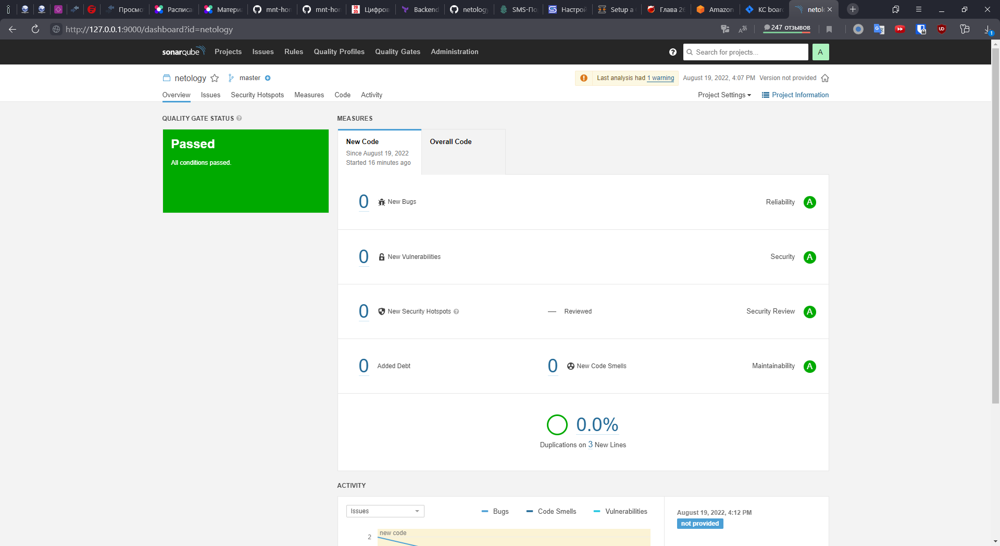

# Домашнее задание к занятию "09.02 CI\CD"

## Знакомоство с SonarQube

### Подготовка к выполнению

1. Выполняем `docker pull sonarqube:8.7-community`
2. Выполняем `docker run -d --name sonarqube -e SONAR_ES_BOOTSTRAP_CHECKS_DISABLE=true -p 9000:9000 sonarqube:8.7-community`
3. Ждём запуск, смотрим логи через `docker logs -f sonarqube`
4. Проверяем готовность сервиса через [браузер](http://localhost:9000)
5. Заходим под admin\admin, меняем пароль на свой

В целом, в [этой статье](https://docs.sonarqube.org/latest/setup/install-server/) описаны все варианты установки, включая и docker, но так как нам он нужен разово, то достаточно того набора действий, который я указал выше.

>### Подготовились к выполнению
```bash
user@user-Aspire-5750G:~$ docker pull sonarqube:8.7-community
8.7-community: Pulling from library/sonarqube
22599d3e9e25: Pull complete
00bb4d95f2aa: Pull complete
3ef8cf8a60c8: Pull complete
928990dd1bda: Pull complete
07cca701c22e: Pull complete
Digest: sha256:70496f44067bea15514f0a275ee898a7e4a3fedaaa6766e7874d24a39be336dc
Status: Downloaded newer image for sonarqube:8.7-community
docker.io/library/sonarqube:8.7-community
user@user-Aspire-5750G:~$ docker run -d --name sonarqube -e SONAR_ES_BOOTSTRAP_CHECKS_DISABLE=true -p 9000:9000 sonarqube:8.7-community
554dca1db1315cbedd4baa645faa0701e61e1d9290e0884ba7fe619984cc9e27
user@user-Aspire-5750G:~$ docker logs -f sonarqube
```

### Основная часть

1. Создаём новый проект, название произвольное
2. Скачиваем пакет sonar-scanner, который нам предлагает скачать сам sonarqube
3. Делаем так, чтобы binary был доступен через вызов в shell (или меняем переменную PATH или любой другой удобный вам способ)
4. Проверяем `sonar-scanner --version`
5. Запускаем анализатор против кода из директории [example](./example) с дополнительным ключом `-Dsonar.coverage.exclusions=fail.py`
6. Смотрим результат в интерфейсе
7. Исправляем ошибки, которые он выявил(включая warnings)
8. Запускаем анализатор повторно - проверяем, что QG пройдены успешно
9. Делаем скриншот успешного прохождения анализа, прикладываем к решению ДЗ

>#### Ответ

>1. Создаём проект под названием `netology`.
>2. Скачиваем [SonarScanner](https://binaries.sonarsource.com/Distribution/sonar-scanner-cli/sonar-scanner-cli-4.7.0.2747-linux.zip).
```bash
user@user-Aspire-5750G:~/Загрузки$ wget https://binaries.sonarsource.com/Distribution/sonar-scanner-cli/sonar-scanner-cli-4.7.0.2747-linux.zip
--2022-08-19 15:58:57--  https://binaries.sonarsource.com/Distribution/sonar-scanner-cli/sonar-scanner-cli-4.7.0.2747-linux.zip
Распознаётся binaries.sonarsource.com (binaries.sonarsource.com)… 108.157.214.10, 108.157.214.83, 108.157.214.96, ...
Подключение к binaries.sonarsource.com (binaries.sonarsource.com)|108.157.214.10|:443... соединение установлено.
HTTP-запрос отправлен. Ожидание ответа… 200 OK
Длина: 43162003 (41M) [application/zip]
Сохранение в: «sonar-scanner-cli-4.7.0.2747-linux.zip»

sonar-scanner-cli-4.7.0.2747-linux.zip               100%[===================================================================================================================>]  41,16M  1,02MB/s    за 40s

2022-08-19 15:59:38 (1,02 MB/s) - «sonar-scanner-cli-4.7.0.2747-linux.zip» сохранён [43162003/43162003]
```

>3. Добавим бинарный файл в переменную `PATH`:

```shell
user@user-Aspire-5750G:~/sonar-scanner-4.7.0.2747-linux/bin$ export PATH=$(pwd):$PATH
```

4. Проверяем `sonar-scanner --version`:

```shell
user@user-Aspire-5750G:~/netology-dvpspdc3/09-ci-02-cicd/example$ sonar-scanner --version
INFO: Scanner configuration file: /home/user/sonar-scanner-4.7.0.2747-linux/conf/sonar-scanner.properties
INFO: Project root configuration file: NONE
INFO: SonarScanner 4.7.0.2747
INFO: Java 11.0.14.1 Eclipse Adoptium (64-bit)
INFO: Linux 5.4.0-120-generic amd64
```

5. Запускаем анализатор для файла [fail.py](example/fail.py):

```shell
user@user-Aspire-5750G:~/netology-dvpspdc3/09-ci-02-cicd/example$ sonar-scanner   -Dsonar.projectKey=netology   -Dsonar.sources=.   -Dsonar.host.url=http://localhost:9000   -Dsonar.login=f02f2f94fc5f0e8b2306888cae0eb0700140f06c    -Dsonar.coverage.exclusions=fail.py
```

6. Смотрим результат в интерфейсе:


7. Исправляем ошибки, запускаем анализатор и проверяем, результат в интерфейсе:




## Знакомство с Nexus

### Подготовка к выполнению

1. Выполняем `docker pull sonatype/nexus3`
2. Выполняем `docker run -d -p 8081:8081 --name nexus sonatype/nexus3`
3. Ждём запуск, смотрим логи через `docker logs -f nexus`
4. Проверяем готовность сервиса через [бразуер](http://localhost:8081)
5. Узнаём пароль от admin через `docker exec -it nexus /bin/bash`
6. Подключаемся под админом, меняем пароль, сохраняем анонимный доступ

>### Подготовились к выполнению
```bash
user@user-Aspire-5750G:~$ docker pull sonatype/nexus3
Using default tag: latest
latest: Pulling from sonatype/nexus3
0c673eb68f88: Pull complete
028bdc977650: Pull complete
887448ad6f44: Pull complete
70daa52d5897: Pull complete
Digest: sha256:d0f242d00a2f93f1bdf4e30cb2c0d1be03217f792db5af17727871bae04783da
Status: Downloaded newer image for sonatype/nexus3:latest
docker.io/sonatype/nexus3:latest
user@user-Aspire-5750G:~$ docker run -d -p 8081:8081 --name nexus sonatype/nexus3
fd9f5927e85d2a221960bf2a37683bac46f0c8ff3322e457e04c56ae79f98901
user@user-Aspire-5750G:~$ docker logs -f nexus
```

### Основная часть

1. В репозиторий `maven-public` загружаем артефакт с GAV параметрами:
   1. groupId: netology
   2. artifactId: java
   3. version: 8_282
   4. classifier: distrib
   5. type: tar.gz
2. В него же загружаем такой же артефакт, но с version: 8_102
3. Проверяем, что все файлы загрузились успешно
4. В ответе присылаем файл `maven-metadata.xml` для этого артефекта

>#### Ответ


Создаём файлы. В результате получаем директорию:


Так же можно ознакомиться с [XML-файлом](nexus/maven-metadata.xml).


### Знакомство с Maven

### Подготовка к выполнению

1. Скачиваем дистрибутив с [maven](https://maven.apache.org/download.cgi)
2. Разархивируем, делаем так, чтобы binary был доступен через вызов в shell (или меняем переменную PATH или любой другой удобный вам способ)
3. Проверяем `mvn --version`
4. Забираем директорию [mvn](./mvn) с pom

### Основная часть

1. Меняем в `pom.xml` блок с зависимостями под наш артефакт из первого пункта задания для Nexus (java с версией 8_282)
2. Запускаем команду `mvn package` в директории с `pom.xml`, ожидаем успешного окончания
3. Проверяем директорию `~/.m2/repository/`, находим наш артефакт
4. В ответе присылаем исправленный файл `pom.xml`

>#### Ответ

>1. Скачиваем дистрибутив по [ссылке](https://dlcdn.apache.org/maven/maven-3/3.8.6/binaries/apache-maven-3.8.6-bin.tar.gz). 
>2. Распаковываем и прописывает путь в `$PATH`:
>3. Проверяем `mvn --version`:
```bash
user@user-Aspire-5750G:~$ wget https://dlcdn.apache.org/maven/maven-3/3.8.6/binaries/apache-maven-3.8.6-bin.tar.gz
--2022-08-19 18:57:09--  https://dlcdn.apache.org/maven/maven-3/3.8.6/binaries/apache-maven-3.8.6-bin.tar.gz
Распознаётся dlcdn.apache.org (dlcdn.apache.org)… 151.101.2.132, 2a04:4e42::644
Подключение к dlcdn.apache.org (dlcdn.apache.org)|151.101.2.132|:443... соединение установлено.
HTTP-запрос отправлен. Ожидание ответа… 200 OK
Длина: 8676320 (8,3M) [application/x-gzip]
Сохранение в: «apache-maven-3.8.6-bin.tar.gz»

apache-maven-3.8.6-bin.tar.gz             100%[====================================================================================>]   8,27M  1,64MB/s    за 5,1s    

2022-08-19 18:57:14 (1,63 MB/s) - «apache-maven-3.8.6-bin.tar.gz» сохранён [8676320/8676320]

user@user-Aspire-5750G:~/apache-maven-3.8.6/bin$ export PATH=$(pwd):$PATH

user@user-Aspire-5750G:~/apache-maven-3.8.6/bin$ mvn --version
Apache Maven 3.8.6 (84538c9988a25aec085021c365c560670ad80f63)
Maven home: /home/user/apache-maven-3.8.6
Java version: 11.0.16, vendor: Ubuntu, runtime: /usr/lib/jvm/java-11-openjdk-amd64
Default locale: ru_RU, platform encoding: UTF-8
OS name: "linux", version: "5.4.0-120-generic", arch: "amd64", family: "unix"
```

>1. После редактирования файла [pom.xml](mvn/pom.xml) запускаем `mvn package`:
Исправленный [XML-файл](mvn/pom.xml).
```bash
user@user-Aspire-5750G:~/netology-dvpspdc3/09-ci-02-cicd/mvn$ mvn package
[INFO] Scanning for projects...
[INFO] 
[INFO] ---------------------------< netology:java >----------------------------
[INFO] Building java 8_282
[INFO] --------------------------------[ jar ]---------------------------------
Downloading from central: https://repo.maven.apache.org/maven2/org/apache/maven/plugins/maven-resources-plugin/2.6/maven-resources-plugin-2.6.pom
Downloaded from central: https://repo.maven.apache.org/maven2/org/apache/maven/plugins/maven-resources-plugin/2.6/maven-resources-plugin-2.6.pom (8.1 kB at 6.0 kB/s)
Downloading from central: https://repo.maven.apache.org/maven2/org/apache/maven/plugins/maven-plugins/23/maven-plugins-23.pom
Downloaded from central: https://repo.maven.apache.org/maven2/org/apache/maven/plugins/maven-plugins/23/maven-plugins-23.pom (9.2 kB at 102 kB/s)
Downloading from central: https://repo.maven.apache.org/maven2/org/apache/maven/maven-parent/22/maven-parent-22.pom
Downloaded from central: https://repo.maven.apache.org/maven2/org/apache/maven/maven-parent/22/maven-parent-22.pom (30 kB at 281 kB/s)
Downloading from central: https://repo.maven.apache.org/maven2/org/apache/apache/11/apache-11.pom
Downloaded from central: https://repo.maven.apache.org/maven2/org/apache/apache/11/apache-11.pom (15 kB at 176 kB/s)
Downloading from central: https://repo.maven.apache.org/maven2/org/apache/maven/plugins/maven-resources-plugin/2.6/maven-resources-plugin-2.6.jar
Downloaded from central: https://repo.maven.apache.org/maven2/org/apache/maven/plugins/maven-resources-plugin/2.6/maven-resources-plugin-2.6.jar (30 kB at 311 kB/s)
Downloading from central: https://repo.maven.apache.org/maven2/org/apache/maven/plugins/maven-compiler-plugin/3.1/maven-compiler-plugin-3.1.pom
Downloaded from central: https://repo.maven.apache.org/maven2/org/apache/maven/plugins/maven-compiler-plugin/3.1/maven-compiler-plugin-3.1.pom (10 kB at 123 kB/s)
Downloading from central: https://repo.maven.apache.org/maven2/org/apache/maven/plugins/maven-plugins/24/maven-plugins-24.pom
Downloaded from central: https://repo.maven.apache.org/maven2/org/apache/maven/plugins/maven-plugins/24/maven-plugins-24.pom (11 kB at 130 kB/s)
Downloading from central: https://repo.maven.apache.org/maven2/org/apache/maven/maven-parent/23/maven-parent-23.pom
Downloaded from central: https://repo.maven.apache.org/maven2/org/apache/maven/maven-parent/23/maven-parent-23.pom (33 kB at 354 kB/s)
Downloading from central: https://repo.maven.apache.org/maven2/org/apache/apache/13/apache-13.pom
Downloaded from central: https://repo.maven.apache.org/maven2/org/apache/apache/13/apache-13.pom (14 kB at 170 kB/s)
Downloading from central: https://repo.maven.apache.org/maven2/org/apache/maven/plugins/maven-compiler-plugin/3.1/maven-compiler-plugin-3.1.jar
Downloaded from central: https://repo.maven.apache.org/maven2/org/apache/maven/plugins/maven-compiler-plugin/3.1/maven-compiler-plugin-3.1.jar (43 kB at 472 kB/s)
Downloading from central: https://repo.maven.apache.org/maven2/org/apache/maven/plugins/maven-surefire-plugin/2.12.4/maven-surefire-plugin-2.12.4.pom
Downloaded from central: https://repo.maven.apache.org/maven2/org/apache/maven/plugins/maven-surefire-plugin/2.12.4/maven-surefire-plugin-2.12.4.pom (10 kB at 119 kB/s)
Downloading from central: https://repo.maven.apache.org/maven2/org/apache/maven/surefire/surefire/2.12.4/surefire-2.12.4.pom
Downloaded from central: https://repo.maven.apache.org/maven2/org/apache/maven/surefire/surefire/2.12.4/surefire-2.12.4.pom (14 kB at 147 kB/s)
Downloading from central: https://repo.maven.apache.org/maven2/org/apache/maven/plugins/maven-surefire-plugin/2.12.4/maven-surefire-plugin-2.12.4.jar
Downloaded from central: https://repo.maven.apache.org/maven2/org/apache/maven/plugins/maven-surefire-plugin/2.12.4/maven-surefire-plugin-2.12.4.jar (30 kB at 354 kB/s)
Downloading from central: https://repo.maven.apache.org/maven2/org/apache/maven/plugins/maven-jar-plugin/2.4/maven-jar-plugin-2.4.pom
Downloaded from central: https://repo.maven.apache.org/maven2/org/apache/maven/plugins/maven-jar-plugin/2.4/maven-jar-plugin-2.4.pom (5.8 kB at 69 kB/s)
Downloading from central: https://repo.maven.apache.org/maven2/org/apache/maven/plugins/maven-plugins/22/maven-plugins-22.pom
Downloaded from central: https://repo.maven.apache.org/maven2/org/apache/maven/plugins/maven-plugins/22/maven-plugins-22.pom (13 kB at 155 kB/s)
Downloading from central: https://repo.maven.apache.org/maven2/org/apache/maven/maven-parent/21/maven-parent-21.pom
Downloaded from central: https://repo.maven.apache.org/maven2/org/apache/maven/maven-parent/21/maven-parent-21.pom (26 kB at 277 kB/s)
Downloading from central: https://repo.maven.apache.org/maven2/org/apache/apache/10/apache-10.pom
Downloaded from central: https://repo.maven.apache.org/maven2/org/apache/apache/10/apache-10.pom (15 kB at 174 kB/s)
Downloading from central: https://repo.maven.apache.org/maven2/org/apache/maven/plugins/maven-jar-plugin/2.4/maven-jar-plugin-2.4.jar
Downloaded from central: https://repo.maven.apache.org/maven2/org/apache/maven/plugins/maven-jar-plugin/2.4/maven-jar-plugin-2.4.jar (34 kB at 301 kB/s)
[INFO] 
[INFO] --- maven-resources-plugin:2.6:resources (default-resources) @ java ---
Downloading from central: https://repo.maven.apache.org/maven2/org/apache/maven/maven-plugin-api/2.0.6/maven-plugin-api-2.0.6.pom
Downloaded from central: https://repo.maven.apache.org/maven2/org/apache/maven/maven-plugin-api/2.0.6/maven-plugin-api-2.0.6.pom (1.5 kB at 18 kB/s)
Downloading from central: https://repo.maven.apache.org/maven2/org/apache/maven/maven/2.0.6/maven-2.0.6.pom
Downloaded from central: https://repo.maven.apache.org/maven2/org/apache/maven/maven/2.0.6/maven-2.0.6.pom (9.0 kB at 108 kB/s)
Downloading from central: https://repo.maven.apache.org/maven2/org/apache/maven/maven-parent/5/maven-parent-5.pom
Downloaded from central: https://repo.maven.apache.org/maven2/org/apache/maven/maven-parent/5/maven-parent-5.pom (15 kB at 169 kB/s)
Downloading from central: https://repo.maven.apache.org/maven2/org/apache/apache/3/apache-3.pom
Downloaded from central: https://repo.maven.apache.org/maven2/org/apache/apache/3/apache-3.pom (3.4 kB at 39 kB/s)
Downloading from central: https://repo.maven.apache.org/maven2/org/apache/maven/maven-project/2.0.6/maven-project-2.0.6.pom
Downloaded from central: https://repo.maven.apache.org/maven2/org/apache/maven/maven-project/2.0.6/maven-project-2.0.6.pom (2.6 kB at 34 kB/s)
Downloading from central: https://repo.maven.apache.org/maven2/org/apache/maven/maven-settings/2.0.6/maven-settings-2.0.6.pom
Downloaded from central: https://repo.maven.apache.org/maven2/org/apache/maven/maven-settings/2.0.6/maven-settings-2.0.6.pom (2.0 kB at 26 kB/s)
Downloading from central: https://repo.maven.apache.org/maven2/org/apache/maven/maven-model/2.0.6/maven-model-2.0.6.pom
Downloaded from central: https://repo.maven.apache.org/maven2/org/apache/maven/maven-model/2.0.6/maven-model-2.0.6.pom (3.0 kB at 40 kB/s)
Downloading from central: https://repo.maven.apache.org/maven2/org/codehaus/plexus/plexus-utils/1.4.1/plexus-utils-1.4.1.pom
Downloaded from central: https://repo.maven.apache.org/maven2/org/codehaus/plexus/plexus-utils/1.4.1/plexus-utils-1.4.1.pom (1.9 kB at 24 kB/s)
Downloading from central: https://repo.maven.apache.org/maven2/org/codehaus/plexus/plexus/1.0.11/plexus-1.0.11.pom
Downloaded from central: https://repo.maven.apache.org/maven2/org/codehaus/plexus/plexus/1.0.11/plexus-1.0.11.pom (9.0 kB at 89 kB/s)
Downloading from central: https://repo.maven.apache.org/maven2/org/codehaus/plexus/plexus-container-default/1.0-alpha-9-stable-1/plexus-container-default-1.0-alpha-9-stable-1.pom
Downloaded from central: https://repo.maven.apache.org/maven2/org/codehaus/plexus/plexus-container-default/1.0-alpha-9-stable-1/plexus-container-default-1.0-alpha-9-stable-1.pom (3.9 kB at 40 kB/s)
Downloading from central: https://repo.maven.apache.org/maven2/org/codehaus/plexus/plexus-containers/1.0.3/plexus-containers-1.0.3.pom
Downloaded from central: https://repo.maven.apache.org/maven2/org/codehaus/plexus/plexus-containers/1.0.3/plexus-containers-1.0.3.pom (492 B at 5.0 kB/s)
Downloading from central: https://repo.maven.apache.org/maven2/org/codehaus/plexus/plexus/1.0.4/plexus-1.0.4.pom
Downloaded from central: https://repo.maven.apache.org/maven2/org/codehaus/plexus/plexus/1.0.4/plexus-1.0.4.pom (5.7 kB at 69 kB/s)
Downloading from central: https://repo.maven.apache.org/maven2/junit/junit/3.8.1/junit-3.8.1.pom
Downloaded from central: https://repo.maven.apache.org/maven2/junit/junit/3.8.1/junit-3.8.1.pom (998 B at 12 kB/s)
Downloading from central: https://repo.maven.apache.org/maven2/org/codehaus/plexus/plexus-utils/1.0.4/plexus-utils-1.0.4.pom
Downloaded from central: https://repo.maven.apache.org/maven2/org/codehaus/plexus/plexus-utils/1.0.4/plexus-utils-1.0.4.pom (6.9 kB at 85 kB/s)
Downloading from central: https://repo.maven.apache.org/maven2/classworlds/classworlds/1.1-alpha-2/classworlds-1.1-alpha-2.pom
Downloaded from central: https://repo.maven.apache.org/maven2/classworlds/classworlds/1.1-alpha-2/classworlds-1.1-alpha-2.pom (3.1 kB at 40 kB/s)
Downloading from central: https://repo.maven.apache.org/maven2/org/apache/maven/maven-profile/2.0.6/maven-profile-2.0.6.pom
Downloaded from central: https://repo.maven.apache.org/maven2/org/apache/maven/maven-profile/2.0.6/maven-profile-2.0.6.pom (2.0 kB at 24 kB/s)
Downloading from central: https://repo.maven.apache.org/maven2/org/apache/maven/maven-artifact-manager/2.0.6/maven-artifact-manager-2.0.6.pom
Downloaded from central: https://repo.maven.apache.org/maven2/org/apache/maven/maven-artifact-manager/2.0.6/maven-artifact-manager-2.0.6.pom (2.6 kB at 32 kB/s)
Downloading from central: https://repo.maven.apache.org/maven2/org/apache/maven/maven-repository-metadata/2.0.6/maven-repository-metadata-2.0.6.pom
Downloaded from central: https://repo.maven.apache.org/maven2/org/apache/maven/maven-repository-metadata/2.0.6/maven-repository-metadata-2.0.6.pom (1.9 kB at 24 kB/s)
Downloading from central: https://repo.maven.apache.org/maven2/org/apache/maven/maven-artifact/2.0.6/maven-artifact-2.0.6.pom
Downloaded from central: https://repo.maven.apache.org/maven2/org/apache/maven/maven-artifact/2.0.6/maven-artifact-2.0.6.pom (1.6 kB at 20 kB/s)
Downloading from central: https://repo.maven.apache.org/maven2/org/apache/maven/maven-plugin-registry/2.0.6/maven-plugin-registry-2.0.6.pom
Downloaded from central: https://repo.maven.apache.org/maven2/org/apache/maven/maven-plugin-registry/2.0.6/maven-plugin-registry-2.0.6.pom (1.9 kB at 25 kB/s)
Downloading from central: https://repo.maven.apache.org/maven2/org/apache/maven/maven-core/2.0.6/maven-core-2.0.6.pom
Downloaded from central: https://repo.maven.apache.org/maven2/org/apache/maven/maven-core/2.0.6/maven-core-2.0.6.pom (6.7 kB at 82 kB/s)
Downloading from central: https://repo.maven.apache.org/maven2/org/apache/maven/maven-plugin-parameter-documenter/2.0.6/maven-plugin-parameter-documenter-2.0.6.pom
Downloaded from central: https://repo.maven.apache.org/maven2/org/apache/maven/maven-plugin-parameter-documenter/2.0.6/maven-plugin-parameter-documenter-2.0.6.pom (1.9 kB at 23 kB/s)
Downloading from central: https://repo.maven.apache.org/maven2/org/apache/maven/reporting/maven-reporting-api/2.0.6/maven-reporting-api-2.0.6.pom
Downloaded from central: https://repo.maven.apache.org/maven2/org/apache/maven/reporting/maven-reporting-api/2.0.6/maven-reporting-api-2.0.6.pom (1.8 kB at 23 kB/s)
Downloading from central: https://repo.maven.apache.org/maven2/org/apache/maven/reporting/maven-reporting/2.0.6/maven-reporting-2.0.6.pom
Downloaded from central: https://repo.maven.apache.org/maven2/org/apache/maven/reporting/maven-reporting/2.0.6/maven-reporting-2.0.6.pom (1.4 kB at 18 kB/s)
Downloading from central: https://repo.maven.apache.org/maven2/org/apache/maven/doxia/doxia-sink-api/1.0-alpha-7/doxia-sink-api-1.0-alpha-7.pom
Downloaded from central: https://repo.maven.apache.org/maven2/org/apache/maven/doxia/doxia-sink-api/1.0-alpha-7/doxia-sink-api-1.0-alpha-7.pom (424 B at 5.4 kB/s)
Downloading from central: https://repo.maven.apache.org/maven2/org/apache/maven/doxia/doxia/1.0-alpha-7/doxia-1.0-alpha-7.pom
Downloaded from central: https://repo.maven.apache.org/maven2/org/apache/maven/doxia/doxia/1.0-alpha-7/doxia-1.0-alpha-7.pom (3.9 kB at 43 kB/s)
Downloading from central: https://repo.maven.apache.org/maven2/org/apache/maven/maven-error-diagnostics/2.0.6/maven-error-diagnostics-2.0.6.pom
Downloaded from central: https://repo.maven.apache.org/maven2/org/apache/maven/maven-error-diagnostics/2.0.6/maven-error-diagnostics-2.0.6.pom (1.7 kB at 17 kB/s)
Downloading from central: https://repo.maven.apache.org/maven2/commons-cli/commons-cli/1.0/commons-cli-1.0.pom
Downloaded from central: https://repo.maven.apache.org/maven2/commons-cli/commons-cli/1.0/commons-cli-1.0.pom (2.1 kB at 26 kB/s)
Downloading from central: https://repo.maven.apache.org/maven2/org/apache/maven/maven-plugin-descriptor/2.0.6/maven-plugin-descriptor-2.0.6.pom
Downloaded from central: https://repo.maven.apache.org/maven2/org/apache/maven/maven-plugin-descriptor/2.0.6/maven-plugin-descriptor-2.0.6.pom (2.0 kB at 26 kB/s)
Downloading from central: https://repo.maven.apache.org/maven2/org/codehaus/plexus/plexus-interactivity-api/1.0-alpha-4/plexus-interactivity-api-1.0-alpha-4.pom
Downloaded from central: https://repo.maven.apache.org/maven2/org/codehaus/plexus/plexus-interactivity-api/1.0-alpha-4/plexus-interactivity-api-1.0-alpha-4.pom (7.1 kB at 86 kB/s)
Downloading from central: https://repo.maven.apache.org/maven2/org/apache/maven/maven-monitor/2.0.6/maven-monitor-2.0.6.pom
Downloaded from central: https://repo.maven.apache.org/maven2/org/apache/maven/maven-monitor/2.0.6/maven-monitor-2.0.6.pom (1.3 kB at 16 kB/s)
Downloading from central: https://repo.maven.apache.org/maven2/classworlds/classworlds/1.1/classworlds-1.1.pom
Downloaded from central: https://repo.maven.apache.org/maven2/classworlds/classworlds/1.1/classworlds-1.1.pom (3.3 kB at 44 kB/s)
Downloading from central: https://repo.maven.apache.org/maven2/org/codehaus/plexus/plexus-utils/2.0.5/plexus-utils-2.0.5.pom
Downloaded from central: https://repo.maven.apache.org/maven2/org/codehaus/plexus/plexus-utils/2.0.5/plexus-utils-2.0.5.pom (3.3 kB at 43 kB/s)
Downloading from central: https://repo.maven.apache.org/maven2/org/codehaus/plexus/plexus/2.0.6/plexus-2.0.6.pom
Downloaded from central: https://repo.maven.apache.org/maven2/org/codehaus/plexus/plexus/2.0.6/plexus-2.0.6.pom (17 kB at 195 kB/s)
Downloading from central: https://repo.maven.apache.org/maven2/org/apache/maven/shared/maven-filtering/1.1/maven-filtering-1.1.pom
Downloaded from central: https://repo.maven.apache.org/maven2/org/apache/maven/shared/maven-filtering/1.1/maven-filtering-1.1.pom (5.8 kB at 71 kB/s)
Downloading from central: https://repo.maven.apache.org/maven2/org/apache/maven/shared/maven-shared-components/17/maven-shared-components-17.pom
Downloaded from central: https://repo.maven.apache.org/maven2/org/apache/maven/shared/maven-shared-components/17/maven-shared-components-17.pom (8.7 kB at 74 kB/s)
Downloading from central: https://repo.maven.apache.org/maven2/org/codehaus/plexus/plexus-utils/1.5.15/plexus-utils-1.5.15.pom
Downloaded from central: https://repo.maven.apache.org/maven2/org/codehaus/plexus/plexus-utils/1.5.15/plexus-utils-1.5.15.pom (6.8 kB at 72 kB/s)
Downloading from central: https://repo.maven.apache.org/maven2/org/codehaus/plexus/plexus/2.0.2/plexus-2.0.2.pom
Downloaded from central: https://repo.maven.apache.org/maven2/org/codehaus/plexus/plexus/2.0.2/plexus-2.0.2.pom (12 kB at 147 kB/s)
Downloading from central: https://repo.maven.apache.org/maven2/org/codehaus/plexus/plexus-interpolation/1.12/plexus-interpolation-1.12.pom
Downloaded from central: https://repo.maven.apache.org/maven2/org/codehaus/plexus/plexus-interpolation/1.12/plexus-interpolation-1.12.pom (889 B at 11 kB/s)
Downloading from central: https://repo.maven.apache.org/maven2/org/codehaus/plexus/plexus-components/1.1.14/plexus-components-1.1.14.pom
Downloaded from central: https://repo.maven.apache.org/maven2/org/codehaus/plexus/plexus-components/1.1.14/plexus-components-1.1.14.pom (5.8 kB at 70 kB/s)
Downloading from central: https://repo.maven.apache.org/maven2/org/sonatype/plexus/plexus-build-api/0.0.4/plexus-build-api-0.0.4.pom
Downloaded from central: https://repo.maven.apache.org/maven2/org/sonatype/plexus/plexus-build-api/0.0.4/plexus-build-api-0.0.4.pom (2.9 kB at 30 kB/s)
Downloading from central: https://repo.maven.apache.org/maven2/org/sonatype/spice/spice-parent/10/spice-parent-10.pom
Downloaded from central: https://repo.maven.apache.org/maven2/org/sonatype/spice/spice-parent/10/spice-parent-10.pom (3.0 kB at 32 kB/s)
Downloading from central: https://repo.maven.apache.org/maven2/org/sonatype/forge/forge-parent/3/forge-parent-3.pom
Downloaded from central: https://repo.maven.apache.org/maven2/org/sonatype/forge/forge-parent/3/forge-parent-3.pom (5.0 kB at 61 kB/s)
Downloading from central: https://repo.maven.apache.org/maven2/org/codehaus/plexus/plexus-utils/1.5.8/plexus-utils-1.5.8.pom
Downloaded from central: https://repo.maven.apache.org/maven2/org/codehaus/plexus/plexus-utils/1.5.8/plexus-utils-1.5.8.pom (8.1 kB at 54 kB/s)
Downloading from central: https://repo.maven.apache.org/maven2/org/codehaus/plexus/plexus-interpolation/1.13/plexus-interpolation-1.13.pom
Downloaded from central: https://repo.maven.apache.org/maven2/org/codehaus/plexus/plexus-interpolation/1.13/plexus-interpolation-1.13.pom (890 B at 11 kB/s)
Downloading from central: https://repo.maven.apache.org/maven2/org/codehaus/plexus/plexus-components/1.1.15/plexus-components-1.1.15.pom
Downloaded from central: https://repo.maven.apache.org/maven2/org/codehaus/plexus/plexus-components/1.1.15/plexus-components-1.1.15.pom (2.8 kB at 36 kB/s)
Downloading from central: https://repo.maven.apache.org/maven2/org/codehaus/plexus/plexus/2.0.3/plexus-2.0.3.pom
Downloaded from central: https://repo.maven.apache.org/maven2/org/codehaus/plexus/plexus/2.0.3/plexus-2.0.3.pom (15 kB at 186 kB/s)
Downloading from central: https://repo.maven.apache.org/maven2/org/apache/maven/maven-plugin-api/2.0.6/maven-plugin-api-2.0.6.jar
Downloading from central: https://repo.maven.apache.org/maven2/org/apache/maven/maven-project/2.0.6/maven-project-2.0.6.jar
Downloading from central: https://repo.maven.apache.org/maven2/org/apache/maven/maven-profile/2.0.6/maven-profile-2.0.6.jar
Downloading from central: https://repo.maven.apache.org/maven2/org/apache/maven/maven-artifact-manager/2.0.6/maven-artifact-manager-2.0.6.jar
Downloading from central: https://repo.maven.apache.org/maven2/org/apache/maven/maven-plugin-registry/2.0.6/maven-plugin-registry-2.0.6.jar
Downloaded from central: https://repo.maven.apache.org/maven2/org/apache/maven/maven-plugin-api/2.0.6/maven-plugin-api-2.0.6.jar (13 kB at 98 kB/s)
Downloading from central: https://repo.maven.apache.org/maven2/org/apache/maven/maven-core/2.0.6/maven-core-2.0.6.jar
Downloaded from central: https://repo.maven.apache.org/maven2/org/apache/maven/maven-plugin-registry/2.0.6/maven-plugin-registry-2.0.6.jar (29 kB at 135 kB/s)
Downloading from central: https://repo.maven.apache.org/maven2/org/apache/maven/maven-plugin-parameter-documenter/2.0.6/maven-plugin-parameter-documenter-2.0.6.jar
Downloaded from central: https://repo.maven.apache.org/maven2/org/apache/maven/maven-core/2.0.6/maven-core-2.0.6.jar (152 kB at 629 kB/s)
Downloaded from central: https://repo.maven.apache.org/maven2/org/apache/maven/maven-profile/2.0.6/maven-profile-2.0.6.jar (35 kB at 140 kB/s)
Downloading from central: https://repo.maven.apache.org/maven2/org/apache/maven/reporting/maven-reporting-api/2.0.6/maven-reporting-api-2.0.6.jar
Downloading from central: https://repo.maven.apache.org/maven2/org/apache/maven/doxia/doxia-sink-api/1.0-alpha-7/doxia-sink-api-1.0-alpha-7.jar
Downloaded from central: https://repo.maven.apache.org/maven2/org/apache/maven/maven-artifact-manager/2.0.6/maven-artifact-manager-2.0.6.jar (57 kB at 220 kB/s)
Downloading from central: https://repo.maven.apache.org/maven2/org/apache/maven/maven-repository-metadata/2.0.6/maven-repository-metadata-2.0.6.jar
Downloaded from central: https://repo.maven.apache.org/maven2/org/apache/maven/maven-project/2.0.6/maven-project-2.0.6.jar (116 kB at 381 kB/s)
Downloading from central: https://repo.maven.apache.org/maven2/org/apache/maven/maven-error-diagnostics/2.0.6/maven-error-diagnostics-2.0.6.jar
Downloaded from central: https://repo.maven.apache.org/maven2/org/apache/maven/maven-plugin-parameter-documenter/2.0.6/maven-plugin-parameter-documenter-2.0.6.jar (21 kB at 68 kB/s)
Downloading from central: https://repo.maven.apache.org/maven2/commons-cli/commons-cli/1.0/commons-cli-1.0.jar
Downloaded from central: https://repo.maven.apache.org/maven2/org/apache/maven/reporting/maven-reporting-api/2.0.6/maven-reporting-api-2.0.6.jar (9.9 kB at 30 kB/s)
Downloading from central: https://repo.maven.apache.org/maven2/org/apache/maven/maven-plugin-descriptor/2.0.6/maven-plugin-descriptor-2.0.6.jar
Downloaded from central: https://repo.maven.apache.org/maven2/org/apache/maven/doxia/doxia-sink-api/1.0-alpha-7/doxia-sink-api-1.0-alpha-7.jar (5.9 kB at 17 kB/s)
Downloading from central: https://repo.maven.apache.org/maven2/org/codehaus/plexus/plexus-interactivity-api/1.0-alpha-4/plexus-interactivity-api-1.0-alpha-4.jar
Downloaded from central: https://repo.maven.apache.org/maven2/org/apache/maven/maven-repository-metadata/2.0.6/maven-repository-metadata-2.0.6.jar (24 kB at 71 kB/s)
Downloading from central: https://repo.maven.apache.org/maven2/classworlds/classworlds/1.1/classworlds-1.1.jar
Downloaded from central: https://repo.maven.apache.org/maven2/commons-cli/commons-cli/1.0/commons-cli-1.0.jar (30 kB at 76 kB/s)
Downloading from central: https://repo.maven.apache.org/maven2/org/apache/maven/maven-artifact/2.0.6/maven-artifact-2.0.6.jar
Downloaded from central: https://repo.maven.apache.org/maven2/org/apache/maven/maven-error-diagnostics/2.0.6/maven-error-diagnostics-2.0.6.jar (14 kB at 34 kB/s)
Downloading from central: https://repo.maven.apache.org/maven2/org/apache/maven/maven-settings/2.0.6/maven-settings-2.0.6.jar
Downloaded from central: https://repo.maven.apache.org/maven2/org/apache/maven/maven-plugin-descriptor/2.0.6/maven-plugin-descriptor-2.0.6.jar (37 kB at 90 kB/s)
Downloading from central: https://repo.maven.apache.org/maven2/org/apache/maven/maven-model/2.0.6/maven-model-2.0.6.jar
Downloaded from central: https://repo.maven.apache.org/maven2/classworlds/classworlds/1.1/classworlds-1.1.jar (38 kB at 88 kB/s)
Downloading from central: https://repo.maven.apache.org/maven2/org/apache/maven/maven-monitor/2.0.6/maven-monitor-2.0.6.jar
Downloaded from central: https://repo.maven.apache.org/maven2/org/codehaus/plexus/plexus-interactivity-api/1.0-alpha-4/plexus-interactivity-api-1.0-alpha-4.jar (13 kB at 30 kB/s)
Downloading from central: https://repo.maven.apache.org/maven2/org/codehaus/plexus/plexus-container-default/1.0-alpha-9-stable-1/plexus-container-default-1.0-alpha-9-stable-1.jar
Downloaded from central: https://repo.maven.apache.org/maven2/org/apache/maven/maven-artifact/2.0.6/maven-artifact-2.0.6.jar (87 kB at 174 kB/s)
Downloading from central: https://repo.maven.apache.org/maven2/junit/junit/3.8.1/junit-3.8.1.jar
Downloaded from central: https://repo.maven.apache.org/maven2/org/apache/maven/maven-model/2.0.6/maven-model-2.0.6.jar (86 kB at 172 kB/s)
Downloading from central: https://repo.maven.apache.org/maven2/org/codehaus/plexus/plexus-utils/2.0.5/plexus-utils-2.0.5.jar
Downloaded from central: https://repo.maven.apache.org/maven2/org/apache/maven/maven-settings/2.0.6/maven-settings-2.0.6.jar (49 kB at 96 kB/s)
Downloading from central: https://repo.maven.apache.org/maven2/org/apache/maven/shared/maven-filtering/1.1/maven-filtering-1.1.jar
Downloaded from central: https://repo.maven.apache.org/maven2/org/apache/maven/maven-monitor/2.0.6/maven-monitor-2.0.6.jar (10 kB at 20 kB/s)
Downloading from central: https://repo.maven.apache.org/maven2/org/sonatype/plexus/plexus-build-api/0.0.4/plexus-build-api-0.0.4.jar
Downloaded from central: https://repo.maven.apache.org/maven2/org/codehaus/plexus/plexus-container-default/1.0-alpha-9-stable-1/plexus-container-default-1.0-alpha-9-stable-1.jar (194 kB at 333 kB/s)
Downloading from central: https://repo.maven.apache.org/maven2/org/codehaus/plexus/plexus-interpolation/1.13/plexus-interpolation-1.13.jar
Downloaded from central: https://repo.maven.apache.org/maven2/org/sonatype/plexus/plexus-build-api/0.0.4/plexus-build-api-0.0.4.jar (6.8 kB at 11 kB/s)
Downloaded from central: https://repo.maven.apache.org/maven2/junit/junit/3.8.1/junit-3.8.1.jar (121 kB at 195 kB/s)
Downloaded from central: https://repo.maven.apache.org/maven2/org/codehaus/plexus/plexus-utils/2.0.5/plexus-utils-2.0.5.jar (223 kB at 352 kB/s)
Downloaded from central: https://repo.maven.apache.org/maven2/org/apache/maven/shared/maven-filtering/1.1/maven-filtering-1.1.jar (43 kB at 68 kB/s)
Downloaded from central: https://repo.maven.apache.org/maven2/org/codehaus/plexus/plexus-interpolation/1.13/plexus-interpolation-1.13.jar (61 kB at 91 kB/s)
[WARNING] Using platform encoding (UTF-8 actually) to copy filtered resources, i.e. build is platform dependent!
[INFO] skip non existing resourceDirectory /home/user/netology-dvpspdc3/09-ci-02-cicd/mvn/src/main/resources
[INFO] 
[INFO] --- maven-compiler-plugin:3.1:compile (default-compile) @ java ---
Downloading from central: https://repo.maven.apache.org/maven2/org/apache/maven/maven-plugin-api/2.0.9/maven-plugin-api-2.0.9.pom
Downloaded from central: https://repo.maven.apache.org/maven2/org/apache/maven/maven-plugin-api/2.0.9/maven-plugin-api-2.0.9.pom (1.5 kB at 19 kB/s)
Downloading from central: https://repo.maven.apache.org/maven2/org/apache/maven/maven/2.0.9/maven-2.0.9.pom
Downloaded from central: https://repo.maven.apache.org/maven2/org/apache/maven/maven/2.0.9/maven-2.0.9.pom (19 kB at 236 kB/s)
Downloading from central: https://repo.maven.apache.org/maven2/org/apache/maven/maven-parent/8/maven-parent-8.pom
Downloaded from central: https://repo.maven.apache.org/maven2/org/apache/maven/maven-parent/8/maven-parent-8.pom (24 kB at 294 kB/s)
Downloading from central: https://repo.maven.apache.org/maven2/org/apache/apache/4/apache-4.pom
Downloaded from central: https://repo.maven.apache.org/maven2/org/apache/apache/4/apache-4.pom (4.5 kB at 56 kB/s)
Downloading from central: https://repo.maven.apache.org/maven2/org/apache/maven/maven-artifact/2.0.9/maven-artifact-2.0.9.pom
Downloaded from central: https://repo.maven.apache.org/maven2/org/apache/maven/maven-artifact/2.0.9/maven-artifact-2.0.9.pom (1.6 kB at 19 kB/s)
Downloading from central: https://repo.maven.apache.org/maven2/org/codehaus/plexus/plexus-utils/1.5.1/plexus-utils-1.5.1.pom
Downloaded from central: https://repo.maven.apache.org/maven2/org/codehaus/plexus/plexus-utils/1.5.1/plexus-utils-1.5.1.pom (2.3 kB at 29 kB/s)
Downloading from central: https://repo.maven.apache.org/maven2/org/apache/maven/maven-core/2.0.9/maven-core-2.0.9.pom
Downloaded from central: https://repo.maven.apache.org/maven2/org/apache/maven/maven-core/2.0.9/maven-core-2.0.9.pom (7.8 kB at 99 kB/s)
Downloading from central: https://repo.maven.apache.org/maven2/org/apache/maven/maven-settings/2.0.9/maven-settings-2.0.9.pom
Downloaded from central: https://repo.maven.apache.org/maven2/org/apache/maven/maven-settings/2.0.9/maven-settings-2.0.9.pom (2.1 kB at 27 kB/s)
Downloading from central: https://repo.maven.apache.org/maven2/org/apache/maven/maven-model/2.0.9/maven-model-2.0.9.pom
Downloaded from central: https://repo.maven.apache.org/maven2/org/apache/maven/maven-model/2.0.9/maven-model-2.0.9.pom (3.1 kB at 42 kB/s)
Downloading from central: https://repo.maven.apache.org/maven2/org/apache/maven/maven-plugin-parameter-documenter/2.0.9/maven-plugin-parameter-documenter-2.0.9.pom
Downloaded from central: https://repo.maven.apache.org/maven2/org/apache/maven/maven-plugin-parameter-documenter/2.0.9/maven-plugin-parameter-documenter-2.0.9.pom (2.0 kB at 26 kB/s)
Downloading from central: https://repo.maven.apache.org/maven2/org/apache/maven/maven-profile/2.0.9/maven-profile-2.0.9.pom
Downloaded from central: https://repo.maven.apache.org/maven2/org/apache/maven/maven-profile/2.0.9/maven-profile-2.0.9.pom (2.0 kB at 27 kB/s)
Downloading from central: https://repo.maven.apache.org/maven2/org/apache/maven/maven-repository-metadata/2.0.9/maven-repository-metadata-2.0.9.pom
Downloaded from central: https://repo.maven.apache.org/maven2/org/apache/maven/maven-repository-metadata/2.0.9/maven-repository-metadata-2.0.9.pom (1.9 kB at 24 kB/s)
Downloading from central: https://repo.maven.apache.org/maven2/org/apache/maven/maven-error-diagnostics/2.0.9/maven-error-diagnostics-2.0.9.pom
Downloaded from central: https://repo.maven.apache.org/maven2/org/apache/maven/maven-error-diagnostics/2.0.9/maven-error-diagnostics-2.0.9.pom (1.7 kB at 14 kB/s)
Downloading from central: https://repo.maven.apache.org/maven2/org/apache/maven/maven-project/2.0.9/maven-project-2.0.9.pom
Downloaded from central: https://repo.maven.apache.org/maven2/org/apache/maven/maven-project/2.0.9/maven-project-2.0.9.pom (2.7 kB at 36 kB/s)
Downloading from central: https://repo.maven.apache.org/maven2/org/apache/maven/maven-artifact-manager/2.0.9/maven-artifact-manager-2.0.9.pom
Downloaded from central: https://repo.maven.apache.org/maven2/org/apache/maven/maven-artifact-manager/2.0.9/maven-artifact-manager-2.0.9.pom (2.7 kB at 34 kB/s)
Downloading from central: https://repo.maven.apache.org/maven2/org/apache/maven/maven-plugin-registry/2.0.9/maven-plugin-registry-2.0.9.pom
Downloaded from central: https://repo.maven.apache.org/maven2/org/apache/maven/maven-plugin-registry/2.0.9/maven-plugin-registry-2.0.9.pom (2.0 kB at 22 kB/s)
Downloading from central: https://repo.maven.apache.org/maven2/org/apache/maven/maven-plugin-descriptor/2.0.9/maven-plugin-descriptor-2.0.9.pom
Downloaded from central: https://repo.maven.apache.org/maven2/org/apache/maven/maven-plugin-descriptor/2.0.9/maven-plugin-descriptor-2.0.9.pom (2.1 kB at 26 kB/s)
Downloading from central: https://repo.maven.apache.org/maven2/org/apache/maven/maven-monitor/2.0.9/maven-monitor-2.0.9.pom
Downloaded from central: https://repo.maven.apache.org/maven2/org/apache/maven/maven-monitor/2.0.9/maven-monitor-2.0.9.pom (1.3 kB at 15 kB/s)
Downloading from central: https://repo.maven.apache.org/maven2/org/apache/maven/maven-toolchain/1.0/maven-toolchain-1.0.pom
Downloaded from central: https://repo.maven.apache.org/maven2/org/apache/maven/maven-toolchain/1.0/maven-toolchain-1.0.pom (3.4 kB at 45 kB/s)
Downloading from central: https://repo.maven.apache.org/maven2/org/apache/maven/shared/maven-shared-utils/0.1/maven-shared-utils-0.1.pom
Downloaded from central: https://repo.maven.apache.org/maven2/org/apache/maven/shared/maven-shared-utils/0.1/maven-shared-utils-0.1.pom (4.0 kB at 44 kB/s)
Downloading from central: https://repo.maven.apache.org/maven2/org/apache/maven/shared/maven-shared-components/18/maven-shared-components-18.pom
Downloaded from central: https://repo.maven.apache.org/maven2/org/apache/maven/shared/maven-shared-components/18/maven-shared-components-18.pom (4.9 kB at 50 kB/s)
Downloading from central: https://repo.maven.apache.org/maven2/com/google/code/findbugs/jsr305/2.0.1/jsr305-2.0.1.pom
Downloaded from central: https://repo.maven.apache.org/maven2/com/google/code/findbugs/jsr305/2.0.1/jsr305-2.0.1.pom (965 B at 11 kB/s)
Downloading from central: https://repo.maven.apache.org/maven2/org/apache/maven/shared/maven-shared-incremental/1.1/maven-shared-incremental-1.1.pom
Downloaded from central: https://repo.maven.apache.org/maven2/org/apache/maven/shared/maven-shared-incremental/1.1/maven-shared-incremental-1.1.pom (4.7 kB at 62 kB/s)
Downloading from central: https://repo.maven.apache.org/maven2/org/apache/maven/shared/maven-shared-components/19/maven-shared-components-19.pom
Downloaded from central: https://repo.maven.apache.org/maven2/org/apache/maven/shared/maven-shared-components/19/maven-shared-components-19.pom (6.4 kB at 87 kB/s)
Downloading from central: https://repo.maven.apache.org/maven2/org/apache/maven/maven-plugin-api/2.2.1/maven-plugin-api-2.2.1.pom
Downloaded from central: https://repo.maven.apache.org/maven2/org/apache/maven/maven-plugin-api/2.2.1/maven-plugin-api-2.2.1.pom (1.5 kB at 19 kB/s)
Downloading from central: https://repo.maven.apache.org/maven2/org/apache/maven/maven/2.2.1/maven-2.2.1.pom
Downloaded from central: https://repo.maven.apache.org/maven2/org/apache/maven/maven/2.2.1/maven-2.2.1.pom (22 kB at 270 kB/s)
Downloading from central: https://repo.maven.apache.org/maven2/org/apache/maven/maven-parent/11/maven-parent-11.pom
Downloaded from central: https://repo.maven.apache.org/maven2/org/apache/maven/maven-parent/11/maven-parent-11.pom (32 kB at 405 kB/s)
Downloading from central: https://repo.maven.apache.org/maven2/org/apache/apache/5/apache-5.pom
Downloaded from central: https://repo.maven.apache.org/maven2/org/apache/apache/5/apache-5.pom (4.1 kB at 53 kB/s)
Downloading from central: https://repo.maven.apache.org/maven2/org/apache/maven/maven-core/2.2.1/maven-core-2.2.1.pom
Downloaded from central: https://repo.maven.apache.org/maven2/org/apache/maven/maven-core/2.2.1/maven-core-2.2.1.pom (12 kB at 144 kB/s)
Downloading from central: https://repo.maven.apache.org/maven2/org/apache/maven/maven-settings/2.2.1/maven-settings-2.2.1.pom
Downloaded from central: https://repo.maven.apache.org/maven2/org/apache/maven/maven-settings/2.2.1/maven-settings-2.2.1.pom (2.2 kB at 27 kB/s)
Downloading from central: https://repo.maven.apache.org/maven2/org/apache/maven/maven-model/2.2.1/maven-model-2.2.1.pom
Downloaded from central: https://repo.maven.apache.org/maven2/org/apache/maven/maven-model/2.2.1/maven-model-2.2.1.pom (3.2 kB at 44 kB/s)
Downloading from central: https://repo.maven.apache.org/maven2/org/codehaus/plexus/plexus-interpolation/1.11/plexus-interpolation-1.11.pom
Downloaded from central: https://repo.maven.apache.org/maven2/org/codehaus/plexus/plexus-interpolation/1.11/plexus-interpolation-1.11.pom (889 B at 12 kB/s)
Downloading from central: https://repo.maven.apache.org/maven2/org/apache/maven/maven-plugin-parameter-documenter/2.2.1/maven-plugin-parameter-documenter-2.2.1.pom
Downloaded from central: https://repo.maven.apache.org/maven2/org/apache/maven/maven-plugin-parameter-documenter/2.2.1/maven-plugin-parameter-documenter-2.2.1.pom (2.0 kB at 25 kB/s)
Downloading from central: https://repo.maven.apache.org/maven2/org/slf4j/slf4j-jdk14/1.5.6/slf4j-jdk14-1.5.6.pom
Downloaded from central: https://repo.maven.apache.org/maven2/org/slf4j/slf4j-jdk14/1.5.6/slf4j-jdk14-1.5.6.pom (1.9 kB at 25 kB/s)
Downloading from central: https://repo.maven.apache.org/maven2/org/slf4j/slf4j-parent/1.5.6/slf4j-parent-1.5.6.pom
Downloaded from central: https://repo.maven.apache.org/maven2/org/slf4j/slf4j-parent/1.5.6/slf4j-parent-1.5.6.pom (7.9 kB at 100 kB/s)
Downloading from central: https://repo.maven.apache.org/maven2/org/slf4j/slf4j-api/1.5.6/slf4j-api-1.5.6.pom
Downloaded from central: https://repo.maven.apache.org/maven2/org/slf4j/slf4j-api/1.5.6/slf4j-api-1.5.6.pom (3.0 kB at 38 kB/s)
Downloading from central: https://repo.maven.apache.org/maven2/org/slf4j/jcl-over-slf4j/1.5.6/jcl-over-slf4j-1.5.6.pom
Downloaded from central: https://repo.maven.apache.org/maven2/org/slf4j/jcl-over-slf4j/1.5.6/jcl-over-slf4j-1.5.6.pom (2.2 kB at 27 kB/s)
Downloading from central: https://repo.maven.apache.org/maven2/org/apache/maven/maven-profile/2.2.1/maven-profile-2.2.1.pom
Downloaded from central: https://repo.maven.apache.org/maven2/org/apache/maven/maven-profile/2.2.1/maven-profile-2.2.1.pom (2.2 kB at 26 kB/s)
Downloading from central: https://repo.maven.apache.org/maven2/org/apache/maven/maven-artifact/2.2.1/maven-artifact-2.2.1.pom
Downloaded from central: https://repo.maven.apache.org/maven2/org/apache/maven/maven-artifact/2.2.1/maven-artifact-2.2.1.pom (1.6 kB at 20 kB/s)
Downloading from central: https://repo.maven.apache.org/maven2/org/apache/maven/maven-repository-metadata/2.2.1/maven-repository-metadata-2.2.1.pom
Downloaded from central: https://repo.maven.apache.org/maven2/org/apache/maven/maven-repository-metadata/2.2.1/maven-repository-metadata-2.2.1.pom (1.9 kB at 24 kB/s)
Downloading from central: https://repo.maven.apache.org/maven2/org/apache/maven/maven-error-diagnostics/2.2.1/maven-error-diagnostics-2.2.1.pom
Downloaded from central: https://repo.maven.apache.org/maven2/org/apache/maven/maven-error-diagnostics/2.2.1/maven-error-diagnostics-2.2.1.pom (1.7 kB at 21 kB/s)
Downloading from central: https://repo.maven.apache.org/maven2/org/apache/maven/maven-project/2.2.1/maven-project-2.2.1.pom
Downloaded from central: https://repo.maven.apache.org/maven2/org/apache/maven/maven-project/2.2.1/maven-project-2.2.1.pom (2.8 kB at 36 kB/s)
Downloading from central: https://repo.maven.apache.org/maven2/org/apache/maven/maven-artifact-manager/2.2.1/maven-artifact-manager-2.2.1.pom
Downloaded from central: https://repo.maven.apache.org/maven2/org/apache/maven/maven-artifact-manager/2.2.1/maven-artifact-manager-2.2.1.pom (3.1 kB at 32 kB/s)
Downloading from central: https://repo.maven.apache.org/maven2/backport-util-concurrent/backport-util-concurrent/3.1/backport-util-concurrent-3.1.pom
Downloaded from central: https://repo.maven.apache.org/maven2/backport-util-concurrent/backport-util-concurrent/3.1/backport-util-concurrent-3.1.pom (880 B at 11 kB/s)
Downloading from central: https://repo.maven.apache.org/maven2/org/apache/maven/maven-plugin-registry/2.2.1/maven-plugin-registry-2.2.1.pom
Downloaded from central: https://repo.maven.apache.org/maven2/org/apache/maven/maven-plugin-registry/2.2.1/maven-plugin-registry-2.2.1.pom (1.9 kB at 20 kB/s)
Downloading from central: https://repo.maven.apache.org/maven2/org/apache/maven/maven-plugin-descriptor/2.2.1/maven-plugin-descriptor-2.2.1.pom
Downloaded from central: https://repo.maven.apache.org/maven2/org/apache/maven/maven-plugin-descriptor/2.2.1/maven-plugin-descriptor-2.2.1.pom (2.1 kB at 26 kB/s)
Downloading from central: https://repo.maven.apache.org/maven2/org/apache/maven/maven-monitor/2.2.1/maven-monitor-2.2.1.pom
Downloaded from central: https://repo.maven.apache.org/maven2/org/apache/maven/maven-monitor/2.2.1/maven-monitor-2.2.1.pom (1.3 kB at 16 kB/s)
Downloading from central: https://repo.maven.apache.org/maven2/org/sonatype/plexus/plexus-sec-dispatcher/1.3/plexus-sec-dispatcher-1.3.pom
Downloaded from central: https://repo.maven.apache.org/maven2/org/sonatype/plexus/plexus-sec-dispatcher/1.3/plexus-sec-dispatcher-1.3.pom (3.0 kB at 41 kB/s)
Downloading from central: https://repo.maven.apache.org/maven2/org/sonatype/spice/spice-parent/12/spice-parent-12.pom
Downloaded from central: https://repo.maven.apache.org/maven2/org/sonatype/spice/spice-parent/12/spice-parent-12.pom (6.8 kB at 91 kB/s)
Downloading from central: https://repo.maven.apache.org/maven2/org/sonatype/forge/forge-parent/4/forge-parent-4.pom
Downloaded from central: https://repo.maven.apache.org/maven2/org/sonatype/forge/forge-parent/4/forge-parent-4.pom (8.4 kB at 112 kB/s)
Downloading from central: https://repo.maven.apache.org/maven2/org/codehaus/plexus/plexus-utils/1.5.5/plexus-utils-1.5.5.pom
Downloaded from central: https://repo.maven.apache.org/maven2/org/codehaus/plexus/plexus-utils/1.5.5/plexus-utils-1.5.5.pom (5.1 kB at 64 kB/s)
Downloading from central: https://repo.maven.apache.org/maven2/org/sonatype/plexus/plexus-cipher/1.4/plexus-cipher-1.4.pom
Downloaded from central: https://repo.maven.apache.org/maven2/org/sonatype/plexus/plexus-cipher/1.4/plexus-cipher-1.4.pom (2.1 kB at 26 kB/s)
Downloading from central: https://repo.maven.apache.org/maven2/org/codehaus/plexus/plexus-component-annotations/1.5.5/plexus-component-annotations-1.5.5.pom
Downloaded from central: https://repo.maven.apache.org/maven2/org/codehaus/plexus/plexus-component-annotations/1.5.5/plexus-component-annotations-1.5.5.pom (815 B at 11 kB/s)
Downloading from central: https://repo.maven.apache.org/maven2/org/codehaus/plexus/plexus-containers/1.5.5/plexus-containers-1.5.5.pom
Downloaded from central: https://repo.maven.apache.org/maven2/org/codehaus/plexus/plexus-containers/1.5.5/plexus-containers-1.5.5.pom (4.2 kB at 57 kB/s)
Downloading from central: https://repo.maven.apache.org/maven2/org/codehaus/plexus/plexus/2.0.7/plexus-2.0.7.pom
Downloaded from central: https://repo.maven.apache.org/maven2/org/codehaus/plexus/plexus/2.0.7/plexus-2.0.7.pom (17 kB at 219 kB/s)
Downloading from central: https://repo.maven.apache.org/maven2/org/codehaus/plexus/plexus-compiler-api/2.2/plexus-compiler-api-2.2.pom
Downloaded from central: https://repo.maven.apache.org/maven2/org/codehaus/plexus/plexus-compiler-api/2.2/plexus-compiler-api-2.2.pom (865 B at 11 kB/s)
Downloading from central: https://repo.maven.apache.org/maven2/org/codehaus/plexus/plexus-compiler/2.2/plexus-compiler-2.2.pom
Downloaded from central: https://repo.maven.apache.org/maven2/org/codehaus/plexus/plexus-compiler/2.2/plexus-compiler-2.2.pom (3.6 kB at 42 kB/s)
Downloading from central: https://repo.maven.apache.org/maven2/org/codehaus/plexus/plexus-components/1.3.1/plexus-components-1.3.1.pom
Downloaded from central: https://repo.maven.apache.org/maven2/org/codehaus/plexus/plexus-components/1.3.1/plexus-components-1.3.1.pom (3.1 kB at 39 kB/s)
Downloading from central: https://repo.maven.apache.org/maven2/org/codehaus/plexus/plexus/3.3.1/plexus-3.3.1.pom
Downloaded from central: https://repo.maven.apache.org/maven2/org/codehaus/plexus/plexus/3.3.1/plexus-3.3.1.pom (20 kB at 241 kB/s)
Downloading from central: https://repo.maven.apache.org/maven2/org/sonatype/spice/spice-parent/17/spice-parent-17.pom
Downloaded from central: https://repo.maven.apache.org/maven2/org/sonatype/spice/spice-parent/17/spice-parent-17.pom (6.8 kB at 86 kB/s)
Downloading from central: https://repo.maven.apache.org/maven2/org/sonatype/forge/forge-parent/10/forge-parent-10.pom
Downloaded from central: https://repo.maven.apache.org/maven2/org/sonatype/forge/forge-parent/10/forge-parent-10.pom (14 kB at 172 kB/s)
Downloading from central: https://repo.maven.apache.org/maven2/org/codehaus/plexus/plexus-utils/3.0.8/plexus-utils-3.0.8.pom
Downloaded from central: https://repo.maven.apache.org/maven2/org/codehaus/plexus/plexus-utils/3.0.8/plexus-utils-3.0.8.pom (3.1 kB at 40 kB/s)
Downloading from central: https://repo.maven.apache.org/maven2/org/codehaus/plexus/plexus/3.2/plexus-3.2.pom
Downloaded from central: https://repo.maven.apache.org/maven2/org/codehaus/plexus/plexus/3.2/plexus-3.2.pom (19 kB at 229 kB/s)
Downloading from central: https://repo.maven.apache.org/maven2/org/codehaus/plexus/plexus-compiler-manager/2.2/plexus-compiler-manager-2.2.pom
Downloaded from central: https://repo.maven.apache.org/maven2/org/codehaus/plexus/plexus-compiler-manager/2.2/plexus-compiler-manager-2.2.pom (690 B at 7.4 kB/s)
Downloading from central: https://repo.maven.apache.org/maven2/org/codehaus/plexus/plexus-compiler-javac/2.2/plexus-compiler-javac-2.2.pom
Downloaded from central: https://repo.maven.apache.org/maven2/org/codehaus/plexus/plexus-compiler-javac/2.2/plexus-compiler-javac-2.2.pom (769 B at 8.4 kB/s)
Downloading from central: https://repo.maven.apache.org/maven2/org/codehaus/plexus/plexus-compilers/2.2/plexus-compilers-2.2.pom
Downloaded from central: https://repo.maven.apache.org/maven2/org/codehaus/plexus/plexus-compilers/2.2/plexus-compilers-2.2.pom (1.2 kB at 16 kB/s)
Downloading from central: https://repo.maven.apache.org/maven2/org/codehaus/plexus/plexus-container-default/1.5.5/plexus-container-default-1.5.5.pom
Downloaded from central: https://repo.maven.apache.org/maven2/org/codehaus/plexus/plexus-container-default/1.5.5/plexus-container-default-1.5.5.pom (2.8 kB at 36 kB/s)
Downloading from central: https://repo.maven.apache.org/maven2/org/codehaus/plexus/plexus-utils/1.4.5/plexus-utils-1.4.5.pom
Downloaded from central: https://repo.maven.apache.org/maven2/org/codehaus/plexus/plexus-utils/1.4.5/plexus-utils-1.4.5.pom (2.3 kB at 30 kB/s)
Downloading from central: https://repo.maven.apache.org/maven2/org/codehaus/plexus/plexus-classworlds/2.2.2/plexus-classworlds-2.2.2.pom
Downloaded from central: https://repo.maven.apache.org/maven2/org/codehaus/plexus/plexus-classworlds/2.2.2/plexus-classworlds-2.2.2.pom (4.0 kB at 52 kB/s)
Downloading from central: https://repo.maven.apache.org/maven2/org/apache/xbean/xbean-reflect/3.4/xbean-reflect-3.4.pom
Downloaded from central: https://repo.maven.apache.org/maven2/org/apache/xbean/xbean-reflect/3.4/xbean-reflect-3.4.pom (2.8 kB at 36 kB/s)
Downloading from central: https://repo.maven.apache.org/maven2/org/apache/xbean/xbean/3.4/xbean-3.4.pom
Downloaded from central: https://repo.maven.apache.org/maven2/org/apache/xbean/xbean/3.4/xbean-3.4.pom (19 kB at 232 kB/s)
Downloading from central: https://repo.maven.apache.org/maven2/log4j/log4j/1.2.12/log4j-1.2.12.pom
Downloaded from central: https://repo.maven.apache.org/maven2/log4j/log4j/1.2.12/log4j-1.2.12.pom (145 B at 1.9 kB/s)
Downloading from central: https://repo.maven.apache.org/maven2/commons-logging/commons-logging-api/1.1/commons-logging-api-1.1.pom
Downloaded from central: https://repo.maven.apache.org/maven2/commons-logging/commons-logging-api/1.1/commons-logging-api-1.1.pom (5.3 kB at 68 kB/s)
Downloading from central: https://repo.maven.apache.org/maven2/com/google/collections/google-collections/1.0/google-collections-1.0.pom
Downloaded from central: https://repo.maven.apache.org/maven2/com/google/collections/google-collections/1.0/google-collections-1.0.pom (2.5 kB at 34 kB/s)
Downloading from central: https://repo.maven.apache.org/maven2/com/google/google/1/google-1.pom
Downloaded from central: https://repo.maven.apache.org/maven2/com/google/google/1/google-1.pom (1.6 kB at 21 kB/s)
Downloading from central: https://repo.maven.apache.org/maven2/junit/junit/3.8.2/junit-3.8.2.pom
Downloaded from central: https://repo.maven.apache.org/maven2/junit/junit/3.8.2/junit-3.8.2.pom (747 B at 9.8 kB/s)
Downloading from central: https://repo.maven.apache.org/maven2/org/apache/maven/maven-plugin-api/2.0.9/maven-plugin-api-2.0.9.jar
Downloading from central: https://repo.maven.apache.org/maven2/org/apache/maven/maven-artifact/2.0.9/maven-artifact-2.0.9.jar
Downloading from central: https://repo.maven.apache.org/maven2/org/apache/maven/maven-core/2.0.9/maven-core-2.0.9.jar
Downloading from central: https://repo.maven.apache.org/maven2/org/codehaus/plexus/plexus-utils/1.5.1/plexus-utils-1.5.1.jar
Downloading from central: https://repo.maven.apache.org/maven2/org/apache/maven/maven-settings/2.0.9/maven-settings-2.0.9.jar
Downloaded from central: https://repo.maven.apache.org/maven2/org/apache/maven/maven-plugin-api/2.0.9/maven-plugin-api-2.0.9.jar (13 kB at 152 kB/s)
Downloading from central: https://repo.maven.apache.org/maven2/org/apache/maven/maven-plugin-parameter-documenter/2.0.9/maven-plugin-parameter-documenter-2.0.9.jar
Downloaded from central: https://repo.maven.apache.org/maven2/org/apache/maven/maven-settings/2.0.9/maven-settings-2.0.9.jar (49 kB at 427 kB/s)
Downloading from central: https://repo.maven.apache.org/maven2/org/apache/maven/maven-profile/2.0.9/maven-profile-2.0.9.jar
Downloaded from central: https://repo.maven.apache.org/maven2/org/apache/maven/maven-core/2.0.9/maven-core-2.0.9.jar (160 kB at 1.3 MB/s)
Downloading from central: https://repo.maven.apache.org/maven2/org/apache/maven/maven-model/2.0.9/maven-model-2.0.9.jar
Downloaded from central: https://repo.maven.apache.org/maven2/org/apache/maven/maven-artifact/2.0.9/maven-artifact-2.0.9.jar (89 kB at 570 kB/s)
Downloading from central: https://repo.maven.apache.org/maven2/org/apache/maven/maven-repository-metadata/2.0.9/maven-repository-metadata-2.0.9.jar
Downloaded from central: https://repo.maven.apache.org/maven2/org/apache/maven/maven-plugin-parameter-documenter/2.0.9/maven-plugin-parameter-documenter-2.0.9.jar (21 kB at 130 kB/s)
Downloading from central: https://repo.maven.apache.org/maven2/org/apache/maven/maven-error-diagnostics/2.0.9/maven-error-diagnostics-2.0.9.jar
Downloaded from central: https://repo.maven.apache.org/maven2/org/apache/maven/maven-profile/2.0.9/maven-profile-2.0.9.jar (35 kB at 184 kB/s)
Downloading from central: https://repo.maven.apache.org/maven2/org/apache/maven/maven-project/2.0.9/maven-project-2.0.9.jar
Downloaded from central: https://repo.maven.apache.org/maven2/org/codehaus/plexus/plexus-utils/1.5.1/plexus-utils-1.5.1.jar (211 kB at 1.0 MB/s)
Downloading from central: https://repo.maven.apache.org/maven2/org/apache/maven/maven-plugin-registry/2.0.9/maven-plugin-registry-2.0.9.jar
Downloaded from central: https://repo.maven.apache.org/maven2/org/apache/maven/maven-model/2.0.9/maven-model-2.0.9.jar (87 kB at 390 kB/s)
Downloading from central: https://repo.maven.apache.org/maven2/org/apache/maven/maven-plugin-descriptor/2.0.9/maven-plugin-descriptor-2.0.9.jar
Downloaded from central: https://repo.maven.apache.org/maven2/org/apache/maven/maven-repository-metadata/2.0.9/maven-repository-metadata-2.0.9.jar (25 kB at 102 kB/s)
Downloading from central: https://repo.maven.apache.org/maven2/org/apache/maven/maven-artifact-manager/2.0.9/maven-artifact-manager-2.0.9.jar
Downloaded from central: https://repo.maven.apache.org/maven2/org/apache/maven/maven-error-diagnostics/2.0.9/maven-error-diagnostics-2.0.9.jar (14 kB at 56 kB/s)
Downloading from central: https://repo.maven.apache.org/maven2/org/apache/maven/maven-monitor/2.0.9/maven-monitor-2.0.9.jar
Downloaded from central: https://repo.maven.apache.org/maven2/org/apache/maven/maven-project/2.0.9/maven-project-2.0.9.jar (122 kB at 430 kB/s)
Downloading from central: https://repo.maven.apache.org/maven2/org/apache/maven/maven-toolchain/1.0/maven-toolchain-1.0.jar
Downloaded from central: https://repo.maven.apache.org/maven2/org/apache/maven/maven-plugin-registry/2.0.9/maven-plugin-registry-2.0.9.jar (29 kB at 102 kB/s)
Downloading from central: https://repo.maven.apache.org/maven2/org/apache/maven/shared/maven-shared-utils/0.1/maven-shared-utils-0.1.jar
Downloaded from central: https://repo.maven.apache.org/maven2/org/apache/maven/maven-plugin-descriptor/2.0.9/maven-plugin-descriptor-2.0.9.jar (37 kB at 122 kB/s)
Downloading from central: https://repo.maven.apache.org/maven2/com/google/code/findbugs/jsr305/2.0.1/jsr305-2.0.1.jar
Downloaded from central: https://repo.maven.apache.org/maven2/org/apache/maven/maven-artifact-manager/2.0.9/maven-artifact-manager-2.0.9.jar (58 kB at 176 kB/s)
Downloading from central: https://repo.maven.apache.org/maven2/org/apache/maven/shared/maven-shared-incremental/1.1/maven-shared-incremental-1.1.jar
Downloaded from central: https://repo.maven.apache.org/maven2/org/apache/maven/maven-monitor/2.0.9/maven-monitor-2.0.9.jar (10 kB at 30 kB/s)
Downloading from central: https://repo.maven.apache.org/maven2/org/codehaus/plexus/plexus-component-annotations/1.5.5/plexus-component-annotations-1.5.5.jar
Downloaded from central: https://repo.maven.apache.org/maven2/org/apache/maven/maven-toolchain/1.0/maven-toolchain-1.0.jar (33 kB at 88 kB/s)
Downloading from central: https://repo.maven.apache.org/maven2/org/codehaus/plexus/plexus-compiler-api/2.2/plexus-compiler-api-2.2.jar
Downloaded from central: https://repo.maven.apache.org/maven2/com/google/code/findbugs/jsr305/2.0.1/jsr305-2.0.1.jar (32 kB at 83 kB/s)
Downloading from central: https://repo.maven.apache.org/maven2/org/codehaus/plexus/plexus-compiler-manager/2.2/plexus-compiler-manager-2.2.jar
Downloaded from central: https://repo.maven.apache.org/maven2/org/apache/maven/shared/maven-shared-utils/0.1/maven-shared-utils-0.1.jar (155 kB at 402 kB/s)
Downloading from central: https://repo.maven.apache.org/maven2/org/codehaus/plexus/plexus-compiler-javac/2.2/plexus-compiler-javac-2.2.jar
Downloaded from central: https://repo.maven.apache.org/maven2/org/apache/maven/shared/maven-shared-incremental/1.1/maven-shared-incremental-1.1.jar (14 kB at 33 kB/s)
Downloading from central: https://repo.maven.apache.org/maven2/org/codehaus/plexus/plexus-container-default/1.5.5/plexus-container-default-1.5.5.jar
Downloaded from central: https://repo.maven.apache.org/maven2/org/codehaus/plexus/plexus-component-annotations/1.5.5/plexus-component-annotations-1.5.5.jar (4.2 kB at 10 kB/s)
Downloading from central: https://repo.maven.apache.org/maven2/org/codehaus/plexus/plexus-classworlds/2.2.2/plexus-classworlds-2.2.2.jar
Downloaded from central: https://repo.maven.apache.org/maven2/org/codehaus/plexus/plexus-compiler-api/2.2/plexus-compiler-api-2.2.jar (25 kB at 54 kB/s)
Downloaded from central: https://repo.maven.apache.org/maven2/org/codehaus/plexus/plexus-compiler-manager/2.2/plexus-compiler-manager-2.2.jar (4.6 kB at 9.8 kB/s)
Downloading from central: https://repo.maven.apache.org/maven2/log4j/log4j/1.2.12/log4j-1.2.12.jar
Downloading from central: https://repo.maven.apache.org/maven2/org/apache/xbean/xbean-reflect/3.4/xbean-reflect-3.4.jar
Downloaded from central: https://repo.maven.apache.org/maven2/org/codehaus/plexus/plexus-compiler-javac/2.2/plexus-compiler-javac-2.2.jar (19 kB at 40 kB/s)
Downloading from central: https://repo.maven.apache.org/maven2/commons-logging/commons-logging-api/1.1/commons-logging-api-1.1.jar
Downloaded from central: https://repo.maven.apache.org/maven2/org/codehaus/plexus/plexus-container-default/1.5.5/plexus-container-default-1.5.5.jar (217 kB at 430 kB/s)
Downloading from central: https://repo.maven.apache.org/maven2/com/google/collections/google-collections/1.0/google-collections-1.0.jar
Downloaded from central: https://repo.maven.apache.org/maven2/org/codehaus/plexus/plexus-classworlds/2.2.2/plexus-classworlds-2.2.2.jar (46 kB at 90 kB/s)
Downloading from central: https://repo.maven.apache.org/maven2/junit/junit/3.8.2/junit-3.8.2.jar
Downloaded from central: https://repo.maven.apache.org/maven2/commons-logging/commons-logging-api/1.1/commons-logging-api-1.1.jar (45 kB at 73 kB/s)
Downloaded from central: https://repo.maven.apache.org/maven2/log4j/log4j/1.2.12/log4j-1.2.12.jar (358 kB at 582 kB/s)
Downloaded from central: https://repo.maven.apache.org/maven2/org/apache/xbean/xbean-reflect/3.4/xbean-reflect-3.4.jar (134 kB at 214 kB/s)
Downloaded from central: https://repo.maven.apache.org/maven2/junit/junit/3.8.2/junit-3.8.2.jar (121 kB at 191 kB/s)
Downloaded from central: https://repo.maven.apache.org/maven2/com/google/collections/google-collections/1.0/google-collections-1.0.jar (640 kB at 976 kB/s)
[INFO] No sources to compile
[INFO] 
[INFO] --- maven-resources-plugin:2.6:testResources (default-testResources) @ java ---
[WARNING] Using platform encoding (UTF-8 actually) to copy filtered resources, i.e. build is platform dependent!
[INFO] skip non existing resourceDirectory /home/user/netology-dvpspdc3/09-ci-02-cicd/mvn/src/test/resources
[INFO] 
[INFO] --- maven-compiler-plugin:3.1:testCompile (default-testCompile) @ java ---
[INFO] No sources to compile
[INFO] 
[INFO] --- maven-surefire-plugin:2.12.4:test (default-test) @ java ---
Downloading from central: https://repo.maven.apache.org/maven2/org/apache/maven/surefire/surefire-booter/2.12.4/surefire-booter-2.12.4.pom
Downloaded from central: https://repo.maven.apache.org/maven2/org/apache/maven/surefire/surefire-booter/2.12.4/surefire-booter-2.12.4.pom (3.0 kB at 28 kB/s)
Downloading from central: https://repo.maven.apache.org/maven2/org/apache/maven/surefire/surefire-api/2.12.4/surefire-api-2.12.4.pom
Downloaded from central: https://repo.maven.apache.org/maven2/org/apache/maven/surefire/surefire-api/2.12.4/surefire-api-2.12.4.pom (2.5 kB at 33 kB/s)
Downloading from central: https://repo.maven.apache.org/maven2/org/apache/maven/surefire/maven-surefire-common/2.12.4/maven-surefire-common-2.12.4.pom
Downloaded from central: https://repo.maven.apache.org/maven2/org/apache/maven/surefire/maven-surefire-common/2.12.4/maven-surefire-common-2.12.4.pom (5.5 kB at 70 kB/s)
Downloading from central: https://repo.maven.apache.org/maven2/org/apache/maven/plugin-tools/maven-plugin-annotations/3.1/maven-plugin-annotations-3.1.pom
Downloaded from central: https://repo.maven.apache.org/maven2/org/apache/maven/plugin-tools/maven-plugin-annotations/3.1/maven-plugin-annotations-3.1.pom (1.6 kB at 21 kB/s)
Downloading from central: https://repo.maven.apache.org/maven2/org/apache/maven/plugin-tools/maven-plugin-tools/3.1/maven-plugin-tools-3.1.pom
Downloaded from central: https://repo.maven.apache.org/maven2/org/apache/maven/plugin-tools/maven-plugin-tools/3.1/maven-plugin-tools-3.1.pom (16 kB at 195 kB/s)
Downloading from central: https://repo.maven.apache.org/maven2/org/apache/maven/reporting/maven-reporting-api/2.0.9/maven-reporting-api-2.0.9.pom
Downloaded from central: https://repo.maven.apache.org/maven2/org/apache/maven/reporting/maven-reporting-api/2.0.9/maven-reporting-api-2.0.9.pom (1.8 kB at 23 kB/s)
Downloading from central: https://repo.maven.apache.org/maven2/org/apache/maven/reporting/maven-reporting/2.0.9/maven-reporting-2.0.9.pom
Downloaded from central: https://repo.maven.apache.org/maven2/org/apache/maven/reporting/maven-reporting/2.0.9/maven-reporting-2.0.9.pom (1.5 kB at 19 kB/s)
Downloading from central: https://repo.maven.apache.org/maven2/org/apache/maven/maven-toolchain/2.0.9/maven-toolchain-2.0.9.pom
Downloaded from central: https://repo.maven.apache.org/maven2/org/apache/maven/maven-toolchain/2.0.9/maven-toolchain-2.0.9.pom (3.5 kB at 44 kB/s)
Downloading from central: https://repo.maven.apache.org/maven2/org/apache/commons/commons-lang3/3.1/commons-lang3-3.1.pom
Downloaded from central: https://repo.maven.apache.org/maven2/org/apache/commons/commons-lang3/3.1/commons-lang3-3.1.pom (17 kB at 204 kB/s)
Downloading from central: https://repo.maven.apache.org/maven2/org/apache/commons/commons-parent/22/commons-parent-22.pom
Downloaded from central: https://repo.maven.apache.org/maven2/org/apache/commons/commons-parent/22/commons-parent-22.pom (42 kB at 487 kB/s)
Downloading from central: https://repo.maven.apache.org/maven2/org/apache/apache/9/apache-9.pom
Downloaded from central: https://repo.maven.apache.org/maven2/org/apache/apache/9/apache-9.pom (15 kB at 187 kB/s)
Downloading from central: https://repo.maven.apache.org/maven2/org/apache/maven/shared/maven-common-artifact-filters/1.3/maven-common-artifact-filters-1.3.pom
Downloaded from central: https://repo.maven.apache.org/maven2/org/apache/maven/shared/maven-common-artifact-filters/1.3/maven-common-artifact-filters-1.3.pom (3.7 kB at 49 kB/s)
Downloading from central: https://repo.maven.apache.org/maven2/org/apache/maven/shared/maven-shared-components/12/maven-shared-components-12.pom
Downloaded from central: https://repo.maven.apache.org/maven2/org/apache/maven/shared/maven-shared-components/12/maven-shared-components-12.pom (9.3 kB at 118 kB/s)
Downloading from central: https://repo.maven.apache.org/maven2/org/apache/maven/maven-parent/13/maven-parent-13.pom
Downloaded from central: https://repo.maven.apache.org/maven2/org/apache/maven/maven-parent/13/maven-parent-13.pom (23 kB at 238 kB/s)
Downloading from central: https://repo.maven.apache.org/maven2/org/apache/apache/6/apache-6.pom
Downloaded from central: https://repo.maven.apache.org/maven2/org/apache/apache/6/apache-6.pom (13 kB at 164 kB/s)
Downloading from central: https://repo.maven.apache.org/maven2/org/codehaus/plexus/plexus-container-default/1.0-alpha-9/plexus-container-default-1.0-alpha-9.pom
Downloaded from central: https://repo.maven.apache.org/maven2/org/codehaus/plexus/plexus-container-default/1.0-alpha-9/plexus-container-default-1.0-alpha-9.pom (1.2 kB at 16 kB/s)
Downloading from central: https://repo.maven.apache.org/maven2/org/apache/maven/surefire/surefire-booter/2.12.4/surefire-booter-2.12.4.jar
Downloading from central: https://repo.maven.apache.org/maven2/org/apache/maven/surefire/surefire-api/2.12.4/surefire-api-2.12.4.jar
Downloading from central: https://repo.maven.apache.org/maven2/org/apache/maven/surefire/maven-surefire-common/2.12.4/maven-surefire-common-2.12.4.jar
Downloading from central: https://repo.maven.apache.org/maven2/org/apache/commons/commons-lang3/3.1/commons-lang3-3.1.jar
Downloading from central: https://repo.maven.apache.org/maven2/org/apache/maven/shared/maven-common-artifact-filters/1.3/maven-common-artifact-filters-1.3.jar
Downloaded from central: https://repo.maven.apache.org/maven2/org/apache/maven/surefire/surefire-booter/2.12.4/surefire-booter-2.12.4.jar (35 kB at 365 kB/s)
Downloading from central: https://repo.maven.apache.org/maven2/org/codehaus/plexus/plexus-utils/3.0.8/plexus-utils-3.0.8.jar
Downloaded from central: https://repo.maven.apache.org/maven2/org/apache/maven/surefire/maven-surefire-common/2.12.4/maven-surefire-common-2.12.4.jar (263 kB at 2.3 MB/s)
Downloading from central: https://repo.maven.apache.org/maven2/org/apache/maven/reporting/maven-reporting-api/2.0.9/maven-reporting-api-2.0.9.jar
Downloaded from central: https://repo.maven.apache.org/maven2/org/apache/maven/surefire/surefire-api/2.12.4/surefire-api-2.12.4.jar (118 kB at 956 kB/s)
Downloading from central: https://repo.maven.apache.org/maven2/org/apache/maven/maven-toolchain/2.0.9/maven-toolchain-2.0.9.jar
Downloaded from central: https://repo.maven.apache.org/maven2/org/apache/maven/shared/maven-common-artifact-filters/1.3/maven-common-artifact-filters-1.3.jar (31 kB at 245 kB/s)
Downloading from central: https://repo.maven.apache.org/maven2/org/apache/maven/plugin-tools/maven-plugin-annotations/3.1/maven-plugin-annotations-3.1.jar
Downloaded from central: https://repo.maven.apache.org/maven2/org/codehaus/plexus/plexus-utils/3.0.8/plexus-utils-3.0.8.jar (232 kB at 1.2 MB/s)
Downloaded from central: https://repo.maven.apache.org/maven2/org/apache/maven/reporting/maven-reporting-api/2.0.9/maven-reporting-api-2.0.9.jar (10 kB at 50 kB/s)
Downloaded from central: https://repo.maven.apache.org/maven2/org/apache/maven/maven-toolchain/2.0.9/maven-toolchain-2.0.9.jar (38 kB at 185 kB/s)
Downloaded from central: https://repo.maven.apache.org/maven2/org/apache/commons/commons-lang3/3.1/commons-lang3-3.1.jar (316 kB at 1.5 MB/s)
Downloaded from central: https://repo.maven.apache.org/maven2/org/apache/maven/plugin-tools/maven-plugin-annotations/3.1/maven-plugin-annotations-3.1.jar (14 kB at 63 kB/s)
[INFO] No tests to run.
[INFO] 
[INFO] --- maven-jar-plugin:2.4:jar (default-jar) @ java ---
Downloading from central: https://repo.maven.apache.org/maven2/org/apache/maven/maven-archiver/2.5/maven-archiver-2.5.pom
Downloaded from central: https://repo.maven.apache.org/maven2/org/apache/maven/maven-archiver/2.5/maven-archiver-2.5.pom (4.5 kB at 49 kB/s)
Downloading from central: https://repo.maven.apache.org/maven2/org/codehaus/plexus/plexus-archiver/2.1/plexus-archiver-2.1.pom
Downloaded from central: https://repo.maven.apache.org/maven2/org/codehaus/plexus/plexus-archiver/2.1/plexus-archiver-2.1.pom (2.8 kB at 31 kB/s)
Downloading from central: https://repo.maven.apache.org/maven2/org/codehaus/plexus/plexus-utils/3.0/plexus-utils-3.0.pom
Downloaded from central: https://repo.maven.apache.org/maven2/org/codehaus/plexus/plexus-utils/3.0/plexus-utils-3.0.pom (4.1 kB at 44 kB/s)
Downloading from central: https://repo.maven.apache.org/maven2/org/sonatype/spice/spice-parent/16/spice-parent-16.pom
Downloaded from central: https://repo.maven.apache.org/maven2/org/sonatype/spice/spice-parent/16/spice-parent-16.pom (8.4 kB at 91 kB/s)
Downloading from central: https://repo.maven.apache.org/maven2/org/sonatype/forge/forge-parent/5/forge-parent-5.pom
Downloaded from central: https://repo.maven.apache.org/maven2/org/sonatype/forge/forge-parent/5/forge-parent-5.pom (8.4 kB at 88 kB/s)
Downloading from central: https://repo.maven.apache.org/maven2/org/codehaus/plexus/plexus-io/2.0.2/plexus-io-2.0.2.pom
Downloaded from central: https://repo.maven.apache.org/maven2/org/codehaus/plexus/plexus-io/2.0.2/plexus-io-2.0.2.pom (1.7 kB at 16 kB/s)
Downloading from central: https://repo.maven.apache.org/maven2/org/codehaus/plexus/plexus-components/1.1.19/plexus-components-1.1.19.pom
Downloaded from central: https://repo.maven.apache.org/maven2/org/codehaus/plexus/plexus-components/1.1.19/plexus-components-1.1.19.pom (2.7 kB at 29 kB/s)
Downloading from central: https://repo.maven.apache.org/maven2/org/codehaus/plexus/plexus/3.0.1/plexus-3.0.1.pom
Downloaded from central: https://repo.maven.apache.org/maven2/org/codehaus/plexus/plexus/3.0.1/plexus-3.0.1.pom (19 kB at 177 kB/s)
Downloading from central: https://repo.maven.apache.org/maven2/org/codehaus/plexus/plexus-interpolation/1.15/plexus-interpolation-1.15.pom
Downloaded from central: https://repo.maven.apache.org/maven2/org/codehaus/plexus/plexus-interpolation/1.15/plexus-interpolation-1.15.pom (1.0 kB at 10 kB/s)
Downloading from central: https://repo.maven.apache.org/maven2/commons-lang/commons-lang/2.1/commons-lang-2.1.pom
Downloaded from central: https://repo.maven.apache.org/maven2/commons-lang/commons-lang/2.1/commons-lang-2.1.pom (9.9 kB at 100 kB/s)
Downloading from central: https://repo.maven.apache.org/maven2/classworlds/classworlds/1.1-alpha-2/classworlds-1.1-alpha-2.jar
Downloading from central: https://repo.maven.apache.org/maven2/org/apache/maven/maven-archiver/2.5/maven-archiver-2.5.jar
Downloading from central: https://repo.maven.apache.org/maven2/org/codehaus/plexus/plexus-interpolation/1.15/plexus-interpolation-1.15.jar
Downloading from central: https://repo.maven.apache.org/maven2/org/codehaus/plexus/plexus-archiver/2.1/plexus-archiver-2.1.jar
Downloading from central: https://repo.maven.apache.org/maven2/org/codehaus/plexus/plexus-io/2.0.2/plexus-io-2.0.2.jar
Downloaded from central: https://repo.maven.apache.org/maven2/org/apache/maven/maven-archiver/2.5/maven-archiver-2.5.jar (22 kB at 254 kB/s)
Downloading from central: https://repo.maven.apache.org/maven2/commons-lang/commons-lang/2.1/commons-lang-2.1.jar
Downloaded from central: https://repo.maven.apache.org/maven2/org/codehaus/plexus/plexus-io/2.0.2/plexus-io-2.0.2.jar (58 kB at 583 kB/s)
Downloading from central: https://repo.maven.apache.org/maven2/org/codehaus/plexus/plexus-utils/3.0/plexus-utils-3.0.jar
Downloaded from central: https://repo.maven.apache.org/maven2/classworlds/classworlds/1.1-alpha-2/classworlds-1.1-alpha-2.jar (38 kB at 344 kB/s)
Downloaded from central: https://repo.maven.apache.org/maven2/org/codehaus/plexus/plexus-archiver/2.1/plexus-archiver-2.1.jar (184 kB at 1.6 MB/s)
Downloaded from central: https://repo.maven.apache.org/maven2/org/codehaus/plexus/plexus-interpolation/1.15/plexus-interpolation-1.15.jar (60 kB at 526 kB/s)
Downloaded from central: https://repo.maven.apache.org/maven2/org/codehaus/plexus/plexus-utils/3.0/plexus-utils-3.0.jar (226 kB at 1.1 MB/s)
Downloaded from central: https://repo.maven.apache.org/maven2/commons-lang/commons-lang/2.1/commons-lang-2.1.jar (208 kB at 903 kB/s)
[WARNING] JAR will be empty - no content was marked for inclusion!
[INFO] Building jar: /home/user/netology-dvpspdc3/09-ci-02-cicd/mvn/target/java-8_282.jar
[INFO] ------------------------------------------------------------------------
[INFO] BUILD SUCCESS
[INFO] ------------------------------------------------------------------------
[INFO] Total time:  21.107 s
[INFO] Finished at: 2022-08-19T19:08:34+04:00
[INFO] ------------------------------------------------------------------------
user@user-Aspire-5750G:~/netology-dvpspdc3/09-ci-02-cicd/mvn$ 


```