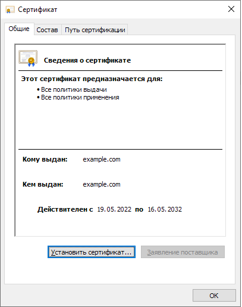
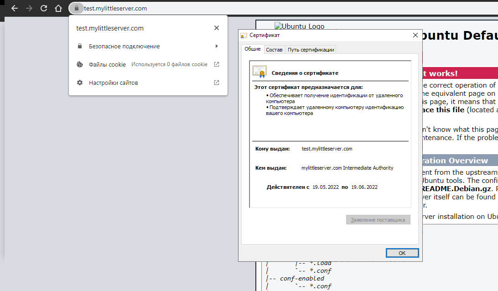
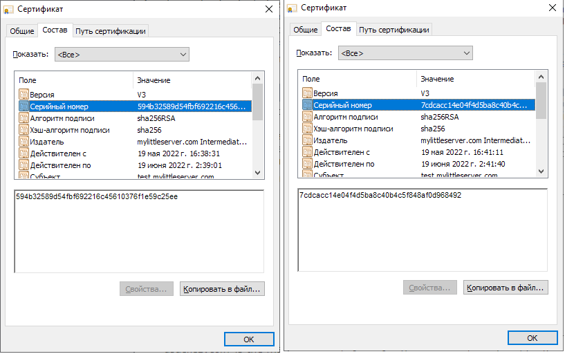

# Курсовая работа по итогам модуля "DevOps и системное администрирование"

Курсовая работа необходима для проверки практических навыков, полученных в ходе прохождения курса "DevOps и системное администрирование".

Мы создадим и настроим виртуальное рабочее место. Позже вы сможете использовать эту систему для выполнения домашних заданий по курсу

## Задание

1. Создайте виртуальную машину Linux.

    >### Создадим виртуальную машину на основе старого конфигурационного файла `vagrant`

    ```bash
    PS D:\netology\vagrant> vagrant up
    Bringing machine 'default' up with 'virtualbox' provider...
    ==> default: Checking if box 'bento/ubuntu-20.04' version '202112.19.0' is up to date...
    ==> default: There was a problem while downloading the metadata for your box
    ==> default: to check for updates. This is not an error, since it is usually due
    ==> default: to temporary network problems. This is just a warning. The problem
    ==> default: encountered was:
    ==> default:
    ==> default: Could not resolve host: vagrantcloud.com
    ==> default:
    ==> default: If you want to check for box updates, verify your network connection
    ==> default: is valid and try again.
    ==> default: Clearing any previously set forwarded ports...
    ==> default: Clearing any previously set network interfaces...
    ==> default: Preparing network interfaces based on configuration...
        default: Adapter 1: nat
    ==> default: Forwarding ports...
        default: 19999 (guest) => 19999 (host) (adapter 1)
        default: 22 (guest) => 2222 (host) (adapter 1)
    ==> default: Running 'pre-boot' VM customizations...
    ==> default: Booting VM...
    ==> default: Waiting for machine to boot. This may take a few minutes...
        default: SSH address: 127.0.0.1:2222
        default: SSH username: vagrant
        default: SSH auth method: private key
        default: Warning: Connection reset. Retrying...
        default: Warning: Connection aborted. Retrying...
    ==> default: Machine booted and ready!
    ==> default: Checking for guest additions in VM...
    ==> default: Configuring proxy for Apt...
    ==> default: Configuring proxy environment variables...
    ==> default: Configuring proxy for Git...
    ==> default: Mounting shared folders...
        default: /vagrant => D:/netology/vagrant
    ==> default: Machine already provisioned. Run `vagrant provision` or use the `--provision`
    ==> default: flag to force provisioning. Provisioners marked to run always will still run.
    PS D:\netology\vagrant>
    ```
    

2. Установите ufw и разрешите к этой машине сессии на порты 22 и 443, при этом трафик на интерфейсе localhost (lo) должен ходить свободно на все порты.

   >### Установили `ufw` и добавили правила разрешающие 22 и 443 порты.
    
    ```bash
    vagrant@vagrant:~$ sudo apt update && sudo apt upgrade && sudo apt install ufw
    vagrant@vagrant:~$ sudo ufw status
    Status: inactive
    vagrant@vagrant:~$ sudo ufw allow 22
    Rules updated
    Rules updated (v6)
    vagrant@vagrant:~$ sudo ufw allow 443
    Rules updated
    Rules updated (v6)
    vagrant@vagrant:~$ sudo ufw status
    Status: inactive
    vagrant@vagrant:~$ sudo ufw enable
    Command may disrupt existing ssh connections. Proceed with operation (y|n)? y
    Firewall is active and enabled on system startup
    vagrant@vagrant:~$ sudo ufw status
    vagrant@vagrant:~$ sudo ufw status verbose
    Status: active
    Logging: on (low)
    Default: deny (incoming), allow (outgoing), disabled (routed)
    New profiles: skip

    To                         Action      From
    --                         ------      ----
    22                         ALLOW IN    Anywhere
    443                        ALLOW IN    Anywhere
    22 (v6)                    ALLOW IN    Anywhere (v6)
    443 (v6)                   ALLOW IN    Anywhere (v6)

    vagrant@vagrant:~$
    ```


3. Установите hashicorp vault ([инструкция по ссылке](https://learn.hashicorp.com/tutorials/vault/getting-started-install?in=vault/getting-started#install-vault)).

   >### Ставим `hashicorp vault` по инструкции с сайта и видим `403 Forbidden`
    
    ```bash
    vagrant@vagrant:~$ wget -O- https://apt.releases.hashicorp.com/gpg | gpg --dearmor | sudo tee /usr/share/keyrings/hashicorp-archive-keyring.gpg
    --2022-05-18 12:42:02--  https://apt.releases.hashicorp.com/gpg
    Resolving apt.releases.hashicorp.com (apt.releases.hashicorp.com)... 18.165.122.122, 18.165.122.100, 18.165.122.19, ...
    Connecting to apt.releases.hashicorp.com (apt.releases.hashicorp.com)|18.165.122.122|:443... connected.
    HTTP request sent, awaiting response... 403 Forbidden
    2022-05-18 12:42:02 ERROR 403: Forbidden.

    gpg: no valid OpenPGP data found.
    ```

   >### Включаем `VPN` и пробуем установить еще раз
    
    ```bash

    vagrant@vagrant:~$ wget -O- https://apt.releases.hashicorp.com/gpg | gpg --dearmor | sudo tee /usr/share/keyrings/hashicorp-archive-keyring.gpg
    --2022-05-18 12:42:38--  https://apt.releases.hashicorp.com/gpg
    Resolving apt.releases.hashicorp.com (apt.releases.hashicorp.com)... 18.165.122.122, 18.165.122.100, 18.165.122.19, ...
    Connecting to apt.releases.hashicorp.com (apt.releases.hashicorp.com)|18.165.122.122|:443... connected.
    HTTP request sent, awaiting response... 200 OK
    Length: 3195 (3.1K) [binary/octet-stream]
    Saving to: ‘STDOUT’

    -                             100%[=================================================>]   3.12K   583 B/s    in 5.5s

    2022-05-18 12:42:54 (583 B/s) - written to stdout [3195/3195]

    vagrant@vagrant:~$ echo "deb [signed-by=/usr/share/keyrings/hashicorp-archive-keyring.gpg] https://apt.releases.hashicorp.com $(lsb_release -cs) main" | sudo tee /etc/apt/sources.list.d/hashicorp.list
    deb [signed-by=/usr/share/keyrings/hashicorp-archive-keyring.gpg] https://apt.releases.hashicorp.com focal main

    vagrant@vagrant:~$ sudo apt update && sudo apt install vault
    vagrant@vagrant:~$ vault
    Usage: vault <command> [args]

    Common commands:
        read        Read data and retrieves secrets
        write       Write data, configuration, and secrets
        delete      Delete secrets and configuration
        list        List data or secrets
        login       Authenticate locally
        agent       Start a Vault agent
        server      Start a Vault server
        status      Print seal and HA status
        unwrap      Unwrap a wrapped secret

    Other commands:
        audit                Interact with audit devices
        auth                 Interact with auth methods
        debug                Runs the debug command
        kv                   Interact with Vault's Key-Value storage
        lease                Interact with leases
        monitor              Stream log messages from a Vault server
        namespace            Interact with namespaces
        operator             Perform operator-specific tasks
        path-help            Retrieve API help for paths
        plugin               Interact with Vault plugins and catalog
        policy               Interact with policies
        print                Prints runtime configurations
        secrets              Interact with secrets engines

        ssh                  Initiate an SSH session
        token                Interact with tokens
        version-history      Prints the version history of the target Vault server
    vagrant@vagrant:~$
    ```

    >###  `vault` установлен

4. Cоздайте центр сертификации по инструкции ([ссылка](https://learn.hashicorp.com/tutorials/vault/pki-engine?in=vault/secrets-management)) и выпустите сертификат для использования его в настройке веб-сервера nginx (срок жизни сертификата - месяц).

    >###  Согласно инструкции и рекомендациям на сайте установим `jq` 
    
    ```bash
    vagrant@vagrant:~$ sudo apt-get install jq
    Reading package lists... Done
    Building dependency tree
    Reading state information... Done
    The following package was automatically installed and is no longer required:
    libfwupdplugin1
    Use 'sudo apt autoremove' to remove it.
    The following additional packages will be installed:
    libjq1 libonig5
    The following NEW packages will be installed:
    jq libjq1 libonig5
    0 upgraded, 3 newly installed, 0 to remove and 0 not upgraded.
    Need to get 313 kB of archives.
    After this operation, 1,062 kB of additional disk space will be used.
    Do you want to continue? [Y/n] y
    Get:1 http://us.archive.ubuntu.com/ubuntu focal/universe amd64 libonig5 amd64 6.9.4-1 [142 kB]
    Get:2 http://us.archive.ubuntu.com/ubuntu focal-updates/universe amd64 libjq1 amd64 1.6-1ubuntu0.20.04.1 [121 kB]
    Get:3 http://us.archive.ubuntu.com/ubuntu focal-updates/universe amd64 jq amd64 1.6-1ubuntu0.20.04.1 [50.2 kB]
    Fetched 313 kB in 2s (166 kB/s)
    Selecting previously unselected package libonig5:amd64.
    (Reading database ... 48809 files and directories currently installed.)
    Preparing to unpack .../libonig5_6.9.4-1_amd64.deb ...
    Unpacking libonig5:amd64 (6.9.4-1) ...
    Selecting previously unselected package libjq1:amd64.
    Preparing to unpack .../libjq1_1.6-1ubuntu0.20.04.1_amd64.deb ...
    Unpacking libjq1:amd64 (1.6-1ubuntu0.20.04.1) ...
    Selecting previously unselected package jq.
    Preparing to unpack .../jq_1.6-1ubuntu0.20.04.1_amd64.deb ...
    Unpacking jq (1.6-1ubuntu0.20.04.1) ...
    Setting up libonig5:amd64 (6.9.4-1) ...
    Setting up libjq1:amd64 (1.6-1ubuntu0.20.04.1) ...
    Setting up jq (1.6-1ubuntu0.20.04.1) ...
    Processing triggers for man-db (2.9.1-1) ...
    Processing triggers for libc-bin (2.31-0ubuntu9.9) ...
    vagrant@vagrant:~$ jq
    ```
    >### В другом терминале запустили сервер разработки `Vault` с `root` в качестве корневого токена.
    ```bash
    vagrant@vagrant:~$ vault server -dev -dev-root-token-id root
    ==> Vault server configuration:

                Api Address: http://127.0.0.1:8200
                        Cgo: disabled
            Cluster Address: https://127.0.0.1:8201
                Go Version: go1.17.9
                Listener 1: tcp (addr: "127.0.0.1:8200", cluster address: "127.0.0.1:8201", max_request_duration: "1m30s", max_request_size: "33554432", tls: "disabled")
                Log Level: info
                    Mlock: supported: true, enabled: false
            Recovery Mode: false
                    Storage: inmem
                    Version: Vault v1.10.3
                Version Sha: af866591ee60485f05d6e32dd63dde93df686dfb

    ==> Vault server started! Log data will stream in below:

    2022-05-19T10:55:33.673Z [INFO]  proxy environment: http_proxy="" https_proxy="" no_proxy=""
    2022-05-19T10:55:33.674Z [WARN]  no `api_addr` value specified in config or in VAULT_API_ADDR; falling back to detection if possible, but this value should be manually set
    2022-05-19T10:55:33.974Z [INFO]  core: Initializing versionTimestamps for core
    2022-05-19T10:55:34.180Z [INFO]  core: security barrier not initialized
    2022-05-19T10:55:34.180Z [INFO]  core: security barrier initialized: stored=1 shares=1 threshold=1
    2022-05-19T10:55:34.182Z [INFO]  core: post-unseal setup starting
    2022-05-19T10:55:34.186Z [INFO]  core: loaded wrapping token key
    2022-05-19T10:55:34.186Z [INFO]  core: Recorded vault version: vault version=1.10.3 upgrade time="2022-05-19 10:55:34.186927863 +0000 UTC"
    2022-05-19T10:55:34.209Z [INFO]  core: successfully setup plugin catalog: plugin-directory=""
    2022-05-19T10:55:34.209Z [INFO]  core: no mounts; adding default mount table
    2022-05-19T10:55:34.216Z [INFO]  core: successfully mounted backend: type=cubbyhole path=cubbyhole/
    2022-05-19T10:55:34.467Z [INFO]  core: successfully mounted backend: type=system path=sys/
    2022-05-19T10:55:34.534Z [INFO]  core: successfully mounted backend: type=identity path=identity/
    2022-05-19T10:55:34.638Z [INFO]  core: successfully enabled credential backend: type=token path=token/ namespace="ID: root. Path: "
    2022-05-19T10:55:34.639Z [INFO]  core: restoring leases
    2022-05-19T10:55:34.640Z [INFO]  rollback: starting rollback manager
    2022-05-19T10:55:34.701Z [INFO]  expiration: lease restore complete
    2022-05-19T10:55:34.702Z [INFO]  identity: entities restored
    2022-05-19T10:55:34.702Z [INFO]  identity: groups restored
    2022-05-19T10:55:35.291Z [INFO]  core: post-unseal setup complete
    2022-05-19T10:55:35.291Z [INFO]  core: root token generated
    2022-05-19T10:55:35.291Z [INFO]  core: pre-seal teardown starting
    2022-05-19T10:55:35.291Z [INFO]  rollback: stopping rollback manager
    2022-05-19T10:55:35.292Z [INFO]  core: pre-seal teardown complete
    2022-05-19T10:55:35.292Z [INFO]  core.cluster-listener.tcp: starting listener: listener_address=127.0.0.1:8201
    2022-05-19T10:55:35.292Z [INFO]  core.cluster-listener: serving cluster requests: cluster_listen_address=127.0.0.1:8201
    2022-05-19T10:55:35.292Z [INFO]  core: post-unseal setup starting
    2022-05-19T10:55:35.292Z [INFO]  core: loaded wrapping token key
    2022-05-19T10:55:35.292Z [INFO]  core: successfully setup plugin catalog: plugin-directory=""
    2022-05-19T10:55:35.293Z [INFO]  core: successfully mounted backend: type=system path=sys/
    2022-05-19T10:55:35.335Z [INFO]  core: successfully mounted backend: type=identity path=identity/
    2022-05-19T10:55:35.335Z [INFO]  core: successfully mounted backend: type=cubbyhole path=cubbyhole/
    2022-05-19T10:55:35.336Z [INFO]  core: successfully enabled credential backend: type=token path=token/ namespace="ID: root. Path: "
    2022-05-19T10:55:35.337Z [INFO]  core: restoring leases
    2022-05-19T10:55:35.337Z [INFO]  rollback: starting rollback manager
    2022-05-19T10:55:35.337Z [INFO]  expiration: lease restore complete
    2022-05-19T10:55:35.337Z [INFO]  identity: entities restored
    2022-05-19T10:55:35.337Z [INFO]  identity: groups restored
    2022-05-19T10:55:35.338Z [INFO]  core: post-unseal setup complete
    2022-05-19T10:55:35.338Z [INFO]  core: vault is unsealed
    2022-05-19T10:55:35.411Z [INFO]  expiration: revoked lease: lease_id=auth/token/root/h383307a998786705b8554eee5abf450f7e76a1023893da4a7910b3b0e34540a6
    2022-05-19T10:55:35.417Z [INFO]  core: successful mount: namespace="" path=secret/ type=kv
    2022-05-19T10:55:35.450Z [INFO]  secrets.kv.kv_fafe74ea: collecting keys to upgrade
    2022-05-19T10:55:35.452Z [INFO]  secrets.kv.kv_fafe74ea: done collecting keys: num_keys=1
    2022-05-19T10:55:35.454Z [INFO]  secrets.kv.kv_fafe74ea: upgrading keys finished
    WARNING! dev mode is enabled! In this mode, Vault runs entirely in-memory
    and starts unsealed with a single unseal key. The root token is already
    authenticated to the CLI, so you can immediately begin using Vault.

    You may need to set the following environment variable:

        $ export VAULT_ADDR='http://127.0.0.1:8200'

    The unseal key and root token are displayed below in case you want to
    seal/unseal the Vault or re-authenticate.

    Unseal Key: h7lDx6NsDQ092pN9mjfH5oUtkocNEftr2GqnU97Nhoo=
    Root Token: root

    Development mode should NOT be used in production installations!
    ```
    >### Откроем коно нового терминала и экспортируем переменные

    ```bash
    vagrant@vagrant:~$ export VAULT_ADDR=http://127.0.0.1:8200
    vagrant@vagrant:~$ export VAULT_TOKEN=root
    ```

    >### Сервер `vault` готов. Тепрь можно приступить к созданию корневого ЦС. Включаем механизм `pki` и выставляем время `ttl`

    ```bash
    vagrant@vagrant:~$ vault secrets enable pki
    Success! Enabled the pki secrets engine at: pki/
    vagrant@vagrant:~$ vault secrets tune -max-lease-ttl=87600h pki
    Success! Tuned the secrets engine at: pki/
    vagrant@vagrant:~$
    ```

    >### Сгенерируем корневой сертификат

    ```bash
    vagrant@vagrant:~$ vault write -field=certificate pki/root/generate/internal common_name="example.com" ttl=87600h > CA_cert.crt
    vagrant@vagrant:~$ ls *.crt
    CA_cert.crt
    ```

    >### Настроим URL`ы:

    ```bash
    vagrant@vagrant:~$ vault write pki/config/urls issuing_certificates="$VAULT_ADDR/v1/pki/ca" crl_distribution_points="$VAULT_ADDR/v1/pki/crl"
    Success! Data written to: pki/config/urls
    ```

    >### Создадим промежуточный ЦС..

    ```bash
    vagrant@vagrant:~$ vault secrets enable -path=pki_int pki
    Success! Enabled the pki secrets engine at: pki_int/
    ```

    >### В среднем количество часов в месяце невисокосного года 730 часов. Выпустим сертификат с максимальным сроком жизни 1 месяц:

    ```bash
    vagrant@vagrant:~$ vault secrets tune -max-lease-ttl=730h pki_int
    Success! Tuned the secrets engine at: pki_int/
    vagrant@vagrant:~$ vault write -format=json pki_int/intermediate/generate/internal common_name="mylittleserver.com Intermediate Authority" | jq -r '.data.csr' > pki_intermediate.csr
    ```

    >### Подпишем закрытым ключом корневого ЦС и сохраним:

    ```bash
    vagrant@vagrant:~$ vault write -format=json pki/root/sign-intermediate csr=@pki_intermediate.csr format=pem_bundle ttl="43800h" | jq -r '.data.certificate' > intermediate.cert.pem
    ```

    >### Импортируем:

    ```bash
    vagrant@vagrant:~$ vault write pki_int/intermediate/set-signed certificate=@intermediate.cert.pem
    Success! Data written to: pki_int/intermediate/set-signed
    ```

    >### Создадим роль:

    ```bash
    vagrant@vagrant:~$ vault write pki_int/roles/my-little-role allowed_domains="mylittleserver.com" allow_subdomains=true max_ttl="730h"
    Success! Data written to: pki_int/roles/my-little-role
    ```

    >### Запросим новый сертификат для `test.mylittleserver.com` домена на основе `my-little-role` роли:

    ```bash
    vagrant@vagrant:~$ vault write -format=json pki_int/issue/my-little-role common_name="test.mylittleserver.com" ttl="730h" > full.crt
    ```

    >### C помощью `jq` и разделим ключи и сертификаты:

    ```bash
    vagrant@vagrant:~$ cat full.crt | jq -r .data.certificate > test.mylittleserver.com.crt
    vagrant@vagrant:~$ cat full.crt | jq -r .data.issuing_ca >> test.mylittleserver.com.crt
    vagrant@vagrant:~$ cat full.crt | jq -r .data.private_key > test.mylittleserver.com.key
    ```

5. Установите корневой сертификат созданного центра сертификации в доверенные в хостовой системе.

    >### Установили корневой сертификат на хосте
    

6. Установите nginx.

    >### Установим `nginx` и после устанновки проверим его статус:

    ```bash
    vagrant@vagrant:~$ sudo apt install nginx
    ...
    vagrant@vagrant:~$ sudo systemctl status nginx
    ● nginx.service - A high performance web server and a reverse proxy server
        Loaded: loaded (/lib/systemd/system/nginx.service; enabled; vendor preset: enabled)
        Active: active (running) since Thu 2022-05-19 12:00:14 UTC; 21s ago
        Docs: man:nginx(8)
    Main PID: 44485 (nginx)
        Tasks: 2 (limit: 1071)
        Memory: 5.4M
        CGroup: /system.slice/nginx.service
                ├─44485 nginx: master process /usr/sbin/nginx -g daemon on; master_process on;
                └─44486 nginx: worker process

    May 19 12:00:14 vagrant systemd[1]: Starting A high performance web server and a reverse proxy server...
    May 19 12:00:14 vagrant systemd[1]: Started A high performance web server and a reverse proxy server.
    ```

7. По инструкции ([ссылка](https://nginx.org/en/docs/http/configuring_https_servers.html)) настройте nginx на https, используя ранее подготовленный сертификат:
  - можно использовать стандартную стартовую страницу nginx для демонстрации работы сервера;
  - можно использовать и другой html файл, сделанный вами;

    >### Правим конфиг `sudo nano /etc/nginx/sites-available/default` добавляем следующие параметры следующего содержания:

    ```nginx
    server {
        listen              443 ssl;
        ssl on;
        server_name         test.mylittleserver.com www.test.mylittleserver.com;
        ssl_certificate     /home/vagrant/test.mylittleserver.com.crt;
        ssl_certificate_key /home/vagrant/test.mylittleserver.com.key;
        ssl_protocols       TLSv1 TLSv1.1 TLSv1.2;
        ssl_ciphers         HIGH:!aNULL:!MD5;

        root /var/www/html;

        location / {
            index index.html index.htm;
            }
    }
    ```

8. Откройте в браузере на хосте https адрес страницы, которую обслуживает сервер nginx.

    >### Открываем и видим что наш сертификат действительный:
    

9. Создайте скрипт, который будет генерировать новый сертификат в vault:
  - генерируем новый сертификат так, чтобы не переписывать конфиг nginx;
  - перезапускаем nginx для применения нового сертификата.

    >### Создаем файл `vault_gen_cert.sh` со следуюбщим содержанием:

    ```bash
    #!/bin/bash

    export VAULT_ADDR=http://127.0.0.1:8200
    export VAULT_TOKEN=root

    vault write -format=json pki_int/issue/my-little-role common_name="test.mylittleserver.com" ttl="730h" > /home/vagrant/full.crt

    cat /home/vagrant/full.crt | jq -r .data.certificate > /home/vagrant/test.mylittleserver.com.crt
    cat /home/vagrant/full.crt | jq -r .data.issuing_ca >> /home/vagrant/test.mylittleserver.com.crt
    cat /home/vagrant/full.crt | jq -r .data.private_key > /home/vagrant/test.mylittleserver.com.key

    systemctl reload nginx.service
    ```
    >### Запускаем скрипт обновляем страницу в браузере смотрим сертификат и видим что сертификат поменялся:
    

10. Поместите скрипт в crontab, чтобы сертификат обновлялся какого-то числа каждого месяца в удобное для вас время.
    
    >### Создадим задание с помощью `crontab`
    
    ```bash
    vagrant@vagrant:~$ sudo crontab -e
    no crontab for root - using an empty one
    vagrant@vagrant:~$ sudo crontab -l
    ...
    0 0 1 * * /home/vagrant/vault_gen_cert.sh # Запуск скрипта каждый месяц 1 числа в 00:00

    */1 * * * * /home/vagrant/vault_gen_cert.sh # Т
    ```
    >### Проверим выполяется ли задание
    ```bash
    vagrant@vagrant:~$ grep CRON /var/log/syslog
    ...
    May 19 14:32:01 vagrant CRON[44984]: (root) CMD (/home/vagrant/vault_gen_cert.sh)
    May 19 14:33:01 vagrant CRON[45005]: (root) CMD (/home/vagrant/vault_gen_cert.sh)
    May 19 14:34:01 vagrant CRON[45022]: (root) CMD (/home/vagrant/vault_gen_cert.sh)
    May 19 14:35:01 vagrant CRON[45038]: (root) CMD (/home/vagrant/vault_gen_cert.sh)
    May 19 14:36:01 vagrant CRON[45055]: (root) CMD (/home/vagrant/vault_gen_cert.sh)
    vagrant@vagrant:~$
    ```
    >### Задание выполняется