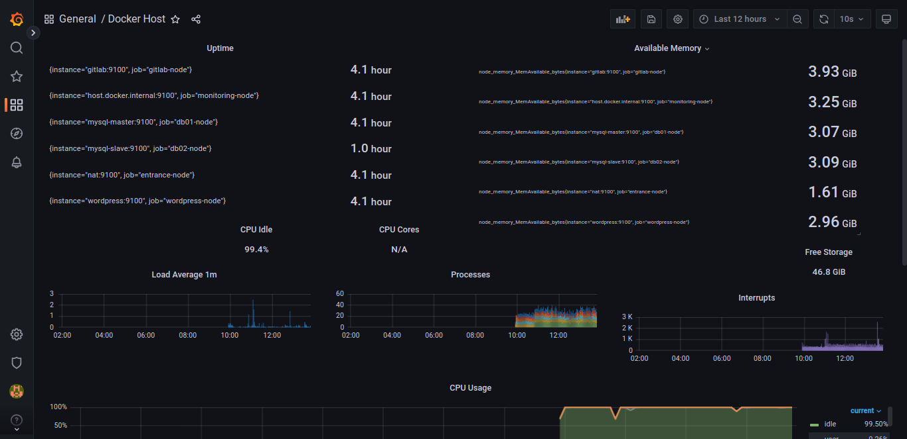

# Дипломный практикум в YandexCloud
  * [Цели:](#цели)
  * [Этапы выполнения:](#этапы-выполнения)
      * [Регистрация доменного имени](#1-регистрация-доменного-имени)
      * [Создание инфраструктуры](#2-создание-инфраструктуры)
      * [Подготовка Ansible](#3-подготовка-ansible)
          * [Установка Nginx и LetsEncrypt](#установка-nginx-и-letsencrypt)
          * [Установка кластера MySQL](#установка-кластера-mysql)
          * [Установка WordPress](#установка-wordpress)
          * [Установка Gitlab CE, Gitlab Runner и настройка CI/CD](#установка-gitlab)
          * [Установка Prometheus, Alert Manager, Node Exporter и Grafana](#установка-prometheus)
  * [Что необходимо для сдачи задания?](#что-необходимо-для-сдачи-задания)
  * [Как правильно задавать вопросы дипломному руководителю?](#как-правильно-задавать-вопросы-дипломному-руководителю)
d
---
## Цели:

1. Зарегистрировать доменное имя (любое на ваш выбор в любой доменной зоне).
2. Подготовить инфраструктуру с помощью Terraform на базе облачного провайдера YandexCloud.
3. Настроить внешний Reverse Proxy на основе Nginx и LetsEncrypt.
4. Настроить кластер MySQL.
5. Установить WordPress.
6. Развернуть Gitlab CE и Gitlab Runner.
7. Настроить CI/CD для автоматического развёртывания приложения.
8. Настроить мониторинг инфраструктуры с помощью стека: Prometheus, Alert Manager и Grafana.

---
## Этапы выполнения:

### 1. Регистрация доменного имени

1. Приобрели домен `jjvod-voevodin.ru` на [reg.ru](https://www.reg.ru/). Прописали
   DNS-серверы (`ns1.yandexcloud.net`, `ns2.yandexcloud.net`).


### 2. Создание инфраструктуры

Предварительная подготовка:

1. Создали сервисный аккаунт, который будет в дальнейшем использоваться Terraform для работы с инфраструктурой с необходимыми и достаточными правами.


2. Настроили профиль для сервисного аккаунта

```bash
user@user-Aspire-5750G:~/netology-dvpspdc3/diploma/terraform$ yc iam key create \
>   --service-account-id aje0e62imrgmrdinl9r6 \
>   --folder-name default \
>   --output key.json
id: ajehndc0bqk0khq9s9sd
service_account_id: aje0e62imrgmrdinl9r6
created_at: "2022-09-18T05:29:56.704821049Z"
key_algorithm: RSA_2048

user@user-Aspire-5750G:~/netology-dvpspdc3/diploma/terraform$ yc config profile create sa-profile
Profile 'sa-profile' created and activated
user@user-Aspire-5750G:~/netology-dvpspdc3/diploma/terraform$ yc config set service-account-key key.json
user@user-Aspire-5750G:~/netology-dvpspdc3/diploma/terraform$ yc config set cloud-id b1gsb5e2dh80gh2m64v3
user@user-Aspire-5750G:~/netology-dvpspdc3/diploma/terraform$ yc config set folder-id b1g6kuq3urjf6j4jq2s8
user@user-Aspire-5750G:~/netology-dvpspdc3/diploma/terraform$ source ./env.sh 
```

2. Подготовили [backend.tf](./terraform/backend.tf) для Terraform в S3 bucket в созданном YC аккаунте.
```terraform
terraform {
    backend "s3" {
    endpoint                    = "storage.yandexcloud.net"
    bucket                      = "devops-diplom-yandexcloud"
    region                      = "ru-central1"
    key                         = "terraform.tfstate"
    access_key = "xxx"
    secret_key = "xxx"
    skip_region_validation      = true
    skip_credentials_validation = true
  }
}
```


3. В [provider.tf](./terraform/provider.tf) добавим конфигурацию провайдера `yandex`:

```terraform
terraform {
  required_providers {
    yandex = {
      source  = "yandex-cloud/yandex"
      version = "0.78.1"
    }
  }
}

provider "yandex" {
  token     = var.YANDEX_TOKEN
  cloud_id  = var.YC_CLOUD_ID
  folder_id = var.YC_FOLDER_ID
  zone      = "ru-central1-a"
}
```
4. В [variables.tf](./terraform/variables.tf) обьявим переменные.

```terraform
variable "YANDEX_TOKEN" {}
variable "YC_FOLDER_ID" {}
variable "YC_CLOUD_ID" {}
```

5. Добавим аутентификационные данные в переменные окружения с помощью `env.sh`
```bash
#!/bin/bash
#source ./env.sh # for export to current shell
export TF_VAR_YANDEX_TOKEN=$(yc iam create-token)
export TF_VAR_YC_CLOUD_ID=$(yc config get cloud-id)
export TF_VAR_YC_FOLDER_ID=$(yc config get folder-id)
```


6. Настроили [workspaces](https://www.terraform.io/docs/language/state/workspaces.html)
```bash
user@user-Aspire-5750G:~/netology-dvpspdc3/diploma/terraform$ terraform workspace new stage
Created and switched to workspace "stage"!

user@user-Aspire-5750G:~/netology-dvpspdc3/diploma/terraform$ terraform workspace list
  default
* stage
```

7. Подготовили `vpc` в файле [network.tf](./terraform/network.tf)

```terraform
resource "yandex_vpc_network" "vpc_network" {  name = "vpc-network" }

resource "yandex_vpc_subnet" "private_vpc_subnet" {
  name           = "private-vpc-subnet"
  network_id     = yandex_vpc_network.vpc_network.id
  zone           = "ru-central1-a"
  v4_cidr_blocks = ["192.168.1.0/24"]
  route_table_id = yandex_vpc_route_table.nat_vpc_route_table.id
}

resource "yandex_vpc_subnet" "public_vpc_subnet" {
  name           = "public-vpc-subnet"
  network_id     = yandex_vpc_network.vpc_network.id
  zone           = "ru-central1-a"
  v4_cidr_blocks = ["192.168.2.0/24"]
}

resource "yandex_dns_zone" "dns_zone" {
  name = "public-dns-zone"
  zone             = "jjvod-voevodin.ru."
  public           = true
  private_networks = [yandex_vpc_network.vpc_network.id]
}

resource "yandex_dns_recordset" "www_recordset" {
  zone_id = yandex_dns_zone.dns_zone.id
  for_each = toset( ["www", "gitlab", "grafana", "prometheus","alertmanager"] )
  name = "${each.key}.jjvod-voevodin.ru."
  type    = "A"
  ttl     = 600
  data    = [yandex_compute_instance.nat_instance.network_interface.0.nat_ip_address]
}

resource "yandex_vpc_route_table" "nat_vpc_route_table" {
  name       = "nat-route-table"
  network_id = yandex_vpc_network.vpc_network.id

  static_route {
    destination_prefix = "0.0.0.0/0"
    next_hop_address   = yandex_compute_instance.nat_instance.network_interface.0.ip_address
  }
}
```
8.Описали инстансы в [main.tf](./terraform/main.tf)

```terraform
data "yandex_compute_image" "image-type" {
  family = "ubuntu-2004-lts"
}
data "yandex_compute_image" "nat-image" {
  family = "nat-instance-ubuntu"
}

resource "yandex_compute_instance" "nat_instance" {
  name     = "nat"
  hostname = "nat"
  zone     = "ru-central1-a"

  resources {
    cores  = 2
    memory = 2
  }

  boot_disk {
    initialize_params {
      image_id = data.yandex_compute_image.nat-image.id
    }
  }

  network_interface {
    subnet_id = yandex_vpc_subnet.public_vpc_subnet.id
    nat_ip_address = "51.250.88.230"
    nat       = true
  }

  metadata = {
    test     = "test_str"
    ssh-keys = "ubuntu:${file("~/.ssh/id_rsa.pub")}"
  }
}

locals{
  instance_map={
    "db01_instance"       = {name = "mysql-master", cores = 4, memory = 4, size = 10},
    "db02_instance"       = {name = "mysql-slave",  cores = 4, memory = 4, size = 10},
    "app_instance"        = {name = "wordpress",    cores = 4, memory = 4, size = 10},
    "monitoring_instance" = {name = "monitoring",   cores = 4, memory = 4, size = 10},
    "gitlab_instance"     = {name = "gitlab",       cores = 8, memory = 8, size = 30},
    "runner_instance"     = {name = "runner",       cores = 4, memory = 4, size = 30}
  }
}

resource "yandex_compute_instance" "instances" {
  for_each = local.instance_map
  name     = "${each.value.name}"
  hostname = "${each.value.name}"
  zone     = "ru-central1-a"

  resources {
    cores  = "${each.value.cores}"
    memory = "${each.value.memory}"
  }

  boot_disk {
    initialize_params {
      image_id = data.yandex_compute_image.image-type.id
      size     = "${each.value.size}"
    }
  }

  network_interface {
    subnet_id = yandex_vpc_subnet.private_vpc_subnet.id
  }

  metadata = {
    ssh-keys = "ubuntu:${file("~/.ssh/id_rsa.pub")}"
  }

  scheduling_policy {
    preemptible = true
  }
}
```
9. Результат выполнения `terraform apply`


---

### 3. Подготовка Ansible

Для подключения к нашим серверам погдотовим [ansible.cfg](./terraform/ansible.cfg)

```config
[defaults]
inventory=../ansible/inventory
roles_path = ../ansible/roles 
deprecation_warnings=False
command_warnings=False
ansible_port=22
host_key_checking = False
[ssh_connection]
ssh_args = -F ./ssh_config 
```
[ssh_config](./terraform/ssh_config) для `Ansible`

```config
User ubuntu
IdentityFile ~/.ssh/id_rsa

Host jjvod-voevodin.ru
  HostName www.jjvod-voevodin.ru
  PasswordAuthentication no
  KbdInteractiveAuthentication no
  PreferredAuthentications publickey
  StrictHostKeyChecking no
  UserKnownHostsFile=/dev/null

Host db01.jjvod-voevodin.ru
  HostName mysql-master
    ProxyJump jjvod-voevodin.ru
    ProxyCommand ssh -W %h:%p -i .ssh/id_rsa 

Host db02.jjvod-voevodin.ru
  HostName mysql-slave
    ProxyJump jjvod-voevodin.ru
    ProxyCommand ssh -W %h:%p -i .ssh/id_rsa

Host app.jjvod-voevodin.ru
  HostName wordpress
    ProxyJump jjvod-voevodin.ru
    ProxyCommand ssh -W %h:%p -i .ssh/id_rsa

Host monitoring.jjvod-voevodin.ru
  HostName monitoring
    ProxyJump jjvod-voevodin.ru
    ProxyCommand ssh -W %h:%p -i .ssh/id_rsa

Host gitlab.jjvod-voevodin.ru
  HostName gitlab
    ProxyJump jjvod-voevodin.ru
    ProxyCommand ssh -W %h:%p -i .ssh/id_rsa

Host runner.jjvod-voevodin.ru
  HostName runner
    ProxyJump jjvod-voevodin.ru
    ProxyCommand ssh -W %h:%p -i .ssh/id_rsa

```

### Установка Nginx и LetsEncrypt

Создали [Ansible роль](./ansible/roles/entrance/tasks/main.yml) для установки Nginx и LetsEncrypt.

1. Создали конфигурацию для reverse proxy с поддержкой TLS для обеспечения безопасного доступа к веб-сервисам по HTTPS.
```nginx
          server {
              listen 80;
              server_name www.jjvod-voevodin.ru;
          
              location / {
                proxy_set_header Host $host;
                proxy_set_header X-Real-IP $remote_addr;
                proxy_set_header X-Forwarded-For $proxy_add_x_forwarded_for;
                proxy_set_header X-Forwarded-Proto $scheme;
          
                proxy_pass http://wordpress;
                proxy_read_timeout 90;
          
                proxy_redirect http://wordpress http://www.jjvod-voevodin.ru;
              }
          }
          
          server {
              listen 80;
              server_name gitlab.jjvod-voevodin.ru;
          
              location / {
                client_max_body_size 100m;
                
                proxy_set_header Host $host;
                proxy_set_header X-Real-IP $remote_addr;
                proxy_set_header X-Forwarded-For $proxy_add_x_forwarded_for;
                proxy_set_header X-Forwarded-Proto $scheme;
          
                proxy_pass http://gitlab:10080;
                proxy_read_timeout 90;
          
                proxy_redirect http://gitlab:10080 https://gitlab.jjvod-voevodin.ru;
              }
          }
          
          server {
              listen 80;
              server_name grafana.jjvod-voevodin.ru;
          
              location / {
                proxy_set_header Host $host;
                proxy_set_header X-Real-IP $remote_addr;
                proxy_set_header X-Forwarded-For $proxy_add_x_forwarded_for;
                proxy_set_header X-Forwarded-Proto $scheme;
          
                proxy_pass http://monitoring:3000;
                proxy_read_timeout 90;
          
                proxy_redirect http://monitoring:3000 https://grafana.jjvod-voevodin.ru;
              }
          }
          
          server {
              listen 80;
              server_name prometheus.jjvod-voevodin.ru;
          
              location / {
                proxy_set_header Host $host;
                proxy_set_header X-Real-IP $remote_addr;
                proxy_set_header X-Forwarded-For $proxy_add_x_forwarded_for;
                proxy_set_header X-Forwarded-Proto $scheme;
          
                proxy_pass http://monitoring:9090;
                proxy_read_timeout 90;
          
                proxy_redirect http://monitoring:9090 https://prometheus.jjvod-voevodin.ru;
              }
          }
          
          server {
              listen 80;
              server_name alertmanager.jjvod-voevodin.ru;
          
              location / {
                proxy_set_header Host $host;
                proxy_set_header X-Real-IP $remote_addr;
                proxy_set_header X-Forwarded-For $proxy_add_x_forwarded_for;
                proxy_set_header X-Forwarded-Proto $scheme;
          
                proxy_pass http://monitoring:9093;
                proxy_read_timeout 90;
          
                proxy_redirect http://monitoring:9093 https://alertmanager.jjvod-voevodin.ru;
              }
          }
```

После отработки роли получили валидный сертификат


___
### Установка кластера MySQL

Запустим [роль](ansible/roles/db/tasks/main.yml) кластера MySQL:

```bash
user@user-Aspire-5750G:~/netology-dvpspdc3/diploma/terraform$ ansible-playbook ../ansible/roles/db/tasks/main.yml 

...

PLAY RECAP ************************************************************************************************************************************************************
db01.jjvod-voevodin.ru     : ok=27   changed=15   unreachable=0    failed=0    skipped=0    rescued=0    ignored=0   
db02.jjvod-voevodin.ru     : ok=21   changed=11   unreachable=0    failed=0    skipped=0    rescued=0    ignored=0 
```

Проверяем статус `mysql-master` 

```sql
ubuntu@mysql-master:~$ sudo -i
root@mysql-master:~# mysql

mysql> show processlist;
+----+-----------------+----------------------------------------+------+-------------+------+-----------------------------------------------------------------+------------------+
| Id | User            | Host                                   | db   | Command     | Time | State                                                           | Info             |
+----+-----------------+----------------------------------------+------+-------------+------+-----------------------------------------------------------------+------------------+
|  5 | event_scheduler | localhost                              | NULL | Daemon      |  328 | Waiting on empty queue                                          | NULL             |
| 15 | root            | localhost                              | NULL | Query       |    0 | init                                                            | show processlist |
| 23 | replicator      | mysql-slave.ru-central1.internal:58342 | NULL | Binlog Dump |   26 | Source has sent all binlog to replica; waiting for more updates | NULL             |
+----+-----------------+----------------------------------------+------+-------------+------+-----------------------------------------------------------------+------------------+
3 rows in set (0.00 sec)

mysql> show slave hosts;
+-----------+------+------+-----------+--------------------------------------+
| Server_id | Host | Port | Master_id | Slave_UUID                           |
+-----------+------+------+-----------+--------------------------------------+
|         2 |      | 3306 |         1 | 937d6da6-3c1d-11ed-89cf-d00d92e854aa |
+-----------+------+------+-----------+--------------------------------------+
1 row in set, 1 warning (0.00 sec)

```

Проверяем статус `mysql-slave` 

```sql
mysql> show slave status\G
*************************** 1. row ***************************
               Slave_IO_State: Waiting for source to send event
                  Master_Host: mysql-master
                  Master_User: replicator
                  Master_Port: 3306
                Connect_Retry: 60
              Master_Log_File: mysql-bin.000002
          Read_Master_Log_Pos: 1539
               Relay_Log_File: mysql-relay-bin.000002
                Relay_Log_Pos: 1126
        Relay_Master_Log_File: mysql-bin.000002
             Slave_IO_Running: Yes
            Slave_SQL_Running: Yes
              Replicate_Do_DB: 
          Replicate_Ignore_DB: 
           Replicate_Do_Table: 
       Replicate_Ignore_Table: 
      Replicate_Wild_Do_Table: 
  Replicate_Wild_Ignore_Table: 
                   Last_Errno: 0
                   Last_Error: 
                 Skip_Counter: 0
          Exec_Master_Log_Pos: 1539
              Relay_Log_Space: 1336
              Until_Condition: None
               Until_Log_File: 
                Until_Log_Pos: 0
           Master_SSL_Allowed: No
           Master_SSL_CA_File: 
           Master_SSL_CA_Path: 
              Master_SSL_Cert: 
            Master_SSL_Cipher: 
               Master_SSL_Key: 
        Seconds_Behind_Master: 0
Master_SSL_Verify_Server_Cert: No
                Last_IO_Errno: 0
                Last_IO_Error: 
               Last_SQL_Errno: 0
               Last_SQL_Error: 
  Replicate_Ignore_Server_Ids: 
             Master_Server_Id: 1
                  Master_UUID: 3744182e-3c1d-11ed-bad2-d00d20f7b233
             Master_Info_File: mysql.slave_master_info
                    SQL_Delay: 0
          SQL_Remaining_Delay: NULL
      Slave_SQL_Running_State: Replica has read all relay log; waiting for more updates
           Master_Retry_Count: 86400
                  Master_Bind: 
      Last_IO_Error_Timestamp: 
     Last_SQL_Error_Timestamp: 
               Master_SSL_Crl: 
           Master_SSL_Crlpath: 
           Retrieved_Gtid_Set: 
            Executed_Gtid_Set: 
                Auto_Position: 0
         Replicate_Rewrite_DB: 
                 Channel_Name: 
           Master_TLS_Version: 
       Master_public_key_path: 
        Get_master_public_key: 0
            Network_Namespace: 
1 row in set, 1 warning (0.00 sec)
```
База и пользователь реплицируются

```sql
mysql> show databases;
+--------------------+
| Database           |
+--------------------+
| information_schema |
| mysql              |
| performance_schema |
| sys                |
| wordpress          |
+--------------------+
5 rows in set (0.00 sec)

mysql> select user,host from mysql.user;
+------------------+-------------+
| user             | host        |
+------------------+-------------+
| debian-sys-maint | localhost   |
| mysql.infoschema | localhost   |
| mysql.session    | localhost   |
| mysql.sys        | localhost   |
| root             | localhost   |
| wordpress        | wordpress.% |
+------------------+-------------+
6 rows in set (0.00 sec)

```

___
### Установка WordPress

Запустим [роль](ansible/roles/app/tasks/main.yml) для WordPress:


---
### Установка Gitlab CE и Gitlab Runner


1. Запустим [роль](ansible/roles/monitoring/tasks/main.yml) для Gitlab и Runner:

```bash
user@user-Aspire-5750G:~/netology-dvpspdc3/diploma/terraform$ ansible-playbook ../ansible/roles/gitlab/tasks/main.yml 

...
PLAY RECAP ************************************************************************************************************************************************************
gitlab.jjvod-voevodin.ru   : ok=15   changed=11   unreachable=0    failed=0    skipped=0    rescued=0    ignored=0   
runner.jjvod-voevodin.ru   : ok=11   changed=7    unreachable=0    failed=0    skipped=0    rescued=0    ignored=0  
```

2. Создадим новый `gitlab-runner`:

```shell
root@runner:~# gitlab-runner register
Runtime platform                                    arch=amd64 os=linux pid=7598 revision=43b2dc3d version=15.4.0
Running in system-mode.                            
                                                   
Enter the GitLab instance URL (for example, https://gitlab.com/):
http://gitlab:10080
Enter the registration token:
GR13489414zVm1aSAHvgsC4SmxS1i
Enter a description for the runner:
[runner]: wordpress
Enter tags for the runner (comma-separated):
wordpress
Enter optional maintenance note for the runner:
wordpress
Registering runner... succeeded                     runner=GR13489414zVm1aSA
Enter an executor: docker+machine, docker-ssh+machine, kubernetes, custom, parallels, shell, virtualbox, docker, docker-ssh, ssh:
ssh
Enter the SSH server address (for example, my.server.com):
wordpress
Enter the SSH server port (for example, 22):
22
Enter the SSH user (for example, root):
ubuntu
Enter the SSH password (for example, docker.io):

Enter the path to the SSH identity file (for example, /home/user/.ssh/id_rsa):
/root/.ssh/id_rsa
Runner registered successfully. Feel free to start it, but if it's running already the config should be automatically reloaded!
 
Configuration (with the authentication token) was saved in "/etc/gitlab-runner/config.toml" 
```

3. В Wordpress-проекте создадим pipeline-файл `.gitlab-ci.yml`:

```yaml
deploy-job:
  stage: deploy
  script:
    - echo "Deploy" 
    # Upload to server
    - rsync -vz  ./* /var/www/wordpress/
    - rm -rf /var/www/wordpress/.git
    # Provide file permissions
    - sudo chown -R www-data /var/www/wordpress/
```

4. Добавим .git-репозиторий для Wordpress-проекта:

```git
user@user-Aspire-5750G:~/netology-dvpspdc3/diploma/wordpress$ git clone https://gitlab.jjvod-voevodin.ru/gitlab-instance-d0cee118/wordpress.git
Клонирование в «wordpress»…
```

Проверим URL [gitlab.jjvod-voevodin.ru](https://gitlab.jjvod-voevodin.ru/test.html):


___
### Установка Prometheus, Alert Manager, Node Exporter и Grafana

Запустим [роль](ansible/roles/monitoring/tasks/main.yml) для Prometheus, Alert Manager и Grafana:





## Скриншоты с сертификатами


